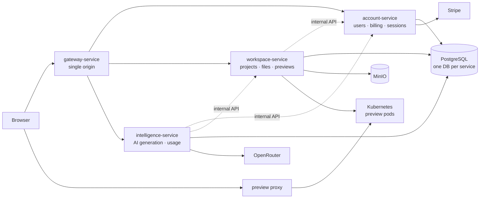

# VibeCraft

**Describe an idea, answer a few questions, and watch a real project get built — live.**


VibeCraft is an AI-assisted project builder. You type a one-line idea; a short, AI-written interview turns it into a spec; an AI chat writes the project file by file while a checklist ticks off each step; and a live preview runs the result in its own Kubernetes pod as it's being built. Teammates collaborate with owner, editor and viewer roles, and usage is metered against plans billed through Stripe.

**Live demo:** <https://vibecraft.divyanshuagrahari.dev> — sign in with Google or email. Payments run in Stripe test mode; use card `4242 4242 4242 4242`.

## Features

- **Idea clarifier** — 2–4 questions written by the model for your specific idea, compiled into a project brief before any code is generated.
- **Streaming code generation** — files are written live, with a build checklist and automatic recovery when a turn stops short.
- **Live previews** — every project runs in an isolated Kubernetes pod behind a signed, expiring preview link, shared correctly between collaborators and reclaimed when idle.
- **Atomic file revisions** — every AI turn lands as one all-or-nothing revision, and any earlier revision can be restored.
- **Teaching mode** — an optional walkthrough of *why* each file is written the way it is.
- **Code insight** — ask about any selection or the whole project; answers are read-only by construction and saved as private notes.
- **Collaboration** — per-project roles, invitations, forking, pinning and starring, code search, and ZIP export.
- **Plans and usage** — Stripe subscriptions with enforced daily-token, project and preview limits, plus a usage dashboard broken down by day, feature and project.

## How it works

1. **Clarify** — a one-line idea becomes a spec through an adaptive interview.
2. **Generate** — the spec starts an AI chat; the model reads the files it needs and streams edits in a tag-based protocol.
3. **Publish** — when the turn completes, its file changes are published to object storage as one atomic revision.
4. **Preview** — a warm Kubernetes pod is claimed, the project's files are synced in, and the Vite dev server runs there, routed to the browser through Redis and a small reverse proxy.
5. **Iterate** — later turns edit the running project, and the preview reflects each completed turn.

## Architecture



A Spring Cloud Gateway routes each URL to one of three domain services, each with its own database. Services find each other through Eureka and call each other over a private, secret-authenticated internal API. Sign-in is Firebase-only; each service verifies the session itself. **Generated code runs only inside isolated preview pods**, never in the backend.

Read more: [architecture overview](docs/architecture/README.md) · [security model](docs/architecture/security-model.md) · [design decisions](docs/architecture/decisions/README.md)

## Tech stack

| Layer | Technologies |
|---|---|
| Backend | Java 25, Spring Boot 4.1, Spring Cloud (Gateway, Eureka, OpenFeign), Spring AI, PostgreSQL, Flyway |
| Frontend | React 18, TypeScript, Vite, Tailwind CSS, shadcn/ui, TanStack Query, CodeMirror |
| Integrations | Firebase Authentication, OpenRouter, Stripe, MinIO |
| Infrastructure | Kubernetes (kind, k3s), Kustomize, Redis, Docker, GitHub Actions, Cloudflare Tunnel |

Details and versions: [tech stack](docs/tech-stack.md).

## Getting started

**Prerequisites:** JDK 25, Node.js 20+, Docker, and a Firebase project and OpenRouter API key. Stripe keys are optional; a local kind cluster is needed only for live previews. See [prerequisites](docs/local-development/prerequisites.md).

```bash
git clone https://github.com/Divyanshu2805/vibecraft.git
cd vibecraft

# PostgreSQL and MinIO
docker compose -f services.docker-compose.yml up -d
cp .env.example .env                  # fill in your keys

# Backend: one terminal per service, in this order (mvnw.cmd on Windows)
./mvnw -pl common-lib install
MANAGEMENT_SERVER_PORT=9401 ./mvnw -pl discovery-service spring-boot:run
MANAGEMENT_SERVER_PORT=9402 ./mvnw -pl account-service spring-boot:run
MANAGEMENT_SERVER_PORT=9403 ./mvnw -pl workspace-service spring-boot:run
MANAGEMENT_SERVER_PORT=9404 ./mvnw -pl intelligence-service spring-boot:run
MANAGEMENT_SERVER_PORT=9405 ./mvnw -pl gateway-service spring-boot:run

# Frontend
cd frontend && npm install
cp .env.example .env.local            # Firebase web config
npm run dev
```

Open <http://localhost:5173>. The full guide, including live previews and troubleshooting, is in [local development](docs/local-development/README.md).

## Testing

```bash
./mvnw test                  # backend: 452 tests across all modules
cd frontend && npm test      # frontend: 298 tests
cd proxy && node --test      # preview proxy
```

The backend suite is plain JUnit and needs no database or cluster, except one Testcontainers integration test (which needs Docker). The live-preview pipeline and Stripe billing are verified by hand. See [testing](docs/practices/testing.md).

## Project structure

```
common-lib/             shared error model, session authentication, internal-API plumbing
discovery-service/      Eureka service registry
gateway-service/        Spring Cloud Gateway — the browser's single origin (:8000)
account-service/        users, plans, subscriptions, Stripe, sessions (:8081)
workspace-service/      projects, members, files, revisions, live previews (:8082)
intelligence-service/   AI generation, code insight, idea clarifier, usage (:8083)
frontend/               React single-page app
proxy/                  Node reverse proxy for preview hostnames
k8s/                    local preview-pipeline manifests (kind)
deploy/                 production Kubernetes manifests (Kustomize) and deploy scripts
docker/                 shared service Dockerfile and the preview-runner image
infra/postgres-init/    creates the service databases on a fresh volume
docs/                   documentation
```

## Deployment

The live demo runs on a single free-tier Oracle Cloud Arm VM as single-node k3s, with no open inbound ports: visitors arrive through a Cloudflare tunnel, and deploys arrive over Tailscale. GitHub Actions tests every change, builds eight arm64 images, deploys them, smoke-tests the site and rolls back automatically on failure. A nightly job backs up the databases and object storage to Cloudflare R2.

See [deployment](docs/deployment/README.md) and [operations](docs/operations/README.md).

## Documentation

| Section | Contents |
|---|---|
| [Local development](docs/local-development/README.md) | Setup, configuration, live previews, troubleshooting |
| [Architecture](docs/architecture/README.md) | Services, request flows, security model, decision records |
| [API reference](docs/api/README.md) | Every endpoint, streaming formats, errors |
| [Data model](docs/schema/README.md) | Databases, entities, schema conventions |
| [Engineering practices](docs/practices/README.md) | Conventions, testing, guardrails, known pitfalls |
| [Known gaps](docs/known-gaps/README.md) | Trade-offs and what isn't built yet |
| [Deployment](docs/deployment/README.md) · [Operations](docs/operations/README.md) | Running it in production |

The full index is at [`docs/`](docs/README.md).

## Contributing

[`CONTRIBUTING.md`](CONTRIBUTING.md) describes how to work on the codebase: the workflow, conventions and checks every change goes through. To report a security issue, follow [`SECURITY.md`](SECURITY.md) instead of opening a public issue.

## Project history

VibeCraft began as a single Spring Boot application and was split into the current services in stages; the original monolith was then removed ([ADR 0001](docs/architecture/decisions/0001-microservices-with-database-per-service.md)). Both are preserved in git history:

| To see | Command |
|---|---|
| The monolith, just before the split began | `git switch --detach a0c9214` |
| The migration record — what moved where, the cutover, lessons learned | `git show 3257326:docs/migration/` |
