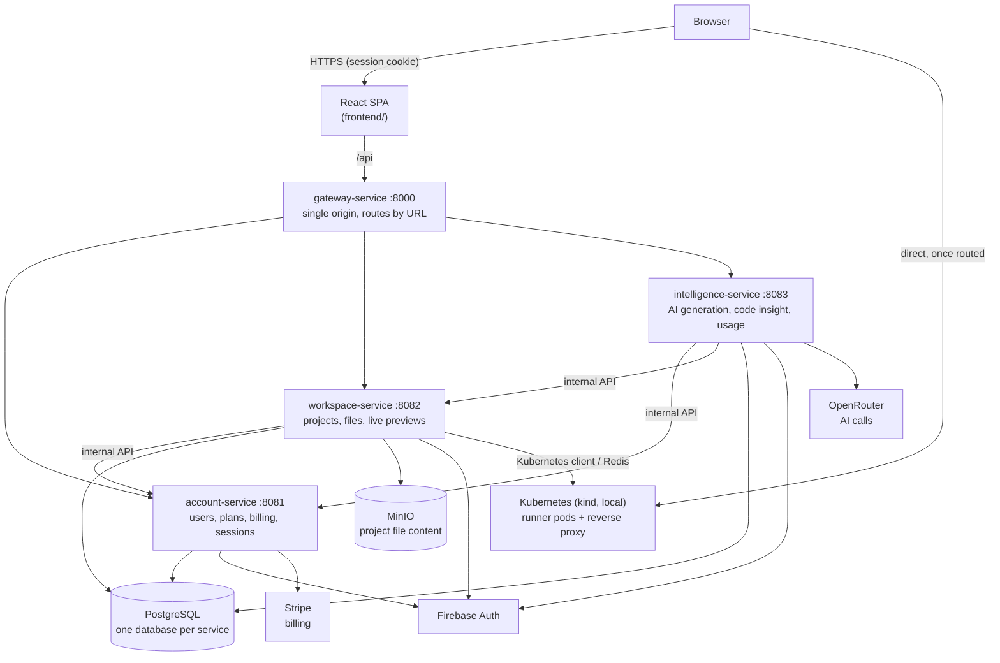
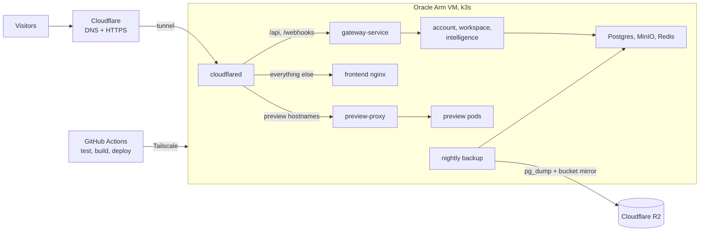

# VibeCraft

> Describe an idea, answer a short AI-tailored interview about it, and watch a real project get built — with live Kubernetes-backed previews and role-based team collaboration.

**VibeCraft** is an AI-assisted project-building platform in the Lovable/Bolt/v0 category: a user types a one-line idea, a short adaptive interview turns it into a spec, an AI chat conversation writes the actual project file by file, and a live preview shows the running result in a real Kubernetes pod while it's being built. Collaborators work on the same project with `OWNER`/`EDITOR`/`VIEWER` roles, and usage is metered against daily token and project quotas billed through Stripe.

**Live demo: <https://vibecraft.divyanshuagrahari.dev>** — sign in with Google or email and build something. Payments run in Stripe **test mode**, so no real money moves (use card `4242 4242 4242 4242`). It runs on a single free-tier Oracle Arm VM and redeploys itself from GitHub Actions on every push to `main` — see [Deployment](#deployment).

This README is the entry point. Deeper, accurate reference material lives in [`docs/`](docs) — see the [Documentation Map](#documentation-map) below.

---

## Table of Contents

- [Features](#features)
- [How It Works](#how-it-works)
- [Architecture](#architecture)
- [Deployment](#deployment)
- [Tech Stack](#tech-stack)
- [Getting Started](#getting-started)
- [Environment Variables](#environment-variables)
- [Project Structure](#project-structure)
- [Testing](#testing)
- [Documentation Map](#documentation-map)
- [Status & Roadmap](#status--roadmap)
- [History: the monolith architecture](#history-the-monolith-architecture)

---

## Features

- **Idea clarifier** — a 2–4 question interview, entirely written by the model for that specific idea (no fixed question bank), scaled by how much the prompt already says, compiled into a spec before the AI ever starts writing code.
- **Streaming AI code generation** — a live build checklist that ticks off as each file is written, with automatic detection and one-retry recovery when a generation stops mid-plan or narrates an edit it never delivers.
- **Teaching Mode** — an opt-in, per-file walkthrough of *why* the code is written the way it is, not just what it does, with clickable references that jump straight to the quoted line.
- **Live previews** — every project runs in its own Kubernetes pod behind a Redis-routed reverse proxy, shared correctly across collaborators (one person stopping their view doesn't take the preview away from someone else watching), auto-reclaimed when idle.
- **Code notes** — select any code and ask about it, or ask about the project in general; answers are read-only by construction (the model has no write-capable tool on this path) and saved privately per person.
- **Role-based collaboration** — `OWNER`/`EDITOR`/`VIEWER` per project, invites, project forking, pin/star, code search, and whole-project ZIP export.
- **Billing & quotas** — three Stripe-backed plans with real, enforced daily-token and project-count limits (a 402, not a silent failure), plus a usage-insights dashboard broken down by day/feature/project.

## How It Works

1. **Idea** — a short adaptive interview turns a one-line prompt into a spec (`POST /api/ideas/clarify` → `/compile`).
2. **Build** — the spec becomes the first message in an AI chat conversation. The model plans, reads files it needs, and writes/edits real files through a streamed, tag-based protocol.
3. **Persist** — each generated file is saved to object storage independently, so one bad file never loses the rest of a generation or the chat history.
4. **Preview** — a Kubernetes pod is claimed from a warm pool, the project's files are synced in, and `npm install && vite dev` runs inside it — routed to the browser through Redis and a small reverse proxy.
5. **Iterate** — further chat turns edit the running project; the live preview reflects a completed turn once its files finish writing.

The full request-flow-with-real-file-paths version of this, including sequence diagrams for the AI-generation and live-preview pipelines: [`docs/architecture/`](docs/architecture/README.md).

## Architecture



Services find each other by name through Eureka (`discovery-service`, `:8761`, not drawn). The full picture, with the internal API each arrow stands for: [`docs/architecture/`](docs/architecture/README.md).

**Key boundary:** AI-generated/user code executes **only** inside a live-preview Kubernetes pod — never in-process in the backend. Full reasoning and the exact isolation mechanism: [`docs/architecture/`](docs/architecture/README.md) §4.3.

## Deployment

The live demo runs entirely on one free Oracle Cloud Arm machine (2 cores, 12 GB) as single-node k3s, for about $0 a month plus the domain and a capped AI key. The machine has **no open inbound ports**: visitors arrive through a Cloudflare tunnel, and deploys and admin access arrive over Tailscale.



- **Continuous deployment.** Every push to `main` runs the tests, builds eight arm64 images, deploys them over Tailscale, smoke-tests the live site, and rolls back automatically if anything fails. Nothing is hand-deployed and no secret lives on the server: every Kubernetes Secret is rebuilt from a GitHub environment on each deploy.
- **Kept safe.** A nightly job backs Postgres and the object store up to Cloudflare R2, with a guarded, drilled restore; a scheduled workflow checks the site every 15 minutes and that the newest backup is fresh, and emails on failure.
- **Portable by design.** Nothing depends on Oracle: the same Kustomize manifests run on a local kind cluster (`deploy/k8s/overlays/kind`), so moving to another host is a settings change plus a restore.

The design and the record of how it was built: [`docs/deployment/`](docs/deployment/README.md). Running it day to day: [`docs/operations/`](docs/operations/README.md).

## Tech Stack

**Backend:** Java 25, Spring Boot 4.1 (Web MVC / Data JPA / Security), PostgreSQL, Maven, Lombok, MapStruct, Spring AI (OpenRouter), Firebase Admin SDK (the only sign-in method), Stripe Java SDK, MinIO Java SDK, fabric8 `kubernetes-client`, Spring Data Redis. JJWT lives only in `common-lib`, for the internal service-to-service JWT.

**Frontend:** React 18 + TypeScript, Vite 5, Tailwind CSS + shadcn/ui, `@tanstack/react-query`, CodeMirror 6, Firebase JS SDK, Vitest.

**Infra:** Kubernetes (`k8s/`) for live preview runner pods, a standalone Node reverse proxy (`proxy/`), Docker Compose for local Postgres/MinIO.

## Getting Started

### Prerequisites

Java 25, Maven Wrapper (bundled), Node.js + `npm`, Docker. Optional (live previews only): a local Kubernetes cluster (`kind`) and `kubectl`. Accounts: a Firebase project, an OpenRouter API key, and (for billing) a Stripe test-mode account.

### Quickstart

```bash
git clone https://github.com/Divyanshu2805/vibecraft.git
cd vibecraft

# Backend infra
docker compose -f services.docker-compose.yml up -d
cp .env.example .env    # fill in real values

# Backend services — mvnw.cmd on Windows, each in its own terminal, in this order
./mvnw -pl common-lib install
./mvnw -pl discovery-service spring-boot:run
./mvnw -pl account-service spring-boot:run
./mvnw -pl workspace-service spring-boot:run
./mvnw -pl intelligence-service spring-boot:run
./mvnw -pl gateway-service spring-boot:run      # last, so the three services are already registered

# Frontend, in a sixth terminal
cd frontend
npm install
cp .env.example .env.local
npm run dev
```

Frontend: http://localhost:5173 · Gateway (the browser's actual API origin): http://localhost:8000 · services directly: account `:8081`, workspace `:8082`, intelligence `:8083`

The backend is a multi-module Maven reactor of three domain services behind a Gateway. Full setup (including live previews, which need a Kubernetes cluster) and a troubleshooting table for known gotchas: [`docs/local-development/`](docs/local-development/README.md).

## Environment Variables

| Variable | Required | Purpose |
|---|---|---|
| `DB_USERNAME` / `DB_PASSWORD` | ✅ | PostgreSQL credentials |
| `FIREBASE_PROJECT_ID` / `FIREBASE_CREDENTIALS_PATH` | ✅ | The only sign-in method — verifying Firebase ID tokens |
| `OPENROUTER_API_KEY` | ✅ | Every AI call (generation, idea clarifier, code insight) |
| `MINIO_ACCESS_KEY` / `MINIO_SECRET_KEY` | ✅ | Project file storage |
| `STRIPE_SECRET` / `STRIPE_WEBHOOK_SECRET` / `STRIPE_PRICE_PRO` / `STRIPE_PRICE_BUSINESS` | for billing | Everything else works without these |
| `INTERNAL_SERVICE_SHARED_SECRET` | ✅ | The only credential every service's `/internal/v1/**` API accepts — see `docs/architecture/service-communication.md` §3 |

Every backend value above is a bare placeholder in `application.yaml` with **no** committed fallback — a missing one fails startup rather than running insecurely. Full list with context: [`.env.example`](.env.example). The frontend has its own [`frontend/.env.example`](frontend/.env.example) (Firebase web config). Never commit real values for either.

## Project Structure

```
common-lib/                            shared error shape, internal-call plumbing and cross-service DTOs
discovery-service/                     Eureka
gateway-service/                       Spring Cloud Gateway — the browser's single origin (:8000)
account-service/                       Users, plans, subscriptions, Stripe billing, sign-in sessions (:8081)
workspace-service/                     Projects, members, files and the live-preview pipeline (:8082)
intelligence-service/                  AI chat generation, code insight, idea clarifier, usage metering (:8083)
infra/postgres-init/                   creates each service's database on a brand-new Postgres volume
frontend/                              React SPA
k8s/                                   Kubernetes manifests for live previews
proxy/                                 standalone Node reverse proxy (preview routing)
docs/                                  architecture, data model, API reference, local dev setup
```

Full per-module responsibilities and a "where do I change X" table: [`docs/architecture/`](docs/architecture/README.md).
## Testing

```bash
./mvnw test                          # backend — every module's tests (132); needs no database or cluster
cd frontend && npm test              # frontend — 298 tests
```

The service tests are plain JUnit with no Spring context, deliberately — see `docs/local-development/troubleshooting.md`'s troubleshooting table for the Windows timezone problem a Spring-context test would hit. Neither the Kubernetes/Redis-backed live-preview pipeline nor Stripe billing has end-to-end automated coverage; both are verified by hand.

## Documentation Map

| File | What it's for |
|---|---|
| [`CLAUDE.md`](CLAUDE.md) | Working agreement for AI coding agents in this repo — read-before-acting table, hard-won gotchas, guardrails |
| [`docs/architecture/`](docs/architecture/README.md) | Module map, request flows with real file paths, "where do I change X" |
| [`docs/schema/`](docs/schema/README.md) | Entities, ER diagram, enum/schema conventions |
| [`docs/api/`](docs/api/README.md) | Every endpoint, SSE stream formats, the full error taxonomy |
| [`docs/local-development/`](docs/local-development/README.md) | Setup, running live previews locally, a troubleshooting table |
| [`docs/deployment/`](docs/deployment/README.md) | The production deployment's design, phase-by-phase build record, and the bugs found live |
| [`docs/operations/`](docs/operations/README.md) | Running the live deployment: deploys and rollback, monitoring, backup and restore, routine upkeep |
| [`TODO.md`](TODO.md) | Known gaps, deferred features, open questions — local only, not pushed to GitHub |

## Status & Roadmap

Every backend service is implemented — no stubs remain as of the last full audit. Known gaps (an unenforced single-owner invariant, a nonexistent-project-id returning 403 instead of 404, no code-splitting on the frontend bundle, and others), and deferred product ideas (a static "Publish" alongside live previews, multi-stack preview support beyond React+Vite, an automatic preview-failure-to-AI-repair feedback loop) are tracked in `TODO.md` rather than here, so there's exactly one place that can go stale instead of two disagreeing ones.

## History: the monolith architecture

This repository used to be a **single Spring Boot application** (one deployable, one database) behind the same React frontend. It was split into the three services described above, and the original was then removed from the working tree, so nothing in the current code depends on it. It is preserved in git history:

| To see | Commit | How |
|---|---|---|
| **The monolith backend**, exactly as it was before the split began — one Spring Boot app at the repo root (`src/main/java/com/java/vibecraft/`) | `a0c9214` | `git switch --detach a0c9214`, or keep both checked out side by side with `git worktree add ../vibecraft-monolith a0c9214` |
| The record of how it was split into services: what moved where, the cutover, the lessons learned (`docs/migration/`) | `3257326` | `git show 3257326:docs/migration/` |

`a0c9214` is the last commit before the microservices work started; from `1371db5` onward the repository is the multi-module reactor.
