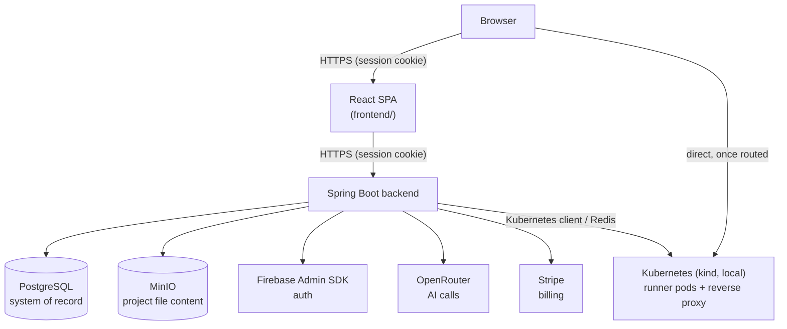

# VibeCraft

> Describe an idea, answer a short AI-tailored interview about it, and watch a real project get built — with live Kubernetes-backed previews and role-based team collaboration.

**VibeCraft** is an AI-assisted project-building platform in the Lovable/Bolt/v0 category: a user types a one-line idea, a short adaptive interview turns it into a spec, an AI chat conversation writes the actual project file by file, and a live preview shows the running result in a real Kubernetes pod while it's being built. Collaborators work on the same project with `OWNER`/`EDITOR`/`VIEWER` roles, and usage is metered against daily token and project quotas billed through Stripe.

This README is the entry point. Deeper, accurate reference material lives in [`docs/`](docs) — see the [Documentation Map](#documentation-map) below.

---

## Table of Contents

- [Features](#features)
- [How It Works](#how-it-works)
- [Architecture](#architecture)
- [Tech Stack](#tech-stack)
- [Getting Started](#getting-started)
- [Environment Variables](#environment-variables)
- [Project Structure](#project-structure)
- [Testing](#testing)
- [Documentation Map](#documentation-map)
- [Status & Roadmap](#status--roadmap)

---

## Features

- **Idea clarifier** — a 2–4 question interview, entirely written by the model for that specific idea (no fixed question bank), scaled by how much the prompt already says, compiled into a spec before the AI ever starts writing code.
- **Streaming AI code generation** — a live build checklist that ticks off as each file is written, with automatic detection and one-retry recovery when a generation stops mid-plan or narrates an edit it never delivers.
- **Teaching Mode** — an opt-in, per-file walkthrough of *why* the code is written the way it is, not just what it does, with clickable references that jump straight to the quoted line.
- **Live previews** — every project runs in its own Kubernetes pod behind a Redis-routed reverse proxy, shared correctly across collaborators (one person stopping their view doesn't take the preview away from someone else watching), auto-reclaimed when idle.
- **Code notes** — select any code and ask about it, or ask about the project in general; answers are read-only by construction (the model has no write-capable tool on this path) and saved privately per person.
- **Role-based collaboration** — `OWNER`/`EDITOR`/`VIEWER` per project, invites, project forking, pin/star, code search, and whole-project ZIP export.
- **Billing & quotas** — three Stripe-backed plans with real, enforced daily-token and project-count limits (a 402, not a silent failure), plus a usage-insights dashboard broken down by day/feature/project.

## How It Works

1. **Idea** — a short adaptive interview turns a one-line prompt into a spec (`POST /api/ideas/clarify` → `/compile`).
2. **Build** — the spec becomes the first message in an AI chat conversation. The model plans, reads files it needs, and writes/edits real files through a streamed, tag-based protocol.
3. **Persist** — each generated file is saved to object storage independently, so one bad file never loses the rest of a generation or the chat history.
4. **Preview** — a Kubernetes pod is claimed from a warm pool, the project's files are synced in, and `npm install && vite dev` runs inside it — routed to the browser through Redis and a small reverse proxy.
5. **Iterate** — further chat turns edit the running project; the live preview reflects a completed turn once its files finish writing.

The full request-flow-with-real-file-paths version of this, including sequence diagrams for the AI-generation and live-preview pipelines: [`docs/architecture/`](docs/architecture/README.md).

## Architecture



**Key boundary:** AI-generated/user code executes **only** inside a live-preview Kubernetes pod — never in-process in the backend. Full reasoning and the exact isolation mechanism: [`docs/architecture/`](docs/architecture/README.md) §3.3.

## Tech Stack

**Backend:** Java 25, Spring Boot 4.1 (Web MVC / Data JPA / Security), PostgreSQL, Maven, Lombok, MapStruct, Spring AI (OpenRouter), Firebase Admin SDK, JJWT (legacy rollback), Stripe Java SDK, MinIO Java SDK, fabric8 `kubernetes-client`, Spring Data Redis.

**Frontend:** React 18 + TypeScript, Vite 5, Tailwind CSS + shadcn/ui, `@tanstack/react-query`, CodeMirror 6, Firebase JS SDK, Vitest.

**Infra:** Kubernetes (`k8s/`) for live preview runner pods, a standalone Node reverse proxy (`proxy/`), Docker Compose for local Postgres/MinIO/Mailpit.

## Getting Started

### Prerequisites

Java 25, Maven Wrapper (bundled), Node.js + `npm`, Docker. Optional (live previews only): a local Kubernetes cluster (`kind`) and `kubectl`. Accounts: a Firebase project, an OpenRouter API key, and (for billing) a Stripe test-mode account.

### Quickstart

```bash
git clone https://github.com/Divyanshu2805/vibecraft.git
cd vibecraft

# Backend infra
docker compose -f services.docker-compose.yml up -d
cp .env.example .env    # fill in real values

# Backend services — mvnw.cmd on Windows, each in its own terminal, in this order
./mvnw -pl discovery-service spring-boot:run
./mvnw -pl gateway-service spring-boot:run
./mvnw -pl legacy-monolith spring-boot:run

# Frontend, in a fourth terminal
cd frontend
npm install
cp .env.example .env.local
npm run dev
```

Frontend: http://localhost:5173 · Gateway (the browser's actual API origin): http://localhost:8000 · legacy-monolith direct: http://localhost:8080

The backend is a multi-module Maven reactor mid-migration to microservices — see [`docs/migration/`](docs/migration/README.md) for what's moved so far. Full setup (including live previews, which need a Kubernetes cluster) and a troubleshooting table for known gotchas: [`docs/local-development/`](docs/local-development/README.md).

## Environment Variables

| Variable | Required | Purpose |
|---|---|---|
| `DB_USERNAME` / `DB_PASSWORD` | ✅ | PostgreSQL credentials |
| `JWT_SECRET` | ✅ | Legacy Bearer-token signing (rollback auth path) |
| `FIREBASE_PROJECT_ID` / `FIREBASE_CREDENTIALS_PATH` | ✅ | Primary auth — verifying Firebase ID tokens |
| `OPENROUTER_API_KEY` | ✅ | Every AI call (generation, idea clarifier, code insight) |
| `MINIO_ACCESS_KEY` / `MINIO_SECRET_KEY` | ✅ | Project file storage |
| `STRIPE_SECRET` / `STRIPE_WEBHOOK_SECRET` / `STRIPE_PRICE_PRO` / `STRIPE_PRICE_BUSINESS` | for billing | Everything else works without these |

Every backend value above is a bare placeholder in `application.yaml` with **no** committed fallback — a missing one fails startup rather than running insecurely. Full list with context: [`.env.example`](.env.example). The frontend has its own [`frontend/.env.example`](frontend/.env.example) (Firebase web config). Never commit real values for either.

## Project Structure

```
common-lib/                            shared internal-JWT/Feign/error-handling code for the microservices split
discovery-service/                     Eureka
gateway-service/                       Spring Cloud Gateway — the browser's single origin
legacy-monolith/src/main/java/com/java/vibecraft/    the original Spring Boot backend, unmodified —
                                        see docs/architecture/ for per-package ownership
frontend/                              React SPA
k8s/                                   Kubernetes manifests for live previews
proxy/                                 standalone Node reverse proxy (preview routing)
docs/                                  architecture, data model, API reference, local dev setup, migration map
```

Full per-module responsibilities and a "where do I change X" table: [`docs/architecture/`](docs/architecture/README.md). What's moved into a microservice so far (nothing yet — Phase 0 is scaffolding only): [`docs/migration/`](docs/migration/README.md).

## Testing

```bash
./mvnw -pl legacy-monolith test -Dtest=IdeaServiceImplTest,LlmResponseParserTest,PromptUtilsTest    # backend — see docs/local-development/ for the full named list
cd frontend && npm test                                                          # frontend — 270 tests
```

A bare `./mvnw test` does not currently pass (a pre-existing Windows timezone issue, unrelated to code correctness) — see `docs/local-development/troubleshooting.md`'s troubleshooting table before assuming a red run means something's broken.

## Documentation Map

| File | What it's for |
|---|---|
| [`CLAUDE.md`](CLAUDE.md) | Working agreement for AI coding agents in this repo — read-before-acting table, hard-won gotchas, guardrails |
| [`docs/architecture/`](docs/architecture/README.md) | Module map, request flows with real file paths, "where do I change X" |
| [`docs/schema/`](docs/schema/README.md) | Entities, ER diagram, enum/schema conventions |
| [`docs/api/`](docs/api/README.md) | Every endpoint, SSE stream formats, the full error taxonomy |
| [`docs/local-development/`](docs/local-development/README.md) | Setup, running live previews locally, a troubleshooting table |
| [`TODO.md`](TODO.md) | Known gaps, deferred features, open questions — local only, not pushed to GitHub |

## Status & Roadmap

Every backend service is implemented — no stubs remain as of the last full audit. Known gaps (an unenforced single-owner invariant, a nonexistent-project-id returning 403 instead of 404, no code-splitting on the frontend bundle, and others), and deferred product ideas (a static "Publish" alongside live previews, multi-stack preview support beyond React+Vite, an automatic preview-failure-to-AI-repair feedback loop) are tracked in `TODO.md` rather than here, so there's exactly one place that can go stale instead of two disagreeing ones.
