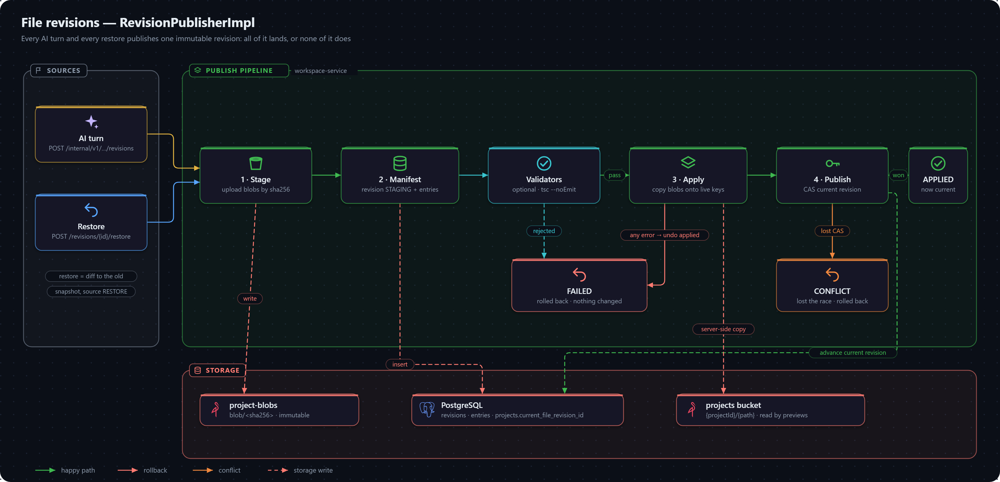

# File Revisions

Every change to a project's files — an AI turn or a restore — is published as one atomic, immutable **revision**. A revision either lands completely or not at all, and any earlier revision can be restored. The implementation lives in workspace-service: `RevisionPublisherImpl`, `RevisionManifestStore`, `RevisionServiceImpl` and `RevisionSnapshotReader`. The design rationale is in [ADR 0005](decisions/0005-content-addressed-file-revisions.md).

## Publishing a revision

1. **Stage.** Every changed path's new content is uploaded to a dedicated MinIO bucket (`project-blobs`, `minio.blob-bucket`) under `blob/<sha256>`. Blobs are content-addressed and immutable: the same bytes written twice, even across projects, land at the same key. A failure here leaves the live file layout and every table untouched, because nothing references the new content yet.
2. **Manifest.** One short Postgres transaction inserts a `PROJECT_FILE_REVISION` row in `STAGING` and one `PROJECT_FILE_REVISION_ENTRY` per changed path, recording both the new hash and the path's previous hash (the rollback data).
3. **Apply.** Each entry is copied server-side from its blob onto the project's live key (`{bucket}/{projectId}/{path}` — the layout every reader, including the preview pod's `mc mirror`, depends on), or removed for a delete. Any failure rolls back every entry already applied in that call using its previous hash, and marks the revision `FAILED`.
4. **Publish.** A single-statement compare-and-swap (`ProjectRepository.casAdvanceCurrentRevision`) advances `PROJECT.currentFileRevisionId` only if it still equals the revision this publish was staged against. Losing that race rolls back the same way and marks the revision `CONFLICT`.

The AI pipeline publishes one revision per turn through `POST /internal/v1/projects/{id}/revisions` ([internal API](../api/internal.md)).

## Restoring

Restore is not a special code path. `RevisionServiceImpl.restore` reconstructs the target revision's snapshot, diffs it against the project's current files, and publishes that diff through the same pipeline with `source = RESTORE`. Restores therefore always create a new, forward-only revision; history is never rewritten.

A snapshot at any revision is reconstructed by walking `parentRevisionId` back to the root and keeping each path's most recent entry (`ProjectFileRevisionRepository.reconstructSnapshot`, a recursive CTE).

The restore endpoints are in the [revisions API](../api/revisions.md). They answer 404 unless the revision belongs to the project in the path and is `APPLIED`.

## Files created before revisions existed

A `ProjectFile` with `contentHash IS NULL` predates this pipeline. It is adopted lazily the first time it is next touched: its current bytes are read once, hashed, and staged as-is, becoming that write's `previousContentHash`. There is no bulk backfill — a Flyway migration cannot hash MinIO objects, and a file that is never touched again never needs history.

## Validation before publish

`RevisionValidator` is an extension point: `RevisionPublisherImpl` runs every bean of that type between the manifest commit and apply, and a rejection needs no rollback because nothing has touched the live layout yet.

`RevisionBuildValidator` is the built-in implementation. It:

1. claims a fresh, disposable runner pod — never a pod already serving a preview, since a concurrent build could starve or kill a live dev server;
2. uploads the staged revision's full snapshot into it (fabric8's tar-based upload, safe for binary content);
3. runs `npm install`, then a configurable check command — `npx tsc --noEmit` by default;
4. rejects the revision on a non-zero exit, with the tool's diagnostic output;
5. always deletes the pod afterwards. A pod that is never released is still swept by `PreviewReaper`'s label-based orphan sweep.

`tsc --noEmit` is the default rather than `npm run build` because the starter template's `build` script is a plain `vite build`, which strips TypeScript types without checking them.

It is **off by default** (`revision-validation.enabled: false`) because every run is a cold `npm install`, which adds real latency to every AI turn. If the warm pool has no idle pod, validation fails open. All settings live under `revision-validation.*` in workspace-service's `application.yaml`.

## Current limits

- **No blob garbage collection.** Blobs are never deleted, so storage grows monotonically. That is what keeps every revision restorable; reference counting can be added when real usage calls for it.
- **No crash recovery mid-apply.** An in-request failure rolls back cleanly, but a process crash between two apply steps leaves a revision stuck in `STAGING` with no automatic reconciliation.
- **No user interface yet.** The list, preview-restore and restore endpoints exist and are tested, but the frontend doesn't call them.

These are tracked in [not yet built](../known-gaps/not-yet-built.md).
