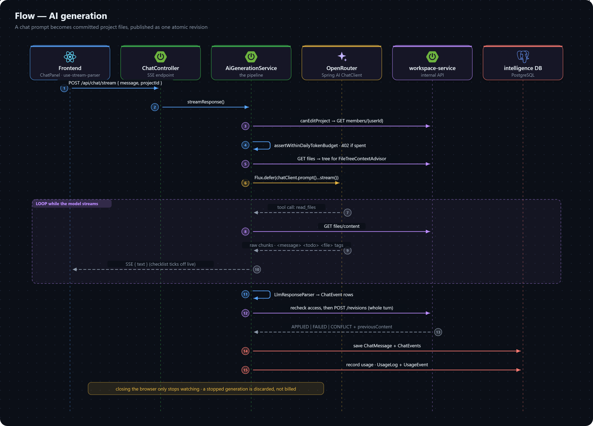

# Flow: AI Generation

The platform's core loop: a user asks for something in the project chat, and files actually get written. It runs in intelligence-service, which reaches workspace-service over the internal API for anything about the project.

## Steps

All paths below are under `intelligence-service/src/main/java/com/vibecraft/intelligence/`.

1. **`controller/ChatController.streamChat`** — the SSE endpoint. The `@PreAuthorize("@security.canEditProject(#projectId)")` gate sits on the service method.
2. **`service/impl/AiGenerationServiceImpl.streamResponse`** — the whole pipeline lives here. It calls `UsageService.assertWithinDailyTokenBudget()` *synchronously, before building the `Flux`*, so a quota refusal is a real HTTP 402 rather than an error event inside the stream. The plan's limit comes from account-service.
3. **`GenerationRegistry`** — the in-process record of a running generation. Closing the browser connection only stops *watching*; the generation continues and can be re-attached (`GET .../active/stream`) or stopped (`POST .../active/stop`). A second generation for the same project and user is a 409.
4. **`llm/advisors/FileTreeContextAdvisor`** — a Spring AI `StreamAdvisor` that injects the project's current file tree as an extra system message on every request, plus a notice if the starter template failed to copy (`templateInitIssue`).
5. **`llm/PromptUtils.getSystemPrompt(TeachingMode)`** — the system prompt defines a custom XML-tag protocol (`<tool>`, `<message>`, `<todo>`, `<file>`, `<delete>`, and `<learn>` when teaching mode is on) rather than Spring AI's structured output. See [ADR 0004](../decisions/0004-tag-based-generation-protocol.md). `llm/tools/CodeGenerationTools.readFiles` is the one tool the model can call.
6. **Retries.** The whole `chatClient.prompt()...` call is wrapped in `Flux.defer(...)`. Attaching `.retryWhen(...)` to an already-built stream does not work: Spring AI's advisor chain is single-use per subscription, so resubscribing throws. `Flux.defer` rebuilds the call, advisor chain included, on each attempt. An OpenRouter 429 is retried up to 3 times with backoff.
7. **`llm/LlmResponseParser`** — once the stream completes, extracts the tags from the raw text into typed `ChatEvent` rows (`THOUGHT`, `MESSAGE`, `TODO`, `FILE_EDIT`, `FILE_DELETE`, `LEARN`, `TOOL_LOG`). A `<todo path="...">` must match a later `<file path="...">` **byte for byte** — that string equality is the entire mechanism behind the client-side build checklist (`frontend/src/components/ChatEventRenderer.tsx`).
8. **`finalizeChats`** — runs on `Schedulers.boundedElastic()` after the stream, off the request thread, so it carries the user id explicitly instead of reading it from a `SecurityContext` that isn't there. It:
   - rechecks that the user still has access to the project (the authoritative check, even if a stop request from a project delete never arrived);
   - builds one `PublishRevisionRequest` from the turn's `FILE_EDIT` / `FILE_DELETE` events and makes a single `publishRevision` call. Publishing is all-or-nothing: a `FAILED` or `CONFLICT` response marks every changed path as failed, and those events are dropped before the turn is saved, so a failed write is never recorded as a success. Each edited file's `previousContent` (for the diff view) comes back on the same response;
   - saves the `ChatMessage` and its `ChatEvent` children with `saveAll`, falling back to one-at-a-time saves if the batch fails, so one bad event doesn't lose an otherwise good conversation record.

   **A stopped generation never reaches this step**: its output is discarded and its tokens are not billed.
9. **`llm/AiUsageRecorder`** — records the exchange's token usage into the daily counter and the ledger.

## In-turn recovery

The model gets feedback only within the current request:

- If it narrates an edit but produces no `FILE_EDIT` events (`looksLikeAbandonedEdit`), the turn is retried once.
- If it returns no text at all, the turn is retried once. A turn that is still empty is saved with an explicit "nothing was changed" message instead of a silent no-op.

Runtime failures — a project that fails to install or boot in its preview — are not fed back into another AI turn automatically. See [not yet built](../../known-gaps/not-yet-built.md).

## Optional pre-publish validation

`RevisionBuildValidator` can type-check a revision in a disposable runner pod before it is applied. It is off by default (`revision-validation.enabled: false`). See [File revisions](../file-revisions.md#validation-before-publish).

## Related

- [Chat API](../../api/chat.md) and [streaming formats](../../api/streaming.md).
- [intelligence-service data model](../../schema/intelligence-service.md) — `CHAT_MESSAGE`, `CHAT_EVENT`, usage tables.
- [Security model](../security-model.md#ai-prompt-boundaries) — why code insight cannot write files.
