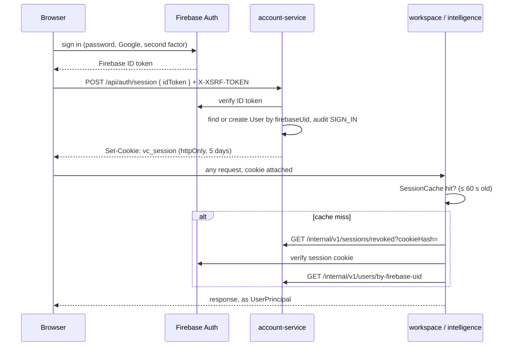

# Flow: Authentication

How a user signs in, and how every service trusts the resulting session. Firebase is the only sign-in method; the backend never sees a password.

## Steps

1. **The browser signs in against Firebase directly.** No request reaches the backend yet. See `frontend/src/lib/firebase-auth.ts`.
2. **The ID token is exchanged for a session.** `POST /api/auth/session { idToken }` → Gateway → account-service `AuthController` → `SessionServiceImpl.createSession`:
   - `FirebaseIdentityVerifier` verifies the token;
   - the `User` is found, or created, by `firebaseUid`;
   - `SessionCookies` mints the `httpOnly` `vc_session` cookie, valid for 5 days;
   - `AuthAuditService` records a `SIGN_IN` event.
3. **Every later request carries the cookie** to whichever service owns the URL. In each service, `SessionAuthFilter` (ahead of `UsernamePasswordAuthenticationFilter`) hands it to the `SessionAuthenticator`, which checks its in-process `SessionCache` first. An entry lives at most `app.auth.revocation-check-interval` (60 s). On a miss it:
   - checks whether the cookie's hash has been revoked;
   - verifies the cookie with Firebase;
   - resolves the Firebase uid to a user.

   In account-service the two lookups read local tables; in workspace-service and intelligence-service they are internal calls to account-service. The result is a `UserPrincipal` in the `SecurityContext`, read everywhere through `AuthUtil.getCurrentUserId()`.
4. **Sign-out.** `POST /api/auth/logout` records a `RevokedSession` (the cookie's SHA-256) in account's database. `SessionEvictionNotifier` then tells every running workspace and intelligence instance, found through Eureka, to drop that entry (`POST /internal/v1/sessions/evict`), so the cookie stops working immediately rather than after the 60-second cache lifetime. Delivery is best-effort and bounded (500 ms connect, 1 s read); the cache lifetime is the backstop. *Sign out everywhere* revokes at Firebase and evicts by user.
5. **Role checks happen per request** via `@PreAuthorize("@security.canEditProject(#projectId)")` → `SecurityExpressions`. In workspace this reads its own `project_members` table; in intelligence it asks workspace. Both resolve the same `ProjectRole` → `Set<ProjectPermission>` mapping (see [enums](../../schema/enums.md)).

## Related

- [Authentication API](../../api/authentication.md) — the endpoints, CSRF handling, and rate limits.
- [Security model](../security-model.md) — tenancy, CSRF, and the internal API boundary.
- [account-service data model](../../schema/account-service.md#auth_audit_event--revoked_session) — `AUTH_AUDIT_EVENT` and `REVOKED_SESSION`.
