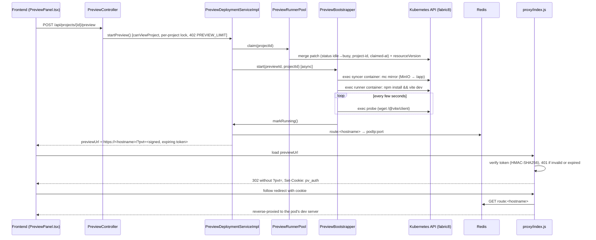

# Flow: Live Preview

Starting a preview claims a warm Kubernetes pod, syncs the project's files into it, runs the Vite dev server there, and routes a hostname to it through Redis and a small reverse proxy. This runs entirely in workspace-service.

## Steps

1. **`PreviewController` → `PreviewDeploymentServiceImpl`.** Start and stop are serialized per project by an in-process lock, so two collaborators opening the preview together share one runner, and a stop can't shut down a runner someone else is joining.
2. **`PreviewRunnerPool` claims a warm pod.** The pool is a Deployment that only selects pods labelled `status=idle`; relabelling a claimed pod to `busy` detaches it from the ReplicaSet, and a replacement starts warming immediately. The claim is a **JSON merge patch carrying the listed `resourceVersion`**, so two simultaneous claims of the same pod can't both win — the API server answers the loser with a 409 and it tries the next pod. No idle pod at all is a `CapacityUnavailableException` (503, `CAPACITY_UNAVAILABLE`).
3. **`PreviewBootstrapper` starts the app.** It execs into the pod's two containers:
   - `syncer` mirrors the project's MinIO objects into `/app` with the `mc` CLI, then keeps watching for changes;
   - `runner` runs `npm install && vite dev --host 0.0.0.0 --port 5173`.

   It polls a probe script (`wget /@vite/client`) until the dev server answers. The bootstrap claims ownership of the preview row and refreshes a heartbeat (`Preview.bootstrapHeartbeatAt`) on every poll. Once running, `PreviewReaper` keeps checking the dev server's and the file-sync watcher's actual process health.
4. **`PreviewRouter`** writes `route:<hostname> → <podIp>:<port>` to Redis.
5. **`proxy/index.js`** — a standalone Node process, not part of any Spring service — verifies the access token (or the cookie it was exchanged for), reads the route from Redis, and reverse-proxies the request to the pod. It also records `seen:<hostname>` timestamps for the idle reaper. A Redis failure and a missing route return distinct responses, and both HTTP and WebSocket proxying are timeout-bounded, so a wedged dev server fails a request rather than hanging it.
6. **Teardown.** `PreviewSession` (one per collaborator), `PreviewLifecycle` and `PreviewReaper` govern it; see [`PREVIEW_SESSION`](../../schema/workspace-service.md#preview_session). The runner is torn down only when its last session ends, or when the reaper finds it idle, its pod gone, or its dev server crashed or unresponsive. A dead file-sync watcher is relaunched instead. Every reaper action re-reads the preview under its project's lock just before acting, since a snapshot taken a scan earlier can be stale against a concurrent stop or restart. On startup, a leftover `CREATING` row is failed only if its bootstrap heartbeat is missing or stale, so a rolling deployment's new instance doesn't fail a bootstrap that another live instance still owns.

## Isolation boundary

Generated and user-authored code executes **only** inside a runner pod, reached through the fabric8 Kubernetes client's `exec` API — never in-process in a Spring service, never through a local shell. Runner pods run as a non-root user with every Linux capability dropped, no service-account token, a PID limit, resource quotas, and a `NetworkPolicy` that admits traffic only from the preview proxy and blocks the cluster's private ranges and cloud metadata endpoints. Any change that runs untrusted project content outside a runner pod is out of bounds. See the [security model](../security-model.md#untrusted-code-isolation).

## Access boundary

A preview's hostname is not a credential. `util/PreviewAccessToken` signs `hostname + "." + expiresAt` with HMAC-SHA256 (`preview.access-token-secret`), and `PreviewDeploymentServiceImpl` appends a fresh token to every `previewUrl` it returns — always from a method already guarded by `@PreAuthorize`. `proxy/auth.js` implements the identical scheme in Node to verify it statelessly; `PreviewAccessTokenTest` (Java) and `proxy/auth.test.js` (Node) pin the same known-good HMAC value so the two implementations can't drift.

On first load the proxy exchanges a valid token for a `SameSite=None; Secure` cookie (`None` because the preview is shown in a cross-site iframe) and redirects to drop the token from the URL. `preview.access-token-ttl` (6 hours by default) bounds how long a removed member's already-open tab keeps working: this is an expiry bound, not instant revocation.

`PreviewPanel.tsx` fetches a fresh token on every poll but deliberately does not feed it straight into the iframe's `src`, which would reload the embedded app every poll and drop its state.

## Timing

The first start of a preview is dominated by `npm install`. In production the warm pool's init container seeds each idle pod's `node_modules` from a pre-built runner image (`docker/preview-runner.Dockerfile`), which cuts a typical start to a few seconds. The overall limit is `preview.boot-timeout` (4 minutes).

## Related

- [Live previews API](../../api/previews.md).
- [Running previews locally](../../local-development/live-previews.md).
- [Preview capacity](../../deployment/capacity.md) in production.
