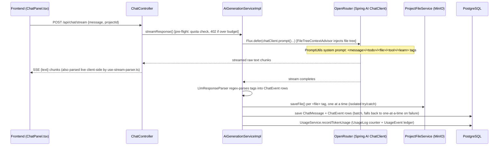
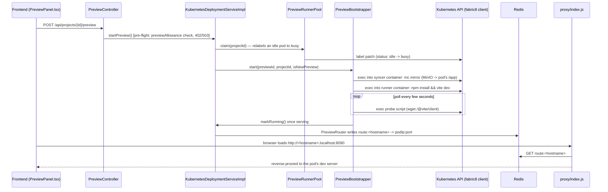

# 3. Request Flows

Three flows, each with real file paths, since these three cover almost everything non-trivial in the system.

## 3.1 Auth: signing in

1. **Browser signs in against Firebase directly** — no request to this backend yet. `frontend/src/lib/firebase-auth.ts`.
2. **Exchange the ID token** — `POST /api/auth/session { idToken }` → `AuthController` → `FirebaseIdentityVerifier` (verifies the token against Firebase Admin SDK) → finds/creates the `User` by `firebaseUid` → `SessionCookies` mints an `httpOnly` cookie → `AuthAuditService` records `SIGN_IN`.
3. **Every later request** carries that cookie. `security/SessionAuthFilter` (a `OncePerRequestFilter`, ahead of `UsernamePasswordAuthenticationFilter`) reads it, checks `SessionCache`/`RevokedSession` (at most once per `app.auth.revocation-check-interval`, default 60s — a sign-out-everywhere doesn't need to hit the DB on every single request), and populates `SecurityContext` with a `UserPrincipal`. Every downstream service reads the caller via `AuthUtil.getCurrentUserId()`.
4. **Role/permission checks** happen per-request via `@PreAuthorize("@security.canEditProject(#id)")` → `security/SecurityExpressions` → `ProjectMemberRepository.findRoleByProjectIdAndUserId` → `ProjectRole`'s `Set<ProjectPermission>`. See `docs/schema/`'s Domain Vocabulary for the permission mapping.

Firebase is the only sign-in method — the legacy username/password Bearer-token path (`LegacyAuthController`, `AuthService`, `PasswordResetService`) was removed once Firebase was confirmed stable. `AuthUtil` is now a thin `SecurityContextHolder` reader with no JWT logic of its own; the JWT machinery that remains (`common-lib`'s `InternalJwtService`) is an unrelated, internal service-to-service concern — see `docs/migration/`.

## 3.2 AI chat: prompt → generated files

This is the platform's core loop — a user asks for something, and files actually get written.

Real files, in the order the flow touches them:

1. **`ChatController.streamResponse`** (`controller/ChatController.java`) — `@PreAuthorize("@security.canEditProject(#projectId)")` on the service method, not the controller.
2. **`AiGenerationServiceImpl.streamResponse`** (`service/impl/`) — the whole pipeline lives here. Calls `UsageService.assertWithinDailyTokenBudget()` **synchronously, before building the `Flux`**, so a quota refusal is a real HTTP 402, not an SSE error event.
3. **`llm/advisors/FileTreeContextAdvisor`** — a Spring AI `StreamAdvisor` that injects the project's current file tree as an extra system message on every request (and a NOTICE if `Project.templateInitIssue` is set).
4. **`llm/PromptUtils.getSystemPrompt(TeachingMode)`** — the ~260-line system prompt: a custom XML-tag protocol (`<tool>`/`<message>`/`<todo>`/`<file>`/`<delete>`, plus `<learn>` when teaching mode is on), **not** Spring AI's structured-output format. `llm/tools/CodeGenerationTools.readFiles` is the one `@Tool` the model can call.
5. **Retry wrapping**: the whole `chatClient.prompt()...` call is wrapped in `Flux.defer(...)`, not `.retryWhen(...)` attached to the stream directly — Spring AI's advisor chain is single-use per subscription, so resubscribing to an already-built `Flux` on retry throws. `Flux.defer` rebuilds the whole call (fresh advisor chain included) on each retry. Retries an OpenRouter 429 up to 3 times with backoff.
6. **`llm/LlmResponseParser`** — once the stream completes, regex-matches the tags back out of the raw text into typed `ChatEvent` rows (`THOUGHT`/`MESSAGE`/`TODO`/`FILE_EDIT`/`LEARN`/`TOOL_LOG`). A `<todo path="...">`'s `path` must match a later `<file path="...">` **byte for byte** — that string equality is the entire client-side checklist tick-off mechanism (`frontend/src/components/ChatEventRenderer.tsx`).
7. **`ProjectFileService.saveFile`** (`service/ProjectFileService.java`, MinIO-backed) — each `<file>` tag is saved independently, so one bad file doesn't lose the rest of the batch or the chat history.
8. **Persistence**: `ChatMessage` + its `ChatEvent` children are saved (`saveAll`, falling back to one-at-a-time if the batch fails — a single bad event shouldn't destroy an otherwise-good conversation record).
9. **`llm/AiUsageRecorder`** — records the exchange's token usage. Note the generation pipeline runs on `Schedulers.boundedElastic()` post-stream, off the original request thread, so it explicitly passes the user id rather than reading it from `SecurityContext` (which wouldn't exist there).

**Self-correction that does *not* exist yet:** if the generated code fails to install or fails to boot in the live-preview pod, nothing feeds that failure back into another AI turn automatically. The model gets feedback only within *this* request/response cycle (e.g. `looksLikeAbandonedEdit` retrying once if the model narrated an edit but produced zero `FILE_EDIT` events) — never from an actual runtime/build failure. See `TODO.md`'s "AI prompt/generation reliability improvements" if this is being worked on.

## 3.3 Live preview: request flow (start a preview)

Real files:

1. **`PreviewController`** (`controller/PreviewController.java`) → **`DeploymentService`/`KubernetesDeploymentServiceImpl`** (`service/DeploymentService.java`, `service/impl/KubernetesDeploymentServiceImpl.java`).
2. **`PreviewRunnerPool`** (`service/impl/`) — claims a warm pod from the idle/busy label-swapped pool (`k8s/runner-pods.yml`: a Deployment that only selects `status=idle`, so relabelling a claimed pod to `busy` detaches it from the ReplicaSet and a replacement idle pod starts warming immediately).
3. **`PreviewBootstrapper`** (`service/impl/`) — execs into the pod's two containers: `syncer` (mirrors the project's MinIO objects in via the `mc` CLI, then watches for later changes) and `runner` (`npm install && vite dev --host 0.0.0.0 --port 5173`). Polls a probe script (`wget /@vite/client`, the single most Vite-specific line in the whole preview pipeline) until the dev server answers.
4. **`PreviewRouter`** (`service/impl/`) — once serving, writes `route:<hostname> -> <podIp>:<port>` to Redis.
5. **`proxy/index.js`** (a standalone Node process, **not** part of the Spring Boot app) — reads that route from Redis and reverse-proxies the browser's request to the pod directly; also records `seen:<hostname>` timestamps in Redis for the idle reaper.
6. **`PreviewSession`** (per-collaborator) and **`PreviewLifecycle`**/**`PreviewReaper`** govern teardown — see `docs/schema/`'s `PREVIEW`/`PREVIEW_SESSION` entities for the full session-sharing model.

**Isolation boundary, stated plainly:** generated/user code executes **only** inside a runner pod, reached by the fabric8 Kubernetes client's `exec` API — never in-process in the Spring Boot backend, never via a local shell call. If you're extending this, any change that runs untrusted project content outside a runner pod is a hard no.
