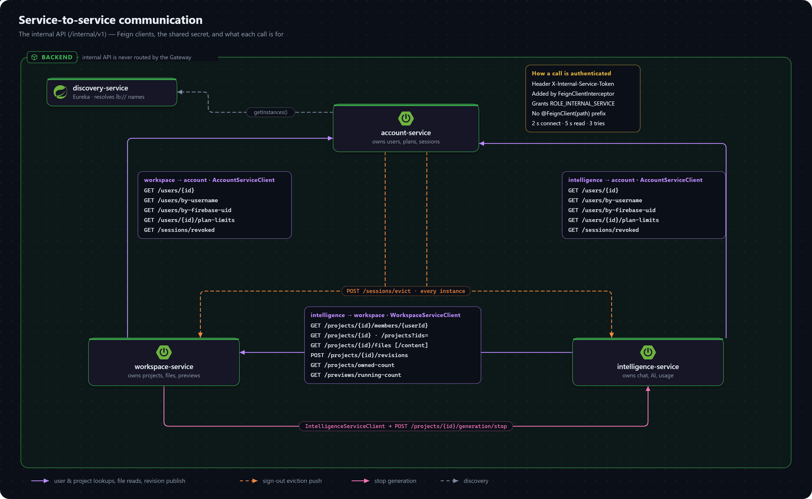

# Service Communication

The browser talks to one origin, the Gateway. The services talk to each other over a private internal API that the Gateway never exposes.



## The Gateway

`gateway-service` matches each request path against an ordered route table (`gateway-service/src/main/resources/application.yaml`) and forwards it, unmodified, to the service that owns it.

- **Order is load-bearing.** `/api/projects/*/code/**` (intelligence) sits underneath `/api/projects/**` (workspace), and only wins because its `order` is lower.
- **There is no catch-all route.** A path no route owns is a 404 from the Gateway itself.
- **`/internal/**` matches no route**, so it is never reachable through the Gateway.
- **The Gateway adds no authentication.** Each service authenticates its own requests.
- `RoutingTableTest` evaluates the real route table against every endpoint. Run it after any controller or route change:

  ```bash
  ./mvnw -pl gateway-service test -Dtest=RoutingTableTest
  ```

## Internal API

Each service exposes `/internal/v1/**` for the other services, never for the browser.

**Authentication.** `InternalServiceAuthFilter` requires the shared secret (`INTERNAL_SERVICE_SHARED_SECRET`) in the `X-Internal-Service-Token` header. A caller that presents it is authenticated as the `internal-service` principal with the `ROLE_INTERNAL_SERVICE` authority, and every service's filter chain requires **that authority** on `/internal/**` — not merely an authenticated caller. That distinction matters: `SessionAuthFilter` would happily authenticate a signed-in user's cookie on the same path, and these endpoints answer for arbitrary user and project ids with no ownership check of their own. See the [security model](security-model.md#internal-api-boundary).

**Discovery.** Callers resolve each target by service name through Eureka.

| Endpoint (`/internal/v1/…`) | Owner | Called by | Purpose |
|---|---|---|---|
| `GET users/{id}`, `users/by-username`, `users/by-firebase-uid` | account | workspace, intelligence | Resolving a session's Firebase uid to a user; invite by email |
| `GET sessions/revoked?cookieHash=` | account | workspace, intelligence | The revocation check when a session isn't in the local cache |
| `GET users/{id}/plan-limits` | account | workspace, intelligence | The effective plan's limits (free-tier fallback included) for quota checks |
| `POST sessions/evict` | workspace, intelligence | account | Push-evicting a signed-out session from their local caches |
| `GET projects/{id}/members/{userId}` | workspace | intelligence | The caller's `ProjectRole` on a project (`role: null` means not a member) |
| `GET projects/{id}`, `projects?ids=`, `projects/owned-count?userId=` | workspace | intelligence | Project summaries (deleted ones included, for usage insights); a user's owned-project count |
| `GET previews/running-count?userId=` | workspace | intelligence | The user's open previews for the usage meter — the same count the preview quota is checked against |
| `GET projects/{id}/files`, `GET projects/{id}/files/content` | workspace | intelligence | The file tree and file content for prompts and code insight |
| `POST projects/{id}/revisions` | workspace | intelligence | Publishing one AI turn's file changes as a single atomic revision (see [File revisions](file-revisions.md)) |
| `POST projects/{id}/generation/stop?userId=` | intelligence | workspace | Stopping in-flight generations that a project delete or member removal just revoked |

The complete request and response shapes are in the [internal API reference](../api/internal.md).

## Calling another service

Adding a call between services takes three pieces: an `Internal*Controller` endpoint in the owning service, a method on the caller's `feign/` client, and — if the payload is shared — a DTO in `common-lib`'s `dto` package.

`FeignClientInterceptor` attaches the shared-secret header only to paths that start with `/internal/`. A `@FeignClient(path = "...")` prefix hides the path from it, and every call through that client becomes a 401 — which surfaces as a 500 on whatever user request triggered it. Keep the full path on each method instead.

**Timeouts and retries.** Every Feign call is bounded:

- `feign.client.config.default.connectTimeout` / `readTimeout` (2 s / 5 s, in each caller's `application.yaml`) caps a single attempt.
- `common-lib`'s `FeignResilienceConfig` gives every client a bounded `Retryer` — 3 attempts with 100 ms–1 s backoff — which fires only on a `RetryableException` (a connect or read timeout, or a refused connection). A decoded 4xx or 5xx response is surfaced once, never retried blindly.

This keeps one slow or unreachable service from stalling most requests through the services that depend on it. It matters most for account-service, since session authentication itself calls it.

## Consequences of database-per-service

- **A cross-service reference is a plain id column, never a foreign key.** `project_members.user_id` points at a user in another database, so a dangling id is possible. See [cross-service references](../schema/cross-service-references.md).
- **An internal endpoint enforces no user permission of its own.** The caller has already authorized the user request it is acting on. That is exactly why the authority requirement above is the only thing standing between these endpoints and an end user.
- **Consistency across services is best-effort.** There are no distributed transactions. See [known constraints](../known-gaps/constraints-and-trade-offs.md).
