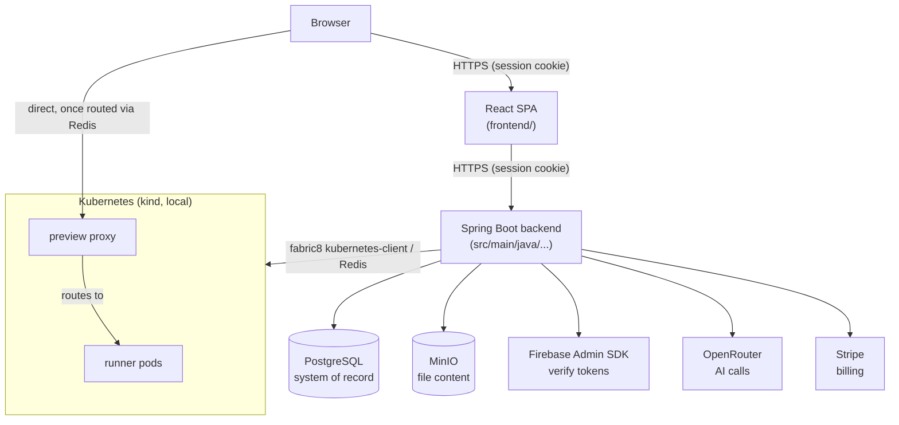

# 1. System Context

VibeCraft is a single Spring Boot backend and a separate React SPA frontend, both in this one repository. There is no microservice split beyond the live-preview subsystem, which really does run as separate processes (Kubernetes pods + a standalone Node proxy) because generated user code has to execute somewhere the backend itself never touches.

**External services this depends on:**

| Service | What it's used for | Where |
|---|---|---|
| PostgreSQL | The only system-of-record database | `spring.datasource` |
| MinIO (S3-compatible) | Project file content (the DB only stores file *metadata*) | `config.StorageConfig` |
| Firebase Authentication | Every sign-in method — this server only verifies tokens, never collects passwords itself (except the legacy rollback path) | `config.FirebaseConfig` |
| OpenRouter (OpenAI-compatible API) | Every AI call — code generation, the idea clarifier, code insight, project naming | `config.AiConfig`, `spring.ai.openai.*` |
| Stripe | Subscription billing | `config.PaymentConfig` |
| Kubernetes (a `kind` cluster locally) + Redis | Live preview runner pods and hostname routing | `config.KubernetesConfig`/`RedisConfig` |
| Mailpit (dev) / a real SMTP relay (prod) | Password-reset emails only (Firebase sends its own reset emails for Firebase accounts) | `spring.mail` |

**What this platform is *not* responsible for:** it never executes AI-generated code anywhere except inside a live-preview Kubernetes pod — not in the request thread, not in a background job in the same process. There's no in-process sandbox and never has been; see [§3.3 Live preview](request-flows.md#33-live-preview-request-flow-start-a-preview) for the actual isolation boundary.

