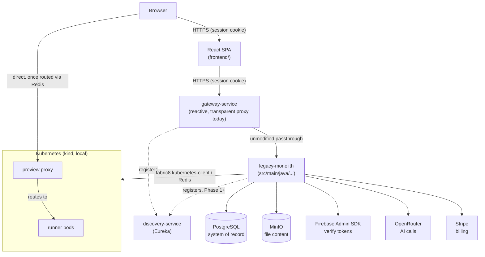

# 1. System Context

**This codebase is mid-migration from a monolith to microservices** — see `docs/migration/` for what's moved so far, why, and where to look for something that used to live in one place. Everything below describes the monolith's *internal* module structure, which as of this migration's Phase 0 is still exactly accurate: `legacy-monolith/` is the same backend described here, byte-for-byte, just relocated into its own Maven module. What's changed at the system level is the request path in front of it: the browser's single origin is now a new `gateway-service` (Spring Cloud Gateway, reactive so it doesn't buffer the two SSE streams), which today is a purely transparent reverse proxy — every request reaches `legacy-monolith` unmodified, so nothing in the flows below has actually changed yet. A new `discovery-service` (Eureka) exists for `gateway-service` and (from Phase 1 onward) the extracted services to find each other by name instead of hardcoded URLs. As each domain is actually extracted into its own service, this section gets rewritten to match — Phase 0 only changes what's *in front of* the monolith, not what's inside it yet.

VibeCraft's backend logic is still, today, a single Spring Boot application and a separate React SPA frontend. There is no domain-level microservice split yet beyond the live-preview subsystem, which already runs as separate processes (Kubernetes pods + a standalone Node proxy) because generated user code has to execute somewhere the backend itself never touches — and beyond the new Gateway/Eureka pair described above, which changes the network topology in front of the app without changing anything the app itself does.

**External services this depends on:**

| Service | What it's used for | Where |
|---|---|---|
| PostgreSQL | The only system-of-record database | `spring.datasource` |
| MinIO (S3-compatible) | Project file content (the DB only stores file *metadata*) | `config.StorageConfig` |
| Firebase Authentication | Every sign-in method — this server only verifies tokens, never collects passwords itself (except the legacy rollback path) | `config.FirebaseConfig` |
| OpenRouter (OpenAI-compatible API) | Every AI call — code generation, the idea clarifier, code insight, project naming | `config.AiConfig`, `spring.ai.openai.*` |
| Stripe | Subscription billing | `config.PaymentConfig` |
| Kubernetes (a `kind` cluster locally) + Redis | Live preview runner pods and hostname routing | `config.KubernetesConfig`/`RedisConfig` |
| Mailpit (dev) / a real SMTP relay (prod) | Password-reset emails only (Firebase sends its own reset emails for Firebase accounts) | `spring.mail` |

**What this platform is *not* responsible for:** it never executes AI-generated code anywhere except inside a live-preview Kubernetes pod — not in the request thread, not in a background job in the same process. There's no in-process sandbox and never has been; see [§3.3 Live preview](request-flows.md#33-live-preview-request-flow-start-a-preview) for the actual isolation boundary.

