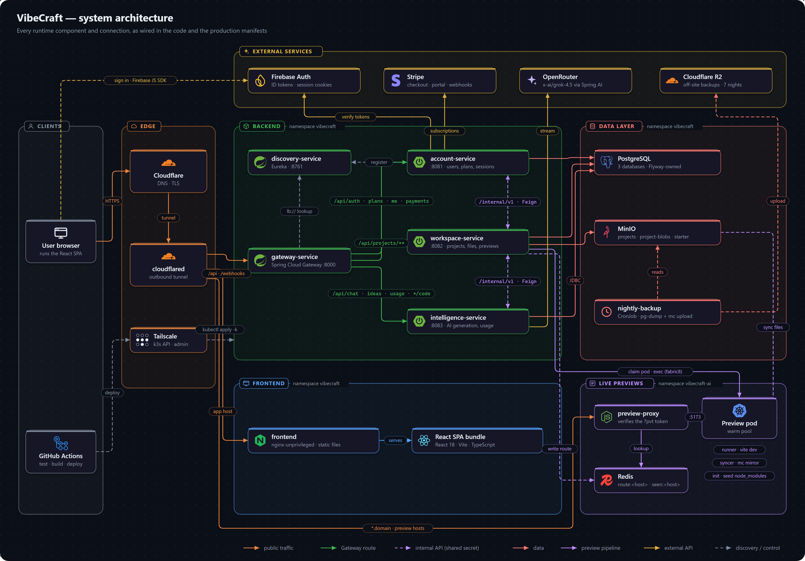

# System Context

VibeCraft is a React single-page app in front of a Spring Boot 4.1 (Java 25) backend made of three domain services, each with its own database, behind one Gateway. Live previews run outside the JVMs entirely — in Kubernetes pods behind a standalone Node proxy — because generated project code has to execute somewhere the backend itself never touches.

## Services

| Service | Port | Owns | Database |
|---|---|---|---|
| `gateway-service` | 8000 | The browser's single origin: an ordered URL → service route table. No auth logic of its own. Reactive (Spring Cloud Gateway), so it never buffers the SSE streams. | — |
| `discovery-service` | 8761 | Eureka. Services find each other by name (`lb://account-service`), not by address. | — |
| `account-service` | 8081 | Users, plans, subscriptions, Stripe billing, the sign-in session and its audit trail. `/api/auth/**`, `/api/plans`, `/api/me/**`, `/api/payments/**`, `/webhooks/payment`. | `vibecraft-account-db` |
| `workspace-service` | 8082 | Projects, members, files, file revisions, and the whole live-preview pipeline. `/api/projects/**` (except `.../code/**`) and `/api/previews`. | `vibecraft-workspace-db` |
| `intelligence-service` | 8083 | Chat generation, code insight and notes, the idea clarifier, usage metering. `/api/chat/**`, `/api/ideas/**`, `/api/usage/**`, `/api/projects/{id}/code/**`. | `vibecraft-intelligence-db` |
| `common-lib` | — | Not a service: the shared error shape, the session-authentication kit, the internal-call plumbing, and cross-service DTOs. | — |

All three databases live on one Postgres server. A service never reads another service's tables: anything it needs from another domain it asks for over that service's [internal API](service-communication.md#internal-api).

## External systems

| System | Used for | Service · configured in |
|---|---|---|
| PostgreSQL | System of record — one database per service, schema owned by that service's Flyway migrations | all three · `spring.datasource`, `db/migration/` |
| Firebase Authentication | Every sign-in method. account-service exchanges a Firebase ID token for a session cookie; every service verifies that cookie. No password ever reaches the backend. | account (mints and verifies), workspace and intelligence (verify) · `FirebaseConfig` |
| MinIO (S3-compatible) | Project file *content* — the database keeps only metadata | workspace · `config.StorageConfig` |
| OpenRouter (OpenAI-compatible API) | Every AI call — code generation, the idea clarifier, code insight | intelligence · `config.AiConfig`, `spring.ai.openai.*` |
| Stripe | Subscription billing | account · `config.StripeConfig` |
| Kubernetes + Redis | Live-preview runner pods and preview hostname routing | workspace · `config.KubernetesConfig`, `config.RedisConfig` |

## What the platform never does

It never executes AI-generated or user-authored code anywhere except inside a live-preview Kubernetes pod — not in a request thread, not in a background job, not in any service. There is no in-process sandbox. The isolation boundary is described in [Live preview](flows/live-preview.md#isolation-boundary) and the [security model](security-model.md#untrusted-code-isolation).

## Diagram

In production the same services run in-cluster on a single k3s node behind a Cloudflare tunnel; see [Deployment](../deployment/README.md) for that topology.
