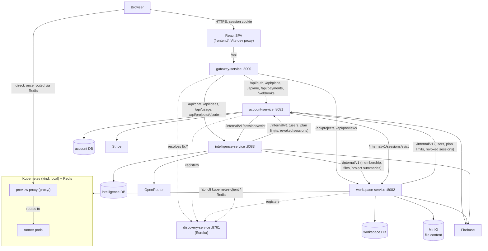

# 1. System Context

VibeCraft is a React SPA in front of a Spring Boot 4.1 (Java 25) backend made of three domain services, each with its own database, behind one Gateway. Live previews run outside the JVMs entirely — in Kubernetes pods behind a standalone Node proxy — because generated user code has to execute somewhere the backend itself never touches.

| Service | Port | Owns | Database |
|---|---|---|---|
| `gateway-service` | 8000 | The browser's single origin: an ordered URL → service route table. No auth logic of its own. Reactive (Spring Cloud Gateway), so it doesn't buffer the SSE streams. | — |
| `discovery-service` | 8761 | Eureka. Services find each other by name (`lb://account-service`), not by address. | — |
| `account-service` | 8081 | Users, plans, subscriptions, Stripe billing, the sign-in session and its audit trail. `/api/auth/**`, `/api/plans`, `/api/me/**`, `/api/payments/**`, `/webhooks/payment`. | `vibecraft-account-db` |
| `workspace-service` | 8082 | Projects, members, files, and the whole live-preview pipeline. `/api/projects/**` (except `.../code/**`) and `/api/previews`. | `vibecraft-workspace-db` |
| `intelligence-service` | 8083 | Chat generation, code insight and notes, the idea clarifier, usage metering. `/api/chat/**`, `/api/ideas/**`, `/api/usage/**`, `/api/projects/{id}/code/**`. | `vibecraft-intelligence-db` |
| `common-lib` | — | Not a service: the shared exception/response shape, the internal-call plumbing, cross-service DTOs. | — |

All three databases live on one local Postgres server. A service never reads another's tables: anything it needs from another domain it asks for over that service's internal API (§3).

**External systems, and which service talks to them:**

| System | Used for | Service · where |
|---|---|---|
| PostgreSQL | System of record — one database per service, schema owned by that service's Flyway migrations | all three · `spring.datasource`, `db/migration/` |
| Firebase Authentication | Every sign-in method. Account exchanges an ID token for a session cookie; every service verifies that cookie. No password ever reaches this backend. | account (mints + verifies), workspace and intelligence (verify) · `config.FirebaseConfig` |
| MinIO (S3-compatible) | Project file *content* (the database keeps only metadata) | workspace · `config.StorageConfig` |
| OpenRouter (OpenAI-compatible API) | Every AI call — code generation, the idea clarifier, code insight | intelligence · `config.AiConfig`, `spring.ai.openai.*` |
| Stripe | Subscription billing | account · `config.StripeConfig` |
| Kubernetes (a `kind` cluster locally) + Redis | Live-preview runner pods and hostname routing | workspace · `config.KubernetesConfig`, `config.RedisConfig` |

**What this platform is *not* responsible for:** it never executes AI-generated code anywhere except inside a live-preview Kubernetes pod — not in a request thread, not in a background job in any service. There is no in-process sandbox and never has been; see [§4.3](request-flows.md#43-live-preview-start-a-preview) for the actual isolation boundary.

