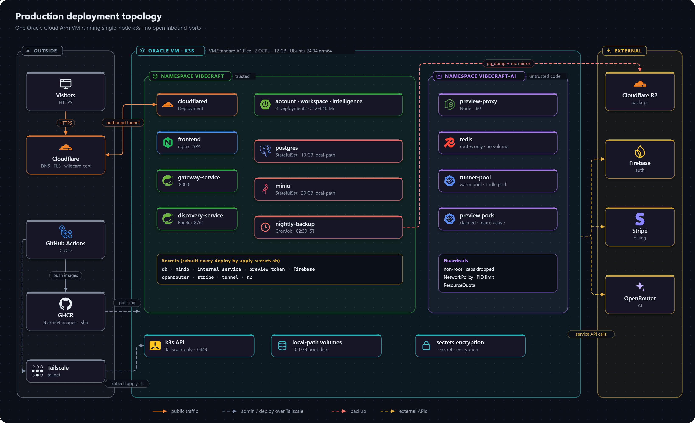

# Deployment

How VibeCraft runs in production: a single free-tier Arm VM running single-node k3s, behind a Cloudflare tunnel, deployed by GitHub Actions. The design rationale is in [ADR 0007](../architecture/decisions/0007-single-node-k3s-deployment.md); day-to-day running is covered in [Operations](../operations/README.md).

**Key properties**

- **No open inbound ports.** Web traffic arrives through the Cloudflare tunnel; deploys and administration arrive over Tailscale.
- **Continuous deployment** with tests, a smoke test and automatic rollback. No secret lives on the server: every Kubernetes Secret is rebuilt from a GitHub environment on each deploy.
- **Portable.** Nothing depends on Oracle. The same Kustomize manifests run on a local kind cluster, so moving hosts is a settings change plus a restore.
- **About $0 a month**, plus a domain and a capped AI key.

## Contents

| Page | Covers |
|---|---|
| [Infrastructure](infrastructure.md) | The machine, network, hostnames, namespaces, storage and external services |
| [Kubernetes manifests](kubernetes.md) | `deploy/k8s/` layout, overlays, resource limits, RBAC, the kind rehearsal |
| [Container images](container-images.md) | The eight images and how each is built |
| [CI/CD pipeline](ci-cd.md) | Tests, image builds, deploy, smoke test, rollback, manual redeploys |
| [Configuration and secrets](configuration.md) | The GitHub `production` environment and the settings each service receives |
| [Provisioning a new environment](provisioning.md) | Accounts, the VM, k3s, the deploy identity and the tunnel, from scratch |
| [Release checklist](release-checklist.md) | What to verify on a new environment before calling it live |
| [Capacity](capacity.md) | Memory and CPU budgets, and how many previews fit |
| [Costs](costs.md) | What each component costs |
| [Risks and growth](risks-and-growth.md) | What could go wrong, the fallbacks, and how to scale |
