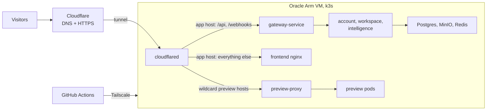

# Architecture

The whole app runs as Kubernetes workloads on one machine, and that machine has no open inbound ports: web traffic arrives through the Cloudflare tunnel, and deploys and admin access arrive over Tailscale.

Cloudflare terminates HTTPS and forwards each hostname to the right pod through the tunnel.

| Item | Value |
| --- | --- |
| Machine | VM.Standard.A1.Flex, 2 OCPU, 12 GB RAM, Ubuntu 24.04 arm64, 100 GB boot volume |
| Kubernetes | k3s, single node, built-in Traefik and service load balancer disabled |
| App URL | `https://vibecraft.divyanshuagrahari.dev` - one level deep on purpose: Cloudflare's free wildcard certificate covers `*.divyanshuagrahari.dev` only, not a second level like `vibecraft.app.…` |
| Preview URLs | `https://p<projectId>-<random>.divyanshuagrahari.dev`, one level deep, so the same wildcard certificate covers them |
| Namespace `vibecraft` | cloudflared, frontend, gateway, discovery (Eureka), account, workspace, intelligence, Postgres, MinIO |
| Namespace `vibecraft-ai` | preview-proxy, Redis, the preview pod pool (same as today's `k8s/` manifests) |
| Storage | k3s local-path volumes on the boot disk: Postgres 10 GB, MinIO 20 GB |
| Stays external | Firebase Auth, OpenRouter, Stripe (test mode) |
