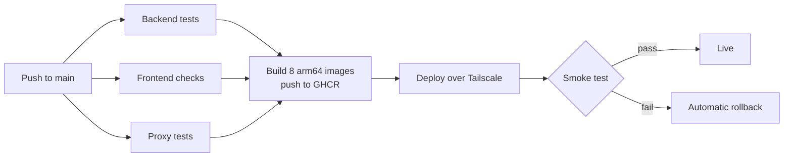

# CI/CD Pipeline

Everything is one workflow, `.github/workflows/ci.yml`.



> **Current status:** the `push` and `pull_request` triggers are disabled until the repository's `production` environment is configured, so the workflow only runs manually. Restore them by adding the following under `on:` in `ci.yml` (and the `schedule:` block in `uptime.yml`):
>
> ```yaml
> push:
>   branches: [main]
> pull_request:
>   branches: [main]
> ```

## Jobs

| Job | Runs on | Does |
|---|---|---|
| `backend` | push, pull request | Builds and tests the Maven reactor; uploads the tested jars for the image build |
| `frontend` | push, pull request | Type-check, lint, tests and production build |
| `proxy` | push, pull request | The preview proxy's `node --test` suite |
| `build-java-images` | push | Five images from the tested jars (a matrix over the services) |
| `build-frontend-image`, `build-proxy-image`, `build-preview-runner-image` | push | The other three images |
| `deploy` | push, manual | Deploys, smoke-tests and, on failure, rolls back |

A pull request runs only the three test jobs; it never sees a secret and never deploys.

## Deploy

1. **One at a time.** The `deploy` job uses the `production-deploy` concurrency group without cancellation, so a second push queues rather than interrupting a deploy in progress.
2. **Connect.** The job joins the tailnet briefly with an ephemeral node, then builds a kubeconfig from the namespace-scoped `deployer` token, retrying `kubectl get --raw=/livez` until the API answers.
3. **Secrets.** `deploy/scripts/apply-secrets.sh` rebuilds every Kubernetes Secret from the `production` environment. A missing required value fails the deploy before anything is applied.
4. **Apply.** The commit SHA is set as the image tag in the `oracle` overlay, and `kubectl apply -k` runs.
5. **Wait.** Each workload's rollout is awaited in dependency order, up to five minutes each.
6. **Smoke test.** `deploy/scripts/smoke-test.sh` checks that the app answers `200`, `/api/plans` returns JSON, and a random preview hostname reaches the proxy's "not running" page.
7. **Roll back** on any failure after the apply: `kubectl rollout undo` on every workload the deploy changed, including the runner pool.

## Manual redeploy

**Actions → CI → Run workflow**, optionally with a commit SHA, redeploys that version using the images already pushed for it. A manual run skips the test and build jobs.

## Database migrations

Flyway runs when each service starts, and migrations only go forward. Rolling code back after a migration works only if the migration is backward-compatible, so keep migrations additive.
