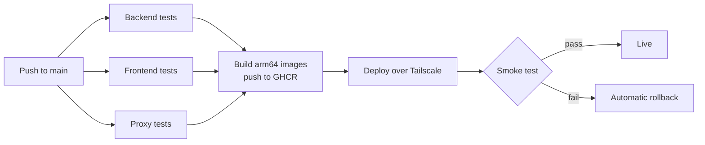

# Phase 5: CI/CD pipeline

Every push to `main` runs the tests. Only if all of them pass, it builds and deploys the new version, checks the live site, and rolls back automatically if the check fails. About 4–6 hours, built on the existing `.github/workflows/ci.yml`.

Any failed box stops the run and GitHub emails the owner.

- **Tests:** the existing backend reactor build and frontend typecheck/lint/test/build, plus the proxy's `node --test` suite (new).
- **Pull requests:** tests only. They never see secrets and never deploy.
- **Images:** 8 built in parallel on Arm runners, tagged with the commit SHA.
- **Deploy:** one at a time, never two overlapping, through the GitHub `production` environment. The job joins the tailnet briefly, refreshes the Kubernetes secrets, and applies the Oracle overlay with the new image tags. It then waits for each service to become ready, one at a time, up to 5 minutes each.
- **Smoke test:** `https://app.divyanshuagrahari.dev/` returns 200, `/api/plans` returns JSON, and a random preview hostname returns the proxy's "not running" page, which proves the preview route is alive.
- **Rollback:** a failed rollout or smoke test runs `kubectl rollout undo` on the services it changed.
- **Redeploy any version:** a manual "Run workflow" button takes a commit SHA.
- **Database caveat:** Flyway migrations run at service start and only go forward. Rolling code back after a migration only works if the migration is backward-compatible, so keep them additive.

- [x] **`.github/workflows/ci.yml`** extended in place (not a second workflow file, per this section's own spec): `proxy` (new, `node --test`), `build-java-images` (a `discovery/gateway/account/workspace/intelligence` matrix sharing `docker/java-service.Dockerfile`, fed the exact jars `backend` just tested via `actions/upload-artifact`/`download-artifact` - never a separate rebuild), `build-frontend-image`, `build-proxy-image`, `build-preview-runner-image`, and `deploy`. Every build/deploy job is gated `github.event_name == 'push'` (or, for `deploy`, also a `workflow_dispatch` redeploy) - a pull request only ever runs the three test jobs, exactly as this section specifies. `deploy/scripts/apply-secrets.sh` (idempotent `kubectl create --dry-run=client | apply`, one call per Kubernetes Secret the oracle overlay's Deployments reference) and `deploy/scripts/smoke-test.sh` (the three checks below) back the workflow's own deploy/smoke-test steps - both live-tested independently: the secrets script against the real `vibecraft-rehearsal` kind cluster (every secret it writes, including the two multi-line JSON ones, read back and confirmed byte-correct), and the full `KUBE_API_SERVER` + `KUBE_DEPLOYER_TOKEN` + `insecure-skip-tls-verify` connection method against the real Oracle cluster from a laptop already on the tailnet (scoped exactly as `deployer-bootstrap.yaml` intends). Both scripts and the workflow YAML pass `shellcheck`/`actionlint` clean.
  - **Never cancels a live deploy:** the existing workflow-level `concurrency` group had `cancel-in-progress: true` for every event - fine for a PR's tests, wrong for a push to `main` that might be mid-`kubectl apply`. Now `cancel-in-progress: ${{ github.event_name == 'pull_request' }}`, plus a separate job-level `concurrency: { group: production-deploy, cancel-in-progress: false }` on `deploy` itself so two overlapping deploys queue instead of either cancelling or racing.

- [x] **First real run, live on the actual Oracle cluster - five real bugs found and fixed, in order, each live-verified before moving to the next:**
  1. **The Tailscale OAuth client needs the `auth_keys` write scope, not `devices:core`.** The original client (Phase 0) had only `devices:core`, which let `tailscale up` *retry* (5 attempts, exponential backoff, "calling actor does not have enough permissions") but never actually log in - confirmed directly: `tailscale status` reported `Logged out` and `tailscale ip` reported `NeedsLogin` even after the step exited with a green checkmark, which is what made this misleading at first (the step "succeeding" does not mean the node is actually authenticated). A fresh OAuth client scoped to `Auth Keys: Write` + tagged `tag:ci` fixed it outright - confirmed by `tailscale status` then listing the runner as a real peer with a real `100.x.y.z` address.
  2. **A brand-new ephemeral CI node isn't necessarily reachable by an existing peer for a short window after joining** ("eventual consistency" - a real Tailscale characteristic, not a myth, though it turned out not to be this deploy's actual blocker once bug 1 was fixed). Two things were tried and abandoned here, worth knowing about: `tailscale/github-action`'s `ping` input (not present on the pinned `@v3` tag - confirmed by the action's own "Unexpected input(s)" warning, a lesson in not trusting a web-fetched summary of an action's interface over what the action itself reports) and a raw `tailscale ping` diagnostic step (useful for *diagnosis*, not kept in the final workflow). What's actually in the workflow now is a plain retry loop against `kubectl get --raw=/livez` - the cheapest real call that needs no RBAC (k3s's default `system:public-info-viewer` binding), and doesn't depend on any specific action's input schema.
  3. **Kubernetes' built-in `admin` ClusterRole deliberately excludes `Namespace`/`LimitRange`/`ResourceQuota`** - a namespace "admin" shouldn't be able to raise the resource ceiling a cluster admin imposed on it. The `deployer` ServiceAccount hit this immediately: every `kubectl apply -k` 403'd trying to patch the namespaces and create the quota/limit objects. Fixed architecturally, not with a permission grant: those three object types moved out of `deploy/k8s/base/` into their own `deploy/k8s/namespaces/` mini-kustomization, applied once, out-of-band, with a privileged kubeconfig - the same bootstrap pattern `deployer-bootstrap.yaml` already established. The kind overlay references it directly (`../../namespaces`) since kind's kubeconfig has no such restriction; the oracle overlay doesn't reference it at all.
  4. **A raw file path can't cross a kustomization's own root, even one directory up** - `overlays/kind/kustomization.yaml` referencing `../../base/namespaces.yaml` directly failed Kustomize's own load-restriction security check (`file 'namespaces.yaml' is not in or below 'overlays/kind'`), while `../../base` (a whole *directory* with its own `kustomization.yaml`) is fine - Kustomize exempts nested-kustomization directory references from this check but not loose files. Giving `namespaces.yaml` its own `kustomization.yaml` sidesteps this rather than duplicating the file.
  5. **The `APP_DOMAIN` GitHub variable was set to `divyanshuagrahari.dev`, not `app.divyanshuagrahari.dev`** - a data-entry slip from whenever Phase 0 was originally done, invisible until the smoke test was the first thing to ever actually resolve it (`curl` exit code 6, "couldn't resolve host" - the bare apex has no DNS record pointing at the tunnel). Corrected by the owner in the `production` environment; the very next run's smoke test passed clean.
  - **Confirmed independently, not just by the workflow's own smoke test:** `https://app.divyanshuagrahari.dev` loads in a real browser with a valid HTTPS certificate, showing the actual sign-in page.
  - **Still worth knowing, not yet hit:** GHCR sometimes defaults a freshly-pushed package to *private* even from a public repo, needing a one-time visibility flip (package settings → Change visibility → Public) per image - hasn't caused a problem so far (the images pulled fine for this deploy), but check it if a future deploy ever fails to pull.
