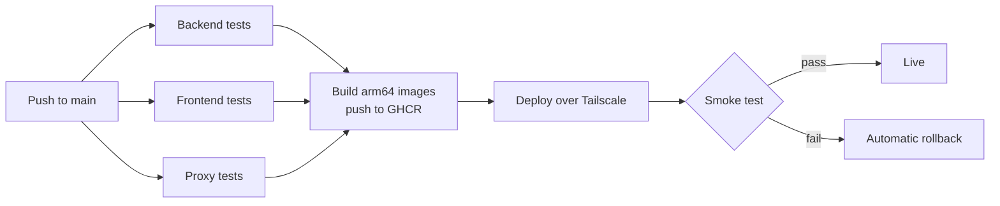

# Phase 5: CI/CD pipeline

Every push to `main` runs the tests. Only if all of them pass, it builds and deploys the new version, checks the live site, and rolls back automatically if the check fails. About 4–6 hours, built on the existing `.github/workflows/ci.yml`.

Any failed box stops the run and GitHub emails the owner.

- **Tests:** the existing backend reactor build and frontend typecheck/lint/test/build, plus the proxy's `node --test` suite (new).
- **Pull requests:** tests only. They never see secrets and never deploy.
- **Images:** 8 built in parallel on Arm runners, tagged with the commit SHA.
- **Deploy:** one at a time, never two overlapping, through the GitHub `production` environment. The job joins the tailnet briefly, refreshes the Kubernetes secrets, and applies the Oracle overlay with the new image tags. It then waits for each service to become ready, one at a time, up to 5 minutes each.
- **Smoke test:** `https://app.divyanshuagrahari.dev/` returns 200, `/api/plans` returns JSON, and a random preview hostname returns the proxy's "not running" page, which proves the preview route is alive.
- **Rollback:** a failed rollout or smoke test runs `kubectl rollout undo` on the services it changed.
- **Redeploy any version:** a manual "Run workflow" button takes a commit SHA.
- **Database caveat:** Flyway migrations run at service start and only go forward. Rolling code back after a migration only works if the migration is backward-compatible, so keep them additive.

- [x] **`.github/workflows/ci.yml`** extended in place (not a second workflow file, per this section's own spec): `proxy` (new, `node --test`), `build-java-images` (a `discovery/gateway/account/workspace/intelligence` matrix sharing `docker/java-service.Dockerfile`, fed the exact jars `backend` just tested via `actions/upload-artifact`/`download-artifact` - never a separate rebuild), `build-frontend-image`, `build-proxy-image`, `build-preview-runner-image`, and `deploy`. Every build/deploy job is gated `github.event_name == 'push'` (or, for `deploy`, also a `workflow_dispatch` redeploy) - a pull request only ever runs the three test jobs, exactly as this section specifies. `deploy/scripts/apply-secrets.sh` (idempotent `kubectl create --dry-run=client | apply`, one call per Kubernetes Secret the oracle overlay's Deployments reference) and `deploy/scripts/smoke-test.sh` (the three checks below) back the workflow's own deploy/smoke-test steps - both live-tested independently: the secrets script against the real `vibecraft-rehearsal` kind cluster (every secret it writes, including the two multi-line JSON ones, read back and confirmed byte-correct), and the full `KUBE_API_SERVER` + `KUBE_DEPLOYER_TOKEN` + `insecure-skip-tls-verify` connection method against the real Oracle cluster from a laptop already on the tailnet (scoped exactly as `deployer-bootstrap.yaml` intends). Both scripts and the workflow YAML pass `shellcheck`/`actionlint` clean.
  - **Never cancels a live deploy:** the existing workflow-level `concurrency` group had `cancel-in-progress: true` for every event - fine for a PR's tests, wrong for a push to `main` that might be mid-`kubectl apply`. Now `cancel-in-progress: ${{ github.event_name == 'pull_request' }}`, plus a separate job-level `concurrency: { group: production-deploy, cancel-in-progress: false }` on `deploy` itself so two overlapping deploys queue instead of either cancelling or racing.
  - **Two things the owner needs to do that this session couldn't** (no `gh` CLI, no Tailscale/GitHub admin-console access from here):
    1. Add the **`KUBE_API_SERVER`** GitHub secret (Phase 0's table, above) - not anticipated when Phase 0 was first done, since the Oracle box's Tailscale hostname didn't exist yet.
    2. **Confirm the Tailscale OAuth client's tag matches `tag:ci`** (the tag `deploy`'s "Join the tailnet" step requests). Phase 0 created "an OAuth client for GitHub Actions" but this session has no way to see what tag it was actually scoped to when created, or whether the tailnet's ACL grants that tag a path to `vibecraft-k3s` - `tailscale status --json` here shows no tagged devices at all, which is a real gap, not just unlogged. If the deploy job's first real run fails at "Join the tailnet" or times out reaching the API, this is the first thing to check (Tailscale admin console → the OAuth client's tags, and the ACL's `tagOwners`/`acls` sections).
  - **A third thing worth knowing, not blocking:** GHCR sometimes defaults a freshly-pushed package to *private* even from a public repo, needing a one-time visibility flip (package settings → Change visibility → Public) per image after its first push - check this once the first `build-*` job actually runs.
