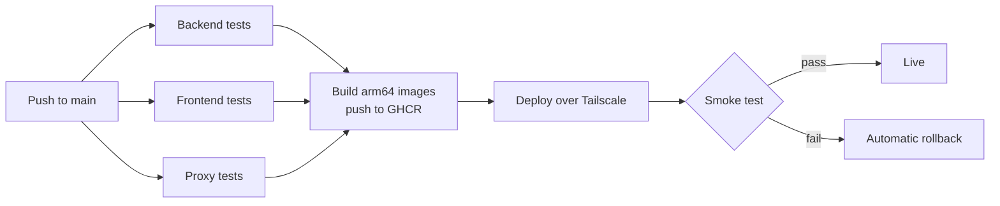

# Phase 5: CI/CD pipeline

Every push to `main` runs the tests. Only if all of them pass, it builds and deploys the new version, checks the live site, and rolls back automatically if the check fails. About 4–6 hours, built on the existing `.github/workflows/ci.yml`.

Any failed box stops the run and GitHub emails the owner.

- **Tests:** the existing backend reactor build and frontend typecheck/lint/test/build, plus the proxy's `node --test` suite (new).
- **Pull requests:** tests only. They never see secrets and never deploy.
- **Images:** 8 built in parallel on Arm runners, tagged with the commit SHA.
- **Deploy:** one at a time, never two overlapping, through the GitHub `production` environment. The job joins the tailnet briefly, refreshes the Kubernetes secrets, and applies the Oracle overlay with the new image tags. It then waits for each service to become ready, one at a time, up to 5 minutes each.
- **Smoke test:** `https://app.divyanshuagrahari.dev/` returns 200, `/api/plans` returns JSON, and a random preview hostname returns the proxy's "not running" page, which proves the preview route is alive.
- **Rollback:** a failed rollout or smoke test runs `kubectl rollout undo` on the services it changed.
- **Redeploy any version:** a manual "Run workflow" button takes a commit SHA.
- **Database caveat:** Flyway migrations run at service start and only go forward. Rolling code back after a migration only works if the migration is backward-compatible, so keep them additive.
