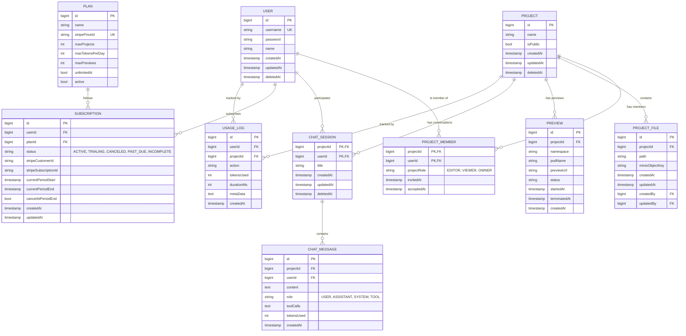

# Entities / Models

10 entity types are implemented as JPA entities. This section documents the schema **as implemented in code**, which is the source of truth. The design was simplified on 2026-04-26 (v3) from the previous implementation (v2): project ownership moved from a `ProjectMember`-role model back onto a direct `Project.owner` FK, `ProjectRole` dropped its permission-set design back to a plain `EDITOR`/`VIEWER` enum, `ChatMessage` dropped the `ChatEvent` child-entity design back to a `toolCalls` JSON string column, and `UsageLog` dropped the daily-counter design back to a per-action audit row. See [Differences from v2](#differences-from-v2) below. Later the same day (v4), two of those v3 decisions were reversed: project ownership moved back onto `ProjectMember.projectRole == OWNER` (no `Project.owner` FK), and `User.email`/`passwordHash` were renamed back to `username`/`password` with `avatarUrl` dropped. See [Differences from v3](#differences-from-v3) below.

## Entity Relationship Diagram (v4)

Fields are shown as Java entity field names (camelCase); Hibernate's default physical naming strategy converts these to `snake_case` actual column names (e.g. `createdBy` → `created_by`). `createdBy`/`updatedBy` above are the FK columns behind `ProjectFile`'s actual `@ManyToOne` object references. `Project` has no owner FK of its own — ownership is expressed entirely via a `PROJECT_MEMBER` row with `projectRole = OWNER`.

## Entity Details

Common columns that recur across most entities: `id` (primary key, `Long`/`bigint`, `IDENTITY` strategy) and, via Hibernate's `@CreationTimestamp`/`@UpdateTimestamp`, `createdAt`/`updatedAt` lifecycle timestamps. `User`, `Project`, and `ChatSession` additionally carry a plain nullable `deletedAt` column for soft deletes — the row is kept and flagged rather than removed, so related history isn't orphaned by a delete. There's no `@SQLDelete`/`@Where` filter wired up yet, so soft-deleted rows aren't automatically excluded from queries — that filtering has to be done manually until it is (see `ProjectRepository.findAllAccessibleByUser` for an example: `WHERE p.deletedAt IS NULL`).

### USER

An account holder on the platform — owns/collaborates on projects, participates in AI chat sessions, and holds a billing subscription.

| Field | Meaning |
|---|---|
| `id` | Primary key. |
| `username` | Login identifier — unique, not null. Despite the name, it's still validated as email-shaped at the DTO layer (see [Request Validation](../api/README.md#request-validation)); nothing in the entity itself constrains its format. |
| `password` | The **BCrypt hash** of the login password (via Spring Security's `PasswordEncoder`) — not null. Despite the field name (renamed from `passwordHash` on 2026-04-26, see [Differences from v3](#differences-from-v3)), it does now hold a hash, not plaintext — `AuthServiceImpl.signup` calls `passwordEncoder.encode(request.password())` before saving. |
| `name` | Display name. |
| `createdAt` / `updatedAt` | Record lifecycle timestamps. |
| `deletedAt` | Soft-delete timestamp — see note above. |

Since 2026-04-26, `User implements UserDetails` (Spring Security) — `getUsername()`/`getPassword()` are satisfied by Lombok's generated getters for the fields above, and `getAuthorities()` is explicitly overridden to return an empty list (no roles/permissions modeled yet; every authenticated user is equivalent from Spring Security's point of view). `UserServiceImpl` additionally implements `UserDetailsService.loadUserByUsername`, used internally by the `AuthenticationManager` during login.

### PROJECT

A workspace/app being built; can be collaborated on and optionally made public.

| Field | Meaning |
|---|---|
| `id` | Primary key. |
| `name` | Project's display name — not null. |
| `isPublic` | Whether the project (and its preview) is visible to anyone, not just members. Defaults to `false`. |
| `createdAt` / `updatedAt` | Record lifecycle timestamps. |
| `deletedAt` | Soft-delete timestamp. |

No `owner` field — as of 2026-04-26 (v4), ownership is expressed entirely through a `PROJECT_MEMBER` row with `projectRole = OWNER`; see [Differences from v3](#differences-from-v3). `ProjectServiceImpl.createProject` creates that owner `ProjectMember` row in the same request that creates the `Project`.

### PROJECT_MEMBER

The sole record of who can access a project and in what capacity — both owners and collaborators are rows here; there's no separate ownership mechanism.

| Field | Meaning |
|---|---|
| `projectId` | Part of the composite primary key (`ProjectMemberId`); the project. |
| `userId` | Part of the composite primary key; the member. |
| `projectRole` | `OWNER` (the project creator — exactly one per project, by convention, not enforced), `EDITOR` (can modify the project), or `VIEWER` (read-only) — a plain `ProjectRole` enum. ⚠ Nothing currently enforces the "exactly one `OWNER`" convention or restricts who can be assigned `OWNER`: `InviteMemberRequest.role`/`UpdateMemberRoleRequest.role` accept any `ProjectRole` value including `OWNER`, and none of `ProjectMemberServiceImpl`'s methods check the caller's own role before inviting/promoting/removing a member — see the "Known gaps" note in [Project Status](../project-status.md#project-status). |
| `invitedAt` | When the invite was sent (also set for the owner's own row, to "now", at project-creation time). |
| `acceptedAt` | When the invite was accepted (also set for the owner's own row at creation time; never set for anyone else, since there's no accept-invite endpoint yet). |

`ProjectMemberId` (the `@EmbeddedId`) implements `Serializable` and `equals()`/`hashCode()` over both fields, as required for a JPA composite key to behave correctly in the persistence context.

### PROJECT_FILE

A single file belonging to a project; its content lives in object storage, not the database row itself.

| Field | Meaning |
|---|---|
| `id` | Primary key. |
| `project` | The project this file belongs to — `@ManyToOne`, not null. |
| `path` | The file's path within the project (e.g. `src/App.tsx`) — not null. |
| `minioObjectKey` | Key locating the actual file content in MinIO object storage — this row is metadata, not the content. |
| `createdAt` / `updatedAt` | Record lifecycle timestamps. |
| `createdBy` / `updatedBy` | The `User` who created/last modified this file — `@ManyToOne`, nullable. |

### PREVIEW

A live, running deployment of a project (`previews` table), so it can be viewed without downloading it.

| Field | Meaning |
|---|---|
| `id` | Primary key. |
| `project` | FK to the project this preview runs — `@ManyToOne`, not null, lazy-loaded. |
| `namespace` | Kubernetes namespace the preview pod runs in. |
| `podName` | The Kubernetes pod backing this preview. |
| `previewUrl` | Public URL where the running preview can be viewed. |
| `status` | Preview lifecycle status — `PreviewStatus` enum (`CREATING`, `RUNNING`, `FAILED`, `TERMINATED`), persisted as a string. |
| `startedAt` / `terminatedAt` | When the preview pod came up and (if applicable) was torn down. |
| `createdAt` | When the preview record was created. |

### CHAT_SESSION

An AI-assisted build conversation scoped to one project and the user who started it.

| Field | Meaning |
|---|---|
| `projectId` | Part of the composite primary key (`ChatSessionId`); the project being worked on. |
| `userId` | Part of the composite primary key; the user having this conversation. |
| `title` | Human-readable session title. |
| `createdAt` / `updatedAt` | Record lifecycle timestamps. |
| `deletedAt` | Soft-delete timestamp. |

`ChatSessionId` (the `@EmbeddedId`) is `@Embeddable`, implements `Serializable`, and has `equals()`/`hashCode()` over both fields — required for a JPA composite key to behave correctly (e.g. for `@MapsId` and persistence-context identity lookups).

### CHAT_MESSAGE

A single message within a chat session — from the user or the AI assistant.

| Field | Meaning |
|---|---|
| `id` | Primary key. |
| `chatSession` (`projectId` + `userId`) | Which chat session this message belongs to — FK to the composite `ChatSession` key. |
| `content` | The message text (`text` column). |
| `role` | Who/what this message represents — `MessageRole` enum (`USER`, `ASSISTANT`, `SYSTEM`, `TOOL`), not null. |
| `toolCalls` | JSON array of AI tool/function calls made in this message (`text` column, not `jsonb`) — a raw string, not a structured child entity. |
| `tokensUsed` | Token cost of this message, for usage metering. |
| `createdAt` | When the message was sent. |

### SUBSCRIPTION

A user's billing subscription to a plan (`subscriptions` table), synced with Stripe.

| Field | Meaning |
|---|---|
| `id` | Primary key. |
| `user` | The subscribing user — `@ManyToOne`, not null. |
| `plan` | Which `PLAN` this subscription is for — `@ManyToOne`, not null. |
| `status` | `SubscriptionStatus` enum (`ACTIVE`, `TRIALING`, `CANCELED`, `PAST_DUE`, `INCOMPLETE`), not null. |
| `stripeCustomerId` | Stripe's customer ID, tracked here (not on `User`). |
| `stripeSubscriptionId` | Stripe's own ID for this subscription, used to reconcile with Stripe webhook events. |
| `currentPeriodStart` / `currentPeriodEnd` | The current billing cycle's date range. |
| `cancelAtPeriodEnd` | Whether the subscription is set to cancel at the end of the current period rather than immediately. Defaults to `false`. |
| `createdAt` / `updatedAt` | Record lifecycle timestamps. |

### PLAN

A billing tier defining what a subscriber gets — quotas and limits (`plans` table).

| Field | Meaning |
|---|---|
| `id` | Primary key. |
| `name` | Plan display name (e.g. Free, Pro) — not null. |
| `stripePriceId` | Stripe's price ID for this plan — unique, used when creating a checkout session/subscription. |
| `maxProjects` | How many projects a user on this plan may have. |
| `maxTokensPerDay` | Daily AI token budget for this plan. |
| `maxPreviews` | How many concurrent live previews this plan allows. |
| `unlimitedAi` | Whether this plan bypasses the daily token budget entirely (ignore `maxTokensPerDay` if true). |
| `active` | Whether this plan is currently offered/selectable. |

### USAGE_LOG

A per-action audit/usage record — one row per billable action a user performs.

| Field | Meaning |
|---|---|
| `id` | Primary key. |
| `user` | Which user performed the action — `@ManyToOne`, not null. |
| `project` | Which project it was performed on — `@ManyToOne`, not null. |
| `action` | What was done (e.g. `ai_generate`, `file_create`). |
| `tokensUsed` | AI tokens consumed by this action, if any. |
| `durationMs` | How long the action took, in milliseconds. |
| `metaData` | Additional context about the action (JSON, stored as `text`). |
| `createdAt` | When the action occurred. |

## Domain Vocabulary (Enums)

| Enum | Values | Used by |
|---|---|---|
| `ProjectRole` | `EDITOR`, `VIEWER`, `OWNER` — since 2026-04-26, each maps to a `Set<ProjectPermission>` (`EDITOR`: `VIEW`/`EDIT`/`DELETE`/`VIEW_MEMBERS`; `VIEWER`: `VIEW`/`VIEW_MEMBERS`; `OWNER`: all five) | `ProjectMember.projectRole`, `InviteMemberRequest.role`, `UpdateMemberRoleRequest.role` |
| `ProjectPermission` | `VIEW`, `EDIT`, `DELETE`, `MANAGE_MEMBERS`, `VIEW_MEMBERS` (each also carries a string `value`, e.g. `"project:view"`, currently unused outside the enum itself) | `ProjectRole.permissions`, checked by `SecurityExpressions` for every `@PreAuthorize` decision |
| `MessageRole` | `USER`, `ASSISTANT`, `SYSTEM`, `TOOL` | `ChatMessage.role` |
| `PreviewStatus` | `CREATING`, `RUNNING`, `FAILED`, `TERMINATED` | `Preview.status` |
| `SubscriptionStatus` | `ACTIVE`, `TRIALING`, `CANCELED`, `PAST_DUE`, `INCOMPLETE` | `Subscription.status` |

## Differences from v2

v2 (2026-03-30) was the first real JPA implementation; v3 (2026-04-26) simplified several designs back toward the original v1 sketch. For reference:

1. **Ownership moved back onto `Project`.** v2 expressed ownership only via `ProjectMember.projectRole == OWNER` (no `owner_id` column at all). v3 restored a direct `Project.owner` FK; `ProjectMember` was meant to be purely for non-owner collaborators, and `ProjectRole` initially dropped the `OWNER` constant to match. **v4 (later the same day) reverted this entirely back to the v2 model** — see [Differences from v3](#differences-from-v3).
2. **`ProjectRole` dropped its permission-set model.** v2 had `ProjectRole` map each role to a `Set<ProjectPermission>` (a now-deleted enum). v3's `ProjectRole` is a plain `EDITOR`/`VIEWER` enum with no permission mapping.
3. **`ChatMessage` dropped the `ChatEvent` child entity.** v2 represented an assistant's multi-step response as an ordered list of typed `ChatEvent` rows (`THOUGHT`/`MESSAGE`/`FILE_EDIT`/`TOOL_LOG`, now deleted along with `ChatEventType`). v3 is back to a single `toolCalls` JSON string column on `ChatMessage` itself.
4. **`UsageLog` is a per-action audit log again**, not a daily counter. v2 had `(userId, date)` unique + a running `tokensUsed` total, no project scoping. v3 has one row per action, with `user`, `project`, `action`, `tokensUsed`, `durationMs`, `metaData`, and `createdAt`.
5. **`User` renamed `username`/`password`/`stripeCustomerId` → `email`/`passwordHash`/(removed).** `avatarUrl` was added. `stripeCustomerId` moved onto `Subscription` instead of living on `User`. **v4 (later the same day) reverted the `username`/`password` part of this and dropped `avatarUrl`** (the `stripeCustomerId`-on-`Subscription` part stands) — see [Differences from v3](#differences-from-v3).
6. **`ChatSession` regained a `title` field** (present in v1, absent in v2).
7. **`ProjectFile` regained `createdBy`/`updatedBy` audit FKs** (present in v1, absent in v2).
8. **`Project` dropped its explicit composite indexes** (`idx_projects_updated_at_desc`, etc.) that v2 had added for a "list non-deleted projects, most recent first" query pattern — no index currently backs `ProjectRepository.findAllAccessibleByUser`'s `ORDER BY p.updatedAt DESC`.

## Differences from v3

v4 (2026-04-26, later the same day as v3) reverted two of v3's decisions back toward v2, and left the rest of v3 standing:

1. **Ownership moved back onto `ProjectMember`, `Project.owner` removed entirely.** v3 had a direct `Project.owner` FK (not null); v4 drops that column and expresses ownership purely via a `PROJECT_MEMBER` row with `projectRole = OWNER`, matching v2's approach. `ProjectRole` regained its `OWNER` constant (dropped in early v3) so that role can be stored on a real row, not just used as a mapper-only synthetic value. `ProjectServiceImpl.createProject` now creates the project row and the owner's `ProjectMember` row together in one request. This also removed every owner-only authorization check in `ProjectServiceImpl`/`ProjectMemberServiceImpl` (they called `project.getOwner()`, which no longer compiles) — see the "Known gaps" note in [Project Status](../project-status.md#project-status) for how serious that regression is.
2. **`User` renamed `email`/`passwordHash` back to `username`/`password`, `avatarUrl` dropped.** Reverses the v3 rename in the other direction. Propagated to every place that referenced the old names: `SignupRequest`/`LoginRequest`/`UserProfileResponse`/`InviteMemberRequest`/`MemberResponse` fields, `UserRepository.findByEmail` → `findByUsername`, `ProjectMemberMapper`'s `@Mapping`, and `data.sql`'s seed columns. The `@Email` validation constraint was kept on the renamed `username` fields (still validated as email-shaped) rather than dropped — see [Request Validation](../api/README.md#request-validation).
3. **`data.sql` now seeds a placeholder `password` value (`'N/A'`) instead of `NULL`.** Unrelated to the rename itself — `User.passwordHash` (now `password`) has always been `@Column(nullable = false)`, and the seed rows had always passed `NULL` for it; this only surfaced as a startup failure once `ddl-auto` was changed (see next point) to actually recreate the table with that constraint enforced on insert.
4. **Local `ddl-auto` switched from `update` to `create`.** Convenient while entity shapes are being actively reworked (as in this v3→v4 change) since `update` can't rename/drop a `NOT NULL` column — it can only fail loudly when asked to. Trade-off: every application restart now wipes and reseeds the whole local database.

## Fixed since first implementation

Bugs found and fixed while documenting the schema (not design differences):

- **v2.1** (2026-03-30): `Preview` had no JPA annotations at all — a plain class Hibernate would never have persisted. `ChatSessionId` was missing `@Embeddable`. `ChatSessionId`/`ProjectMemberId` had no `equals()`/`hashCode()`, required by the JPA spec for composite keys. `Plan`/`Subscription` had no explicit `@Table` name (would've defaulted to singular table names) and `Plan` was missing its Lombok constructors/builder.
- **v3** (2026-04-26): The same class of bug reappeared after an external revert stripped JPA annotations from most entities again (working tree only — the fixes below restore what v2.1 had already established, now against the v3 field/relationship shapes) — `ProjectMemberId`/`ChatSessionId` were recreated from scratch (both files had been deleted), and full JPA annotations (`@Entity`, `@Table`, `@Id`, `@ManyToOne`, `@Enumerated`, `@CreationTimestamp`/`@UpdateTimestamp`) were restored across `ProjectFile`, `ProjectMember`, `ChatSession`, `ChatMessage`, `Preview`, `Plan`, `Subscription`, and `UsageLog`. Also added: `@Column(nullable = false, unique = true)` on `User.email` and `@Column(nullable = false)` on `User.passwordHash` (neither had ever been constrained).

## Revision history

- **v1** (2026-03-30): Initial schema sketch covering users, projects, collaboration (ownership/membership), file storage, live previews, AI chat, and billing (plans/subscriptions/usage) — drafted before any code existed.
- **v2** (2026-03-30): First real implementation — all 13 entities added as JPA entities. Ownership folded into `PROJECT_MEMBER`; AI chat responses restructured into ordered `CHAT_EVENT` steps instead of a single JSON blob; `USAGE_LOG` redesigned into a daily per-user counter.
- **v2.1** (2026-03-30): Fixed genuine annotation/correctness bugs found while documenting v2 — see [Fixed since first implementation](#fixed-since-first-implementation).
- **v3** (2026-04-26): Simplified several v2 designs back toward the v1 sketch (ownership, `ProjectRole`, `ChatMessage`/`ChatEvent`, `UsageLog`) — see [Differences from v2](#differences-from-v2). Also re-fixed annotation regressions introduced by an external working-tree revert — see [Fixed since first implementation](#fixed-since-first-implementation). Entity count is now 10 (`ChatEvent` removed).
- **v4** (2026-04-26, later the same day): Reverted two v3 decisions back toward v2 — `Project.owner` FK removed (ownership back on `ProjectMember.projectRole == OWNER`), `User.email`/`passwordHash` renamed back to `username`/`password` with `avatarUrl` dropped — see [Differences from v3](#differences-from-v3). Entity count unchanged at 10.
