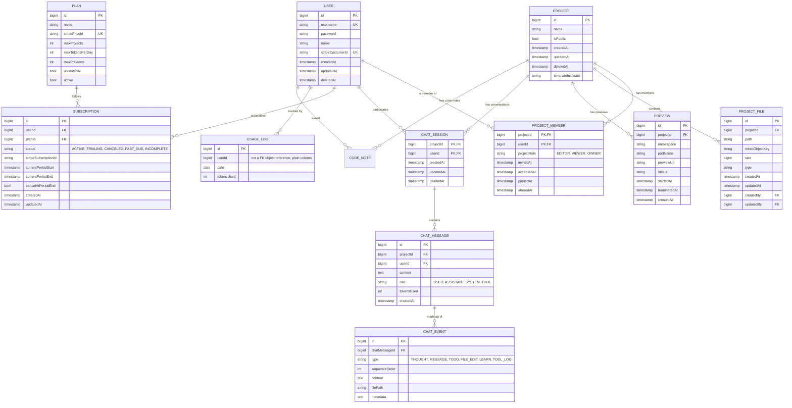

# Entities / Models

17 entity types are implemented as JPA entities. `CodeNote` was added 2026-06-03 to keep each person's code-notes thread, and `AuthAuditEvent`/`RevokedSession`/`PasswordResetToken`/`PreviewSession` on 2026-07-15 for the Firebase session migration, its legacy password-reset path, and live previews respectively - additive tables only, so none of this makes it a v6 schema. This section documents the schema **as implemented in code**, which is the source of truth. The design was simplified on 2026-04-26 (v3) from the previous implementation (v2): project ownership moved from a `ProjectMember`-role model back onto a direct `Project.owner` FK, `ProjectRole` dropped its permission-set design back to a plain `EDITOR`/`VIEWER` enum, `ChatMessage` dropped the `ChatEvent` child-entity design back to a `toolCalls` JSON string column, and `UsageLog` dropped the daily-counter design back to a per-action audit row. See [Differences from v2](#differences-from-v2) below. Later the same day (v4), two of those v3 decisions were reversed: project ownership moved back onto `ProjectMember.projectRole == OWNER` (no `Project.owner` FK), and `User.email`/`passwordHash` were renamed back to `username`/`password` with `avatarUrl` dropped. See [Differences from v3](#differences-from-v3) below. On 2026-05-16 (v5), as real AI chat generation landed, two more v3 decisions were reversed back toward v2: `ChatEvent`/`ChatEventType` were restored (`ChatMessage.toolCalls` removed in favor of structured child rows) and `UsageLog` reverted to a per-user daily counter (from a per-action audit row) — see [Differences from v4](#differences-from-v4) below.

## Entity Relationship Diagram (v5)

Fields are shown as Java entity field names (camelCase); Hibernate's default physical naming strategy converts these to `snake_case` actual column names (e.g. `createdBy` → `created_by`). `createdBy`/`updatedBy` above are the FK columns behind `ProjectFile`'s actual `@ManyToOne` object references. `Project` has no owner FK of its own — ownership is expressed entirely via a `PROJECT_MEMBER` row with `projectRole = OWNER`.

## Entity Details

Common columns that recur across most entities: `id` (primary key, `Long`/`bigint`, `IDENTITY` strategy) and, via Hibernate's `@CreationTimestamp`/`@UpdateTimestamp`, `createdAt`/`updatedAt` lifecycle timestamps. `User`, `Project`, and `ChatSession` additionally carry a plain nullable `deletedAt` column for soft deletes — the row is kept and flagged rather than removed, so related history isn't orphaned by a delete. There's no `@SQLDelete`/`@Where` filter wired up yet, so soft-deleted rows aren't automatically excluded from queries — that filtering has to be done manually until it is (see `ProjectRepository.findAllAccessibleByUser` for an example: `WHERE p.deletedAt IS NULL`).

### USER

An account holder on the platform — owns/collaborates on projects, participates in AI chat sessions, and holds a billing subscription.

| Field | Meaning |
|---|---|
| `id` | Primary key. |
| `username` | Login identifier — unique, not null. Despite the name, it's still validated as email-shaped at the DTO layer (see [Request Validation](../api/README.md#request-validation)); nothing in the entity itself constrains its format. |
| `password` | The **BCrypt hash** of the login password (via Spring Security's `PasswordEncoder`) — not null. Despite the field name (renamed from `passwordHash` on 2026-04-26, see [Differences from v3](#differences-from-v3)), it does now hold a hash, not plaintext — `AuthServiceImpl.signup` calls `passwordEncoder.encode(request.password())` before saving. |
| `name` | Display name. |
| `stripeCustomerId` | Stripe's customer id for this user — unique, nullable. Set once their first Stripe Checkout session completes; reused on every later checkout instead of Stripe minting a new customer each time. Moved here from `Subscription` on 2026-05-02, where it had been duplicated on both entities. |
| `createdAt` / `updatedAt` | Record lifecycle timestamps. |
| `deletedAt` | Soft-delete timestamp — see note above. |

Since 2026-04-26, `User implements UserDetails` (Spring Security) — `getUsername()`/`getPassword()` are satisfied by Lombok's generated getters for the fields above, and `getAuthorities()` is explicitly overridden to return an empty list (no roles/permissions modeled yet; every authenticated user is equivalent from Spring Security's point of view). `UserServiceImpl` additionally implements `UserDetailsService.loadUserByUsername`, used internally by the `AuthenticationManager` during login.

### PROJECT

A workspace/app being built; can be collaborated on and optionally made public.

| Field | Meaning |
|---|---|
| `id` | Primary key. |
| `name` | Project's display name — not null. |
| `isPublic` | Whether the project (and its preview) is visible to anyone, not just members. Defaults to `false`. |
| `createdAt` / `updatedAt` | Record lifecycle timestamps. |
| `deletedAt` | Soft-delete timestamp. |
| `templateInitIssue` | Nullable — `null` when the starter template copied into this project fully succeeded (or wasn't attempted), otherwise a short description of what's still missing (e.g. `"Template initialization incomplete: 2 file(s) could not be created (...)."`). Added 2026-05-16 (later pass) alongside `ProjectTemplateService`'s idempotent-retry rework; not treated as a v6 schema change (unlike v1–v5, a single additive nullable column isn't a redesign of relationships or vocabulary), just an incremental addition to v5. See [Project Status](../project-status.md#project-status) and `POST /api/projects/{id}/retry-template-init` below. |
| `forkedFromProjectId` | Added 2026-07-15. The project this one was forked from, or `null` for an original — a plain id, not a `@ManyToOne`, so a fork keeps working if the source project is later deleted. Set by `POST /api/projects/{id}/fork`. |

No `owner` field — as of 2026-04-26 (v4), ownership is expressed entirely through a `PROJECT_MEMBER` row with `projectRole = OWNER`; see [Differences from v3](#differences-from-v3). `ProjectServiceImpl.createProject` creates that owner `ProjectMember` row in the same request that creates the `Project`.

### PROJECT_MEMBER

The sole record of who can access a project and in what capacity — both owners and collaborators are rows here; there's no separate ownership mechanism.

| Field | Meaning |
|---|---|
| `projectId` | Part of the composite primary key (`ProjectMemberId`); the project. |
| `userId` | Part of the composite primary key; the member. |
| `projectRole` | `OWNER` (the project creator — exactly one per project, by convention, not enforced), `EDITOR` (can modify the project), or `VIEWER` (read-only) — a plain `ProjectRole` enum. ⚠ Nothing currently enforces the "exactly one `OWNER`" convention or restricts who can be assigned `OWNER`: `InviteMemberRequest.role`/`UpdateMemberRoleRequest.role` accept any `ProjectRole` value including `OWNER`, and although inviting/promoting/removing a member is gated to `OWNER` (`@security.canManageMembers`), nothing stops an owner assigning `OWNER` to someone else — see the "Known gaps" note in [Project Status](../project-status.md#project-status). |
| `invitedAt` | When the invite was sent (also set for the owner's own row, to "now", at project-creation time). |
| `acceptedAt` | When the invite was accepted — set for the owner's own row at project-creation time, and for anyone else via `POST /api/projects/{projectId}/members/accept` (added 2026-04-26, see [APIs](../api/README.md#apis)). `null` means still pending. Nothing currently reads this field to restrict access, though — an invited member has full access per their `projectRole` immediately, whether or not they've accepted; see Project Status "Known gaps". |
| `pinnedAt` | Added 2026-05-30. When this member pinned the project, or `null` if they haven't — a per-member preference, so each collaborator pins independently. Set/cleared via `PUT`/`DELETE /api/projects/{id}/pin`. Nullable, so `ddl-auto: update` added it to existing rows without a migration. |
| `starredAt` | Added 2026-05-30. Same as `pinnedAt`, for starring (`PUT`/`DELETE /api/projects/{id}/star`). Independent of `pinnedAt` at the database level. |

`ProjectMemberId` (the `@EmbeddedId`) implements `Serializable` and `equals()`/`hashCode()` over both fields, as required for a JPA composite key to behave correctly in the persistence context.

### PROJECT_FILE

A single file belonging to a project; its content lives in object storage, not the database row itself.

| Field | Meaning |
|---|---|
| `id` | Primary key. |
| `project` | The project this file belongs to — `@ManyToOne`, not null. |
| `path` | The file's path within the project (e.g. `src/App.tsx`) — not null. |
| `minioObjectKey` | Key locating the actual file content in MinIO object storage — this row is metadata, not the content. |
| `size` / `type` | Byte size and MIME content type, set from the actual uploaded content at save time (`ProjectFileServiceImpl.saveFile`) or copied from the template source's real size at template-init time (`ProjectTemplateServiceImpl`) — added 2026-05-24, see [Practices](../practices/conventions.md#practices--conventions). |
| `createdAt` / `updatedAt` | Record lifecycle timestamps. |
| `createdBy` / `updatedBy` | The `User` who created/last modified this file — `@ManyToOne`, nullable. |

### PREVIEW

One attempt at running a project live (`previews` table, indexed on `project_id` and `status`) — a runner pod claimed from the pool, the project's files synced into it, and a Vite dev server behind the preview proxy. A new row per start, so a failure stays readable after a retry. **Real as of 2026-07-15** (see "Live previews" in [Project Status](../project-status.md#project-status)); every field below `id`/`project`/`namespace`/`podName`/`previewUrl`/`status`/`startedAt`/`terminatedAt`/`createdAt` was added in that pass. Status moves only through `PreviewRepository`'s conditional updates, never by saving a loaded entity — the async bootstrap and a user pressing Stop can race, and a plain save from whichever finished last would resurrect a stopped preview.

| Field | Meaning |
|---|---|
| `id` | Primary key. |
| `project` | FK to the project this preview runs — `@ManyToOne`, not null, lazy-loaded. |
| `projectId` | The same column as `project`, read-only (`insertable = false, updatable = false`) — for code running outside a request (the reaper), where touching the lazy relation would throw. Only populated on rows loaded from the database, not on one just built. |
| `namespace` | Kubernetes namespace the preview pod runs in (`vibecraft-ai`, matching `preview.namespace`). |
| `podName` | The Kubernetes pod backing this preview. |
| `hostname` | The host the proxy routes on (`p12-x7k2m9qd4a.localhost`). Reused by every later preview of the same project (`PreviewRepository.findLatestHostname`), so a shared link keeps working across stops and restarts — and random, so it can't be guessed from the project id. |
| `startedByUserId` | Who started it — the plan whose preview allowance it counts against. |
| `previewUrl` | Public URL where the running preview can be viewed, built from `hostname` via `PreviewProperties.urlFor`. |
| `status` | Preview lifecycle status — `PreviewStatus` enum (`CREATING`, `RUNNING`, `FAILED`, `TERMINATED`), persisted as a string. The dev DB's `previews_status_check` constraint lists exactly these four values — adding a status means dropping that constraint first (see the enum-check-constraint gotcha in [Practices / Conventions](../practices/conventions.md#practices--conventions)). |
| `detail` | While CREATING, the step in progress ("Installing dependencies"); once FAILED or TERMINATED, why. |
| `failureLog` | The tail of the install/dev-server output when a start fails — the runner pod is gone by then. |
| `startedAt` / `readyAt` / `terminatedAt` | When the attempt began, when the dev server first answered, and (if applicable) when it was torn down. |
| `lastAccessedAt` | The last time someone looked at this preview from the app (`PreviewLifecycle`, via polling `GET .../preview`). The proxy records direct visits in Redis instead, separately from this column. |
| `createdAt` | When the preview record was created. |

### PREVIEW_SESSION

One person's use of a project's preview (`preview_sessions` table), added 2026-07-15. A `Preview` is the runner — one per project, shared, since collaborators work on the same files and a second runner would only be a stale copy. A session is what makes it *theirs*: it shows as running for someone only while they have an open session, their Stop ends only their session, and their plan's preview allowance counts only their sessions. The runner shuts down once no session is left on it (`shutDownIfUnused`). Before sessions existed (found 2026-06-03), one collaborator starting a preview made it appear running for everyone on the project, and any of them pressing Stop took it away from the others.

| Field | Meaning |
|---|---|
| `id` | Primary key. |
| `preview` | FK to the shared `Preview` runner this session is watching — `@ManyToOne`, not null, lazy-loaded. |
| `projectId` | Denormalised from `preview.project` so "this user's session on this project" is a single-table lookup. |
| `userId` | Who this session belongs to. |
| `startedAt` | When this person's session began. |
| `lastSeenAt` | The last time this person's app asked about the preview — their own idle clock, separate from `Preview.lastAccessedAt`. |
| `endedAt` | Null while open. |
| `endReason` | Why it ended — `"Stopped"` when they pressed Stop, otherwise what ended it (the runner failing, or being replaced by a fresh start). |
| `failed` | True when it ended because the runner failed to start — the one ending shown to the user as an error rather than a normal stop. |

### CHAT_SESSION

An AI-assisted build conversation scoped to one project and the user who started it.

| Field | Meaning |
|---|---|
| `projectId` | Part of the composite primary key (`ChatSessionId`); the project being worked on. |
| `userId` | Part of the composite primary key; the user having this conversation. |
| `createdAt` / `updatedAt` | Record lifecycle timestamps. |
| `deletedAt` | Soft-delete timestamp. |

`ChatSessionId` (the `@EmbeddedId`) is `@Embeddable`, implements `Serializable`, and has `equals()`/`hashCode()` over both fields — required for a JPA composite key to behave correctly (e.g. for `@MapsId` and persistence-context identity lookups). `title` (present in v1, dropped in v2, restored in v3) was dropped again 2026-05-16 — unused by the new chat feature.

### CHAT_MESSAGE

A single message within a chat session — from the user or the AI assistant.

| Field | Meaning |
|---|---|
| `id` | Primary key. |
| `chatSession` (`projectId` + `userId`) | Which chat session this message belongs to — FK to the composite `ChatSession` key. |
| `content` | The message text (`text` column). For an `ASSISTANT` message, currently always the placeholder literal `"Assistant Message here..."` rather than the model's real output — see [Project Status](../project-status.md#project-status) "Known gaps". |
| `role` | Who/what this message represents — `MessageRole` enum (`USER`, `ASSISTANT`, `SYSTEM`, `TOOL`), not null. |
| `tokensUsed` | Token cost of this message (prompt tokens for a `USER` message, completion tokens for the paired `ASSISTANT` message) — `null` if the model provider didn't report usage for that exchange. |
| `createdAt` | When the message was sent. |
| `events` | The structured breakdown of an assistant response — `@OneToMany(mappedBy = "chatMessage", cascade = ALL)`, ordered by `sequenceOrder`. New 2026-05-16, replacing the v3 `toolCalls` JSON string column; see `CHAT_EVENT` below. |

### CHAT_EVENT

One step of an assistant's response — a thought, a plain message, a file edit, or a tool-call log — restored 2026-05-16 from the original v2 design (v3 had flattened this into `ChatMessage.toolCalls`).

| Field | Meaning |
|---|---|
| `id` | Primary key. |
| `chatMessage` | The assistant `ChatMessage` this event belongs to — `@ManyToOne`, not null. |
| `type` | `ChatEventType` enum: `THOUGHT` ("Thought for Ns"), `MESSAGE` (conversational text), `TODO` (one step of the build checklist, added 2026-05-30 — `filePath` holds the file that step writes, when it has one), `FILE_EDIT` (a generated/modified file), `LEARN` (teaching mode only, added 2026-05-30 — a walkthrough of a just-written file: a summary, one explained part per important line of code, and related files), `TOOL_LOG` (a tool call, e.g. reading files). |
| `sequenceOrder` | Position of this event within the response — not null; events are fetched/rendered in this order. |
| `content` | The event's text content (Markdown for `MESSAGE`, file content for `FILE_EDIT`, the raw walkthrough body — `
`, `<part>`s and `<related>` files — for `LEARN`) — `text` column. |
| `filePath` | The file path: always for `FILE_EDIT`; when given, the file a `TODO` step writes or a `LEARN` walkthrough explains. |
| `metadata` | Extra context — the raw tool-args string for `TOOL_LOG` events; for `LEARN` events, the concepts the walkthrough's parts introduce, comma-separated (e.g. `State, Effects`) — `text` column. |

`LlmResponseParser` builds these by regex-matching `<message>`/`<todo path="...">`/`<file path="...">`/`<learn path="...">`/`<tool args="...">` tags out of the LLM's raw streamed text (see [Practices / Conventions](../practices/conventions.md#practices--conventions)); a synthetic `THOUGHT` event (elapsed thinking time) is prepended before the parsed events are saved.

### SUBSCRIPTION

A user's billing subscription to a plan (`subscriptions` table), synced with Stripe.

| Field | Meaning |
|---|---|
| `id` | Primary key. |
| `user` | The subscribing user — `@ManyToOne`, not null. |
| `plan` | Which `PLAN` this subscription is for — `@ManyToOne`, not null. |
| `status` | `SubscriptionStatus` enum (`ACTIVE`, `TRIALING`, `CANCELED`, `PAST_DUE`, `INCOMPLETE`), not null. |
| `stripeSubscriptionId` | Stripe's own ID for this subscription, used to reconcile with Stripe webhook events. |
| `currentPeriodStart` / `currentPeriodEnd` | The current billing cycle's date range. |
| `cancelAtPeriodEnd` | Whether the subscription is set to cancel at the end of the current period rather than immediately. Defaults to `false`. |
| `createdAt` / `updatedAt` | Record lifecycle timestamps. |

`stripeCustomerId` moved off this entity onto `User` on 2026-05-02 — it was duplicated on both; the owning customer id is reachable via `subscription.getUser().getStripeCustomerId()` instead.

### PLAN

A billing tier defining what a subscriber gets — quotas and limits (`plans` table).

| Field | Meaning |
|---|---|
| `id` | Primary key. |
| `name` | Plan display name (e.g. Free, Pro) — not null. |
| `stripePriceId` | Stripe's price ID for this plan — unique, used when creating a checkout session/subscription. |
| `maxProjects` | How many projects a user on this plan may have. |
| `maxTokensPerDay` | Daily AI token budget for this plan. |
| `maxPreviews` | How many concurrent live previews this plan allows. |
| `unlimitedAi` | Kept for compatibility but **enforced nowhere** and not shown in the UI (2026-06-03 product decision): `maxTokensPerDay` is the real limit on every plan. |
| `active` | Whether this plan is currently offered/selectable. |
| `priceAmountMinor` | Price in the currency's smallest unit, as Stripe quotes it (49900 = ₹499). Added 2026-06-03. |
| `currency` / `billingInterval` | Lowercase ISO currency (`inr`) and Stripe interval (`month`). Added 2026-06-03. |
| `tagline` | One line under the name on the pricing card. Added 2026-06-03. |
| `sortOrder` | Cheapest first; ids are insertion order and say nothing about price. Added 2026-06-03. |

Seeded every boot by `config.PlanSeeder`, upserting on `stripePriceId` (the free plan, which has none, on name). The free row's limits are taken from `SubscriptionService.FREE_TIER_*` - the same constants that gate a user with no subscription - so the pricing page can't promise something enforcement doesn't do. Catalogue as of 2026-06-03: Free ₹0 (1 project, 5,000 tokens/day), Pro ₹499/mo (3, 100,000), Business ₹1,499/mo (10, 500,000); Stripe prices are test-mode INR.

### USAGE_EVENT

One AI call's token usage (`usage_events`, added 2026-06-03) — the ledger behind usage insights, written in the same transaction as the `USAGE_LOG` counter by `UsageServiceImpl.recordTokenUsage`. The counter stays the source of truth for quotas; this is the source of truth for breakdowns.

| Field | Meaning |
|---|---|
| `id` | Primary key. |
| `userId` | Who spent the tokens — plain `Long`, like `USAGE_LOG`. Indexed with `createdAt`. |
| `projectId` | The project, or null for calls made before one exists (idea interview, naming). A deleted project's usage is kept. |
| `feature` | `BUILD`, `BUILD_RETRY`, `EXPLAIN`, `IDEA_INTERVIEW` or `PROJECT_NAMING`. A **plain String column**, deliberately: an `@Enumerated` mapping (with or without `columnDefinition`, or via a converter) generated a check constraint pinning today's values, which would make adding a feature break inserts. |
| `inputTokens` / `outputTokens` / `totalTokens` | As reported on the call's usage metadata. |
| `createdAt` | When the call happened. Set explicitly (not `@CreationTimestamp`) so the one-time backfill can keep each historical chat message's real time. |

Backfilled once, only while empty, by `config.UsageLedgerBackfill` from `chat_messages` (each user turn's prompt tokens plus the next assistant reply's completion tokens → one `BUILD` event).

### USAGE_LOG

A per-user, per-day AI token counter (`usage_logs` table) — reverted 2026-05-16 from a per-action audit row back to the original v2 daily-counter design, one row per user per calendar day.

| Field | Meaning |
|---|---|
| `id` | Primary key. |
| `userId` | The user this counter belongs to — a plain `Long` column, not a `@ManyToOne User` object reference (unlike most other FK-shaped fields in this codebase). Not null. |
| `date` | The calendar day this row counts — not null; unique together with `userId` (`@UniqueConstraint(columnNames = {"user_id", "date"})`), so there's exactly one row per user per day. |
| `tokensUsed` | Running total of AI tokens consumed by this user on this day — incremented (not replaced) on each recorded usage. |

### AUTH_AUDIT_EVENT

Added 2026-07-15. One security-relevant thing that happened to an account — append-only, nothing updates or deletes these rows (`GET`/`POST /api/auth/security-events`). `userId` is a plain column rather than a `@ManyToOne`, deliberately: a rejected sign-in often has no matched user yet, and the trail has to outlive whatever later happens to the account it describes.

| Field | Meaning |
|---|---|
| `id` | Primary key. |
| `userId` | Plain FK column (not a relation) — nullable, since a rejected sign-in may have no user to attach to. |
| `firebaseUid` | The Firebase identity involved, when known. |
| `type` | `AuthAuditEventType` — `ACCOUNT_CREATED`/`ACCOUNT_LINKED`/`SIGN_IN`/`SIGN_IN_REJECTED`/`SIGN_OUT`/`SIGN_OUT_EVERYWHERE`/`MFA_ENROLLED`/`MFA_REMOVED`/`PASSWORD_CHANGED`/`LEGACY_SIGN_UP`/`LEGACY_SIGN_IN`/`LEGACY_PASSWORD_RESET_REQUESTED`/`LEGACY_PASSWORD_RESET_COMPLETED`. Stored `varchar(64)` with no `@Enumerated` `CHECK` constraint on purpose — see [Practices](../practices/conventions.md#practices--conventions) on `ddl-auto: update` and enum columns. `isClientReportable()` says which of these a signed-in client may report itself (MFA/password changes it made directly with Firebase, via `POST /api/auth/report-security-event`). |
| `ipAddress` / `userAgent` | Best-effort request context, capped short. |
| `detail` | Free-text extra context. |
| `createdAt` | When it happened — `@CreationTimestamp`. |

### REVOKED_SESSION

Added 2026-07-15. A session cookie that's been signed out of but hasn't expired yet — Firebase can only revoke *every* session for a user at once, so signing out of a single device is enforced here instead. Checked by `SessionAuthenticator` at most once every `app.auth.revocation-check-interval` (default 60s), so a single-device sign-out takes effect quickly without hitting the table on every request. Only the SHA-256 of the cookie is stored (`util.Hashing`), never the raw value.

| Field | Meaning |
|---|---|
| `cookieHash` | Primary key — SHA-256 of the revoked session cookie. |
| `expiresAt` | When the cookie would have expired anyway; past this the row is dead weight and gets pruned. |

### PASSWORD_RESET_TOKEN

Added 2026-07-15. One emailed "reset your password" link, for the legacy flow only (Firebase sends its own reset emails). Only the SHA-256 of the token is stored — a row alone can't take over an account, since the real token exists only in the sent email. Single-use: a successful reset deletes every token the user has, and requesting a new one does too.

| Field | Meaning |
|---|---|
| `id` | Primary key. |
| `user` | The account this link resets — `@ManyToOne`, not null. |
| `tokenHash` | SHA-256 of the token, unique. |
| `expiresAt` | 30 minutes after creation (`password-reset.token-validity`) — the link is a password-equivalent sitting in an inbox, so short-lived on purpose. |
| `createdAt` | When it was requested. |

### CODE_NOTE

One exchange of a project's code notes (`code_notes` table, added 2026-06-03) — a question and the answer it got, belonging to the person who asked it. Before this the thread lived only in the browser's `sessionStorage`, keyed by project alone, so two accounts used in the same browser saw each other's notes.

| Field | Meaning |
|---|---|
| `id` | Primary key — and what `DELETE .../code/notes/{noteId}` deletes. |
| `project` | The project asked about — `@ManyToOne`, not null. |
| `user` | Who asked — `@ManyToOne`, not null. Every query filters on **both** this and `project`; there is deliberately no find-by-project-alone method on the repository, since that query would hand one member another's notes. |
| `question` | What was asked (`"Explain this"` for the one-shot explanation) — `text`, not null. |
| `answer` | The model's reply, as markdown — `text`, not null. Written once the answer has finished streaming; a reply that failed or was cut off is never saved. |
| `selectionPath` / `selectionCode` / `selectionStartLine` / `selectionEndLine` | The block the question quoted, or all null for a question about the project as a whole. Flat columns here, one nested `selection` object in the DTO — `CodeNoteMapper` turns "all null" into an absent selection rather than an object full of nulls. |
| `createdAt` | When the exchange happened — also the transcript's order (rows are read `OrderByIdAsc`). |

A row per *exchange* rather than per message: the transcript is always a question followed by its answer, and deleting one note is meant to take the pair away together rather than leave an answer with nothing above it. There is no `deletedAt` — these are personal notes, so a delete is a delete.

## Domain Vocabulary (Enums)

| Enum | Values | Used by |
|---|---|---|
| `ProjectRole` | `EDITOR`, `VIEWER`, `OWNER` — since 2026-04-26, each maps to a `Set<ProjectPermission>` (`EDITOR`: `VIEW`/`EDIT`/`DELETE`/`VIEW_MEMBERS`; `VIEWER`: `VIEW`/`VIEW_MEMBERS`; `OWNER`: all five) | `ProjectMember.projectRole`, `InviteMemberRequest.role`, `UpdateMemberRoleRequest.role` |
| `ProjectPermission` | `VIEW`, `EDIT`, `DELETE`, `MANAGE_MEMBERS`, `VIEW_MEMBERS` (each also carries a string `value`, e.g. `"project:view"`, currently unused outside the enum itself) | `ProjectRole.permissions`, checked by `SecurityExpressions` for every `@PreAuthorize` decision |
| `MessageRole` | `USER`, `ASSISTANT`, `SYSTEM`, `TOOL` | `ChatMessage.role` |
| `ChatEventType` | `THOUGHT`, `MESSAGE`, `TODO`, `FILE_EDIT`, `LEARN`, `TOOL_LOG` — restored 2026-05-16 (existed in v2, deleted in v3 along with `ChatEvent`); `TODO` added 2026-05-30 for the live build checklist, `LEARN` the same day for teaching mode | `ChatEvent.type` |
| `PreviewStatus` | `CREATING`, `RUNNING`, `FAILED`, `TERMINATED` | `Preview.status` |
| `SubscriptionStatus` | `ACTIVE`, `TRIALING`, `CANCELED`, `PAST_DUE`, `INCOMPLETE` | `Subscription.status` |

## Differences from v2

v2 (2026-03-30) was the first real JPA implementation; v3 (2026-04-26) simplified several designs back toward the original v1 sketch. For reference:

1. **Ownership moved back onto `Project`.** v2 expressed ownership only via `ProjectMember.projectRole == OWNER` (no `owner_id` column at all). v3 restored a direct `Project.owner` FK; `ProjectMember` was meant to be purely for non-owner collaborators, and `ProjectRole` initially dropped the `OWNER` constant to match. **v4 (later the same day) reverted this entirely back to the v2 model** — see [Differences from v3](#differences-from-v3).
2. **`ProjectRole` dropped its permission-set model.** v2 had `ProjectRole` map each role to a `Set<ProjectPermission>` (a now-deleted enum). v3's `ProjectRole` is a plain `EDITOR`/`VIEWER` enum with no permission mapping.
3. **`ChatMessage` dropped the `ChatEvent` child entity.** v2 represented an assistant's multi-step response as an ordered list of typed `ChatEvent` rows (`THOUGHT`/`MESSAGE`/`FILE_EDIT`/`TOOL_LOG`, now deleted along with `ChatEventType`). v3 is back to a single `toolCalls` JSON string column on `ChatMessage` itself.
4. **`UsageLog` is a per-action audit log again**, not a daily counter. v2 had `(userId, date)` unique + a running `tokensUsed` total, no project scoping. v3 has one row per action, with `user`, `project`, `action`, `tokensUsed`, `durationMs`, `metaData`, and `createdAt`.
5. **`User` renamed `username`/`password`/`stripeCustomerId` → `email`/`passwordHash`/(removed).** `avatarUrl` was added. `stripeCustomerId` moved onto `Subscription` instead of living on `User`. **v4 (later the same day) reverted the `username`/`password` part of this and dropped `avatarUrl`** (the `stripeCustomerId`-on-`Subscription` part stands) — see [Differences from v3](#differences-from-v3).
6. **`ChatSession` regained a `title` field** (present in v1, absent in v2).
7. **`ProjectFile` regained `createdBy`/`updatedBy` audit FKs** (present in v1, absent in v2).
8. **`Project` dropped its explicit composite indexes** (`idx_projects_updated_at_desc`, etc.) that v2 had added for a "list non-deleted projects, most recent first" query pattern — no index currently backs `ProjectRepository.findAllAccessibleByUser`'s `ORDER BY p.updatedAt DESC`.

## Differences from v3

v4 (2026-04-26, later the same day as v3) reverted two of v3's decisions back toward v2, and left the rest of v3 standing:

1. **Ownership moved back onto `ProjectMember`, `Project.owner` removed entirely.** v3 had a direct `Project.owner` FK (not null); v4 drops that column and expresses ownership purely via a `PROJECT_MEMBER` row with `projectRole = OWNER`, matching v2's approach. `ProjectRole` regained its `OWNER` constant (dropped in early v3) so that role can be stored on a real row, not just used as a mapper-only synthetic value. `ProjectServiceImpl.createProject` now creates the project row and the owner's `ProjectMember` row together in one request. This also removed every owner-only authorization check in `ProjectServiceImpl`/`ProjectMemberServiceImpl` (they called `project.getOwner()`, which no longer compiles) — see the "Known gaps" note in [Project Status](../project-status.md#project-status) for how serious that regression is.
2. **`User` renamed `email`/`passwordHash` back to `username`/`password`, `avatarUrl` dropped.** Reverses the v3 rename in the other direction. Propagated to every place that referenced the old names: `SignupRequest`/`LoginRequest`/`UserProfileResponse`/`InviteMemberRequest`/`MemberResponse` fields, `UserRepository.findByEmail` → `findByUsername`, `ProjectMemberMapper`'s `@Mapping`, and `data.sql`'s seed columns. The `@Email` validation constraint was kept on the renamed `username` fields (still validated as email-shaped) rather than dropped — see [Request Validation](../api/README.md#request-validation).
3. **`data.sql` now seeds a placeholder `password` value (`'N/A'`) instead of `NULL`.** Unrelated to the rename itself — `User.passwordHash` (now `password`) has always been `@Column(nullable = false)`, and the seed rows had always passed `NULL` for it; this only surfaced as a startup failure once `ddl-auto` was changed (see next point) to actually recreate the table with that constraint enforced on insert.
4. **Local `ddl-auto` switched from `update` to `create`.** Convenient while entity shapes are being actively reworked (as in this v3→v4 change) since `update` can't rename/drop a `NOT NULL` column — it can only fail loudly when asked to. Trade-off: every application restart now wipes and reseeds the whole local database.

## Differences from v4

v5 (2026-05-16) reverted two more v3 decisions back toward v2, landing alongside real AI chat generation (Spring AI + OpenRouter) and MinIO-backed file storage:

1. **`ChatEvent`/`ChatEventType` restored, `ChatMessage.toolCalls` removed.** v3 had flattened an assistant's response into a single `toolCalls` JSON string column; v5 goes back to v2's design — an ordered list of typed `ChatEvent` child rows (`THOUGHT`/`MESSAGE`/`FILE_EDIT`/`TOOL_LOG`) per `ChatMessage`, populated by `LlmResponseParser` regex-matching XML-ish tags out of the LLM's streamed output. `ChatEventType` itself turned out to still exist on disk with its original `com.codingshuttle.projects.lovable_clone.enums` package from the reference project (a leftover from before v3 deleted it) — repackaged rather than recreated from scratch.
2. **`UsageLog` reverted to a per-user daily counter.** v3 had a per-action audit row (`user`, `project`, `action`, `durationMs`, `metaData`, `createdAt`); v5 goes back to v2's shape — a plain `userId` column (not a `@ManyToOne` object reference), a `date`, and a running `tokensUsed` total, unique per `(user_id, date)`. `AiGenerationServiceImpl` calls `UsageService.recordTokenUsage` once per completed chat exchange, incrementing today's row (creating it if absent).
3. **`ChatSession.title` dropped again** (present in v1, absent in v2, restored in v3) — unused by the new chat feature.
4. **New, not a v2→v3→v4 reversal: MinIO-backed `PROJECT_FILE` storage is now real.** `ProjectFile.minioObjectKey` existed on the entity since early on but had no backing service; `StorageConfig`/`ProjectFileServiceImpl` now actually read/write file content through a `MinioClient` bean, closing the gap CLAUDE.md previously flagged as "schema-level intent, not working infrastructure."

## Fixed since first implementation

Bugs found and fixed while documenting the schema (not design differences):

- **v2.1** (2026-03-30): `Preview` had no JPA annotations at all — a plain class Hibernate would never have persisted. `ChatSessionId` was missing `@Embeddable`. `ChatSessionId`/`ProjectMemberId` had no `equals()`/`hashCode()`, required by the JPA spec for composite keys. `Plan`/`Subscription` had no explicit `@Table` name (would've defaulted to singular table names) and `Plan` was missing its Lombok constructors/builder.
- **v3** (2026-04-26): The same class of bug reappeared after an external revert stripped JPA annotations from most entities again (working tree only — the fixes below restore what v2.1 had already established, now against the v3 field/relationship shapes) — `ProjectMemberId`/`ChatSessionId` were recreated from scratch (both files had been deleted), and full JPA annotations (`@Entity`, `@Table`, `@Id`, `@ManyToOne`, `@Enumerated`, `@CreationTimestamp`/`@UpdateTimestamp`) were restored across `ProjectFile`, `ProjectMember`, `ChatSession`, `ChatMessage`, `Preview`, `Plan`, `Subscription`, and `UsageLog`. Also added: `@Column(nullable = false, unique = true)` on `User.email` and `@Column(nullable = false)` on `User.passwordHash` (neither had ever been constrained).

## Revision history

- **v1** (2026-03-30): Initial schema sketch covering users, projects, collaboration (ownership/membership), file storage, live previews, AI chat, and billing (plans/subscriptions/usage) — drafted before any code existed.
- **v2** (2026-03-30): First real implementation — all 13 entities added as JPA entities. Ownership folded into `PROJECT_MEMBER`; AI chat responses restructured into ordered `CHAT_EVENT` steps instead of a single JSON blob; `USAGE_LOG` redesigned into a daily per-user counter.
- **v2.1** (2026-03-30): Fixed genuine annotation/correctness bugs found while documenting v2 — see [Fixed since first implementation](#fixed-since-first-implementation).
- **v3** (2026-04-26): Simplified several v2 designs back toward the v1 sketch (ownership, `ProjectRole`, `ChatMessage`/`ChatEvent`, `UsageLog`) — see [Differences from v2](#differences-from-v2). Also re-fixed annotation regressions introduced by an external working-tree revert — see [Fixed since first implementation](#fixed-since-first-implementation). Entity count is now 10 (`ChatEvent` removed).
- **v4** (2026-04-26, later the same day): Reverted two v3 decisions back toward v2 — `Project.owner` FK removed (ownership back on `ProjectMember.projectRole == OWNER`), `User.email`/`passwordHash` renamed back to `username`/`password` with `avatarUrl` dropped — see [Differences from v3](#differences-from-v3). Entity count unchanged at 10.
- **v5** (2026-05-16): Reverted two more v3 decisions back toward v2 — `ChatEvent`/`ChatEventType` restored (`ChatMessage.toolCalls` removed), `UsageLog` reverted to a per-user daily counter — alongside real AI chat generation and MinIO file storage landing for the first time. See [Differences from v4](#differences-from-v4). Entity count now 11 (`ChatEvent` re-added).
