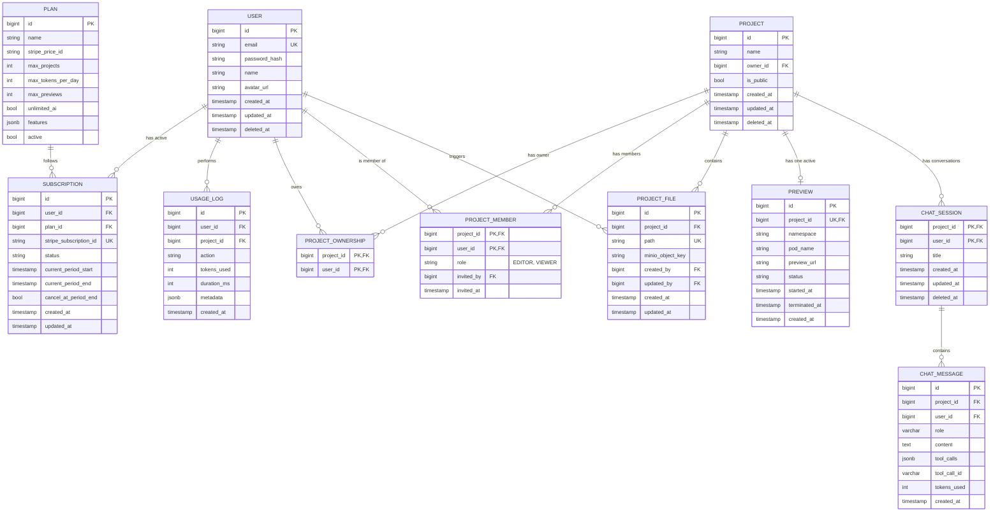

# Entities / Models

No JPA entities are implemented in code yet. Below is the **v1 data model design** (design/planning stage — the target schema, not yet implemented). Update this section (and bump the version) whenever the schema changes.

## ER Diagram

## Entity summary

| Entity | Purpose |
|---|---|
| `USER` | Account holder — auth, profile. |
| `PROJECT` | A user-owned workspace/app being built; can be public or private. |
| `PROJECT_OWNERSHIP` | Join table recording project ownership (alongside `PROJECT.owner_id`, which denormalizes the current owner directly on the project row). |
| `PROJECT_MEMBER` | Join table for collaborators on a project, with `EDITOR`/`VIEWER` roles and invite tracking. |
| `PROJECT_FILE` | A file belonging to a project; content stored in MinIO object storage (`minio_object_key`), with created/updated-by audit fields. |
| `PREVIEW` | A live preview deployment of a project (pod-based, with a public `preview_url` and lifecycle status/timestamps). |
| `CHAT_SESSION` | An AI chat/build conversation scoped to a project and the user who started it. |
| `CHAT_MESSAGE` | An individual message within a chat session, including AI tool-call data and token usage. |
| `SUBSCRIPTION` | A user's billing subscription (Stripe-backed) to a `PLAN`. |
| `PLAN` | A billing tier defining quotas (max projects, daily token budget, max previews) and feature flags. |
| `USAGE_LOG` | Per-user, per-project audit/usage record (action performed, tokens used, duration, metadata). |

## Notes / not yet drawn as explicit relationships

- `PROJECT.owner_id` is a direct FK to `USER.id`, denormalized alongside the `PROJECT_OWNERSHIP` join table.
- `PROJECT_FILE.created_by` / `updated_by` and `PROJECT_MEMBER.invited_by` are FKs to `USER.id` (audit trail), summarized above under the `triggers` relationship rather than drawn as separate lines.
- `CHAT_SESSION.user_id` and `CHAT_MESSAGE.user_id` are FKs to `USER.id`, not drawn as separate lines in this v1 diagram (only the `PROJECT` → `CHAT_SESSION` relationship is shown).

## Entity Details

Common columns that recur across most entities: `id` (primary key, `bigint`) and `created_at`/`updated_at` lifecycle timestamps. `USER`, `PROJECT`, and `CHAT_SESSION` additionally carry a `deleted_at` column for soft deletes — the row is kept and flagged rather than removed, so related history (a user's projects/chats, a project's files/previews) isn't orphaned by a delete.

### USER

An account holder on the platform — owns and collaborates on projects, participates in AI chat sessions, and holds a billing subscription.

| Field | Meaning |
|---|---|
| `id` | Primary key. |
| `email` | Login identifier; unique per user. |
| `password_hash` | Hash of the login password — the raw password is never stored. |
| `name` | Display name. |
| `avatar_url` | Profile picture URL. |
| `created_at` / `updated_at` | Record lifecycle timestamps. |
| `deleted_at` | Soft-delete timestamp — see note above. |

### PROJECT

A user-owned workspace/app being built; can be collaborated on and optionally made public.

| Field | Meaning |
|---|---|
| `id` | Primary key. |
| `name` | Project's display name. |
| `owner_id` | The user who currently owns this project — a direct FK to `USER`, denormalized alongside the `PROJECT_OWNERSHIP` join table so the current owner can be read without a join. |
| `is_public` | Whether the project (and its preview) is visible to anyone, not just the owner/members. |
| `created_at` / `updated_at` | Record lifecycle timestamps. |
| `deleted_at` | Soft-delete timestamp. |

### PROJECT_OWNERSHIP

Join table recording project ownership as a first-class relationship, kept alongside the denormalized `PROJECT.owner_id`.

| Field | Meaning |
|---|---|
| `project_id` | Part of the composite primary key; the project. |
| `user_id` | Part of the composite primary key; the owning user. |

### PROJECT_MEMBER

Join table for collaborators invited onto a project, with role-based access.

| Field | Meaning |
|---|---|
| `project_id` | Part of the composite primary key; the project being collaborated on. |
| `user_id` | Part of the composite primary key; the collaborating user. |
| `role` | Access level — `EDITOR` (can modify the project) or `VIEWER` (read-only). |
| `invited_by` | Which user sent the invite — FK to `USER`. |
| `invited_at` | When the invite was sent. |

### PROJECT_FILE

A single file belonging to a project; its content lives in object storage, not the database row itself.

| Field | Meaning |
|---|---|
| `id` | Primary key. |
| `project_id` | The project this file belongs to. |
| `path` | The file's path within the project (e.g. `src/App.tsx`) — unique per project, so two files can't collide on the same path. |
| `minio_object_key` | Key locating the actual file content in MinIO object storage — this row is metadata, not the content. |
| `created_by` / `updated_by` | Which user created/last modified this file — FKs to `USER`, forming the `triggers` relationship in the diagram above. |
| `created_at` / `updated_at` | Record lifecycle timestamps. |

### PREVIEW

A live, running deployment of a project, so it can be viewed and interacted with without downloading it.

| Field | Meaning |
|---|---|
| `id` | Primary key. |
| `project_id` | The project this preview runs — unique, so a project has at most one active preview at a time. |
| `namespace` | Kubernetes namespace the preview pod runs in — isolates one project's preview environment from another's. |
| `pod_name` | The Kubernetes pod backing this preview. |
| `preview_url` | Public URL where the running preview can be viewed. |
| `status` | Preview lifecycle status (e.g. starting, running, stopped). |
| `started_at` / `terminated_at` | When the preview pod came up and (if applicable) was torn down. |
| `created_at` | When the preview record was created. |

### CHAT_SESSION

An AI-assisted build conversation scoped to one project and the user who started it.

| Field | Meaning |
|---|---|
| `project_id` | Part of the composite primary key; the project being worked on. |
| `user_id` | Part of the composite primary key; the user having this conversation. |
| `title` | Human-readable session title. |
| `created_at` / `updated_at` | Record lifecycle timestamps. |
| `deleted_at` | Soft-delete timestamp. |

### CHAT_MESSAGE

A single message within a chat session — from the user, the AI assistant, or a tool-call result.

| Field | Meaning |
|---|---|
| `id` | Primary key. |
| `project_id` / `user_id` | Which project and user this message belongs to — denormalized from the parent `CHAT_SESSION` for direct querying without a join. |
| `role` | Who sent the message (user, assistant, or tool). |
| `content` | The message text/body. |
| `tool_calls` | Structured record (JSON) of AI tool/function calls made in this message — e.g. "create file", "start preview". |
| `tool_call_id` | Correlates a tool-result message back to the tool call it's responding to. |
| `tokens_used` | Token cost of this message, rolled up for usage metering (`USAGE_LOG`, `PLAN.max_tokens_per_day`). |
| `created_at` | When the message was sent. |

### SUBSCRIPTION

A user's billing subscription to a plan, synced with Stripe.

| Field | Meaning |
|---|---|
| `id` | Primary key. |
| `user_id` | The subscribing user. |
| `plan_id` | Which `PLAN` this subscription is for. |
| `stripe_subscription_id` | Stripe's own ID for this subscription — unique, used to reconcile with Stripe webhook events. |
| `status` | Subscription status, mirroring Stripe's (e.g. active, past_due, canceled). |
| `current_period_start` / `current_period_end` | The current billing cycle's date range. |
| `cancel_at_period_end` | Whether the subscription is set to cancel at the end of the current period rather than immediately. |
| `created_at` / `updated_at` | Record lifecycle timestamps. |

### PLAN

A billing tier defining what a subscriber gets — quotas and feature flags.

| Field | Meaning |
|---|---|
| `id` | Primary key. |
| `name` | Plan display name (e.g. Free, Pro). |
| `stripe_price_id` | Stripe's price ID for this plan, used when creating a checkout session/subscription. |
| `max_projects` | How many projects a user on this plan may have. |
| `max_tokens_per_day` | Daily AI token budget for this plan. |
| `max_previews` | How many concurrent live previews this plan allows. |
| `unlimited_ai` | Whether this plan bypasses the daily token budget entirely. |
| `features` | Additional feature flags for this plan (JSON) — lets plan capabilities evolve without new columns. |
| `active` | Whether this plan is currently offered/selectable — inactive plans are kept for existing subscribers' history. |

### USAGE_LOG

An audit/metering record of an action a user performed, for usage-based billing and quota enforcement.

| Field | Meaning |
|---|---|
| `id` | Primary key. |
| `user_id` | Which user performed the action. |
| `project_id` | Which project it was performed on. |
| `action` | What was done (e.g. `ai_generate`, `file_create`). |
| `tokens_used` | AI tokens consumed by this action, if any. |
| `duration_ms` | How long the action took, in milliseconds. |
| `metadata` | Additional context about the action (JSON). |
| `created_at` | When the action occurred. |

## Domain Vocabulary

| Field | Values | Used by |
|---|---|---|
| `role` | `EDITOR`, `VIEWER` | `PROJECT_MEMBER.role` |

## Revision history

- **v1** (2026-03-30): Initial schema design covering users, projects, collaboration (ownership/membership), file storage, live previews, AI chat, and billing (plans/subscriptions/usage).
