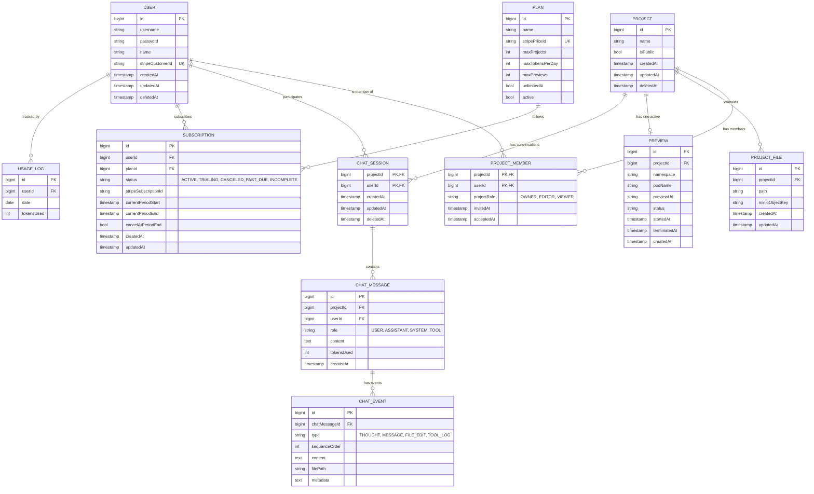

# Entities / Models

All 13 entities are now implemented as JPA entities (no repository/service/controller layers yet — just the persistence layer). One, `Preview`, is missing its JPA annotations and won't actually persist until that's finished (see [Known gaps](#known-gaps--deviations-from-v1-design)).

The schema below (**v2**) reflects the actual implementation, which diverges from the original v1 design in several places — most notably, project ownership is now expressed purely through `ProjectMember` (no separate ownership table or `owner_id` column), and AI chat responses are now composed of an ordered sequence of typed `ChatEvent` rows instead of a single JSON blob.

## Entity Relationship Diagram (v2)

Fields are shown as Java entity field names (camelCase); Hibernate's default physical naming strategy converts these to `snake_case` actual column names (e.g. `stripeCustomerId` → `stripe_customer_id`).

## Entity Details

Common columns that recur across most entities: `id` (primary key, `Long`/`bigint`, `IDENTITY` strategy) and, via Hibernate's `@CreationTimestamp`/`@UpdateTimestamp`, `createdAt`/`updatedAt` lifecycle timestamps. `User`, `Project`, and `ChatSession` additionally carry a plain nullable `deletedAt` column for soft deletes — the row is kept and flagged rather than removed, so related history isn't orphaned by a delete. There's no `@SQLDelete`/`@Where` filter wired up yet, so soft-deleted rows aren't automatically excluded from queries — that filtering has to be done manually until it is.

### USER

An account holder on the platform — collaborates on projects, participates in AI chat sessions, and holds a billing subscription.

| Field | Meaning |
|---|---|
| `id` | Primary key. |
| `username` | Login identifier. |
| `password` | The login password (naming suggests it's stored hashed, though there's no `@Column` comment or hashing code yet to confirm). |
| `name` | Display name. |
| `stripeCustomerId` | Stripe's customer ID for this user — unique; lives directly on `User` rather than only on `Subscription`, so a Stripe customer can exist before any subscription does. |
| `createdAt` / `updatedAt` | Record lifecycle timestamps. |
| `deletedAt` | Soft-delete timestamp — see note above. |

> **Gap vs. v1 design:** no `email` field (uses `username` instead) and no `avatar_url`.

### PROJECT

A workspace/app being built; can be collaborated on and optionally made public. Ownership is expressed entirely through `PROJECT_MEMBER` (see below) — there is no `owner_id` column on this table.

| Field | Meaning |
|---|---|
| `id` | Primary key. |
| `name` | Project's display name. |
| `isPublic` | Whether the project (and its preview) is visible to anyone, not just members. Defaults to `false`. |
| `createdAt` / `updatedAt` | Record lifecycle timestamps. |
| `deletedAt` | Soft-delete timestamp. |

The table also carries two composite indexes (`(updatedAt DESC, deletedAt)` and `(deletedAt, updatedAt DESC)`) plus a single-column index on `deletedAt` — aimed at a "list my non-deleted projects, most recently updated first" query pattern.

> **Gap vs. v1 design:** no `owner_id` FK and no separate `PROJECT_OWNERSHIP` join table — see `PROJECT_MEMBER` below.

### PROJECT_MEMBER

Both collaboration *and* ownership for a project — every project, including the owner's own access, is a row here.

| Field | Meaning |
|---|---|
| `projectId` | Part of the composite primary key (`ProjectMemberId`); the project. |
| `userId` | Part of the composite primary key; the member. |
| `projectRole` | `OWNER`, `EDITOR`, or `VIEWER` — a `ProjectRole` enum, not the v1 design's free-text `EDITOR`/`VIEWER` string. Each role maps to a fixed set of `ProjectPermission`s (see [Domain Vocabulary](../README.md#domain-vocabulary)). |
| `invitedAt` | When the invite was sent. |
| `acceptedAt` | When the invite was accepted — not in the v1 design. |

> **Gap vs. v1 design:** no `invited_by` FK (who sent the invite isn't recorded). No separate `PROJECT_OWNERSHIP` table — replaced entirely by the `OWNER` role here, which also means ownership can now be transferred by changing a role instead of moving a row between two tables.

### PROJECT_FILE

A single file belonging to a project; its content lives in object storage, not the database row itself.

| Field | Meaning |
|---|---|
| `id` | Primary key. |
| `projectId` | The project this file belongs to. |
| `path` | The file's path within the project (e.g. `src/App.tsx`). |
| `minioObjectKey` | Key locating the actual file content in MinIO object storage — this row is metadata, not the content. |
| `createdAt` / `updatedAt` | Record lifecycle timestamps. |

> **Gap vs. v1 design:** no `created_by`/`updated_by` audit FKs, and `path` is no longer marked unique.

### PREVIEW

_Not yet a real JPA entity._ A live, running deployment of a project, so it can be viewed without downloading it.

| Field | Meaning |
|---|---|
| `id` | Intended primary key. |
| `project` | Intended FK to the project this preview runs. |
| `namespace` | Kubernetes namespace the preview pod runs in. |
| `podName` | The Kubernetes pod backing this preview. |
| `previewUrl` | Public URL where the running preview can be viewed. |
| `status` | Preview lifecycle status — `PreviewStatus` enum (`CREATING`, `RUNNING`, `FAILED`, `TERMINATED`). |
| `startedAt` / `terminatedAt` | When the preview pod came up and (if applicable) was torn down. |
| `createdAt` | When the preview record was created. |

> **Known gap:** this class has no `@Entity`, `@Id`/`@GeneratedValue`, `@Table`, `@ManyToOne` on `project`, or `@Enumerated` on `status` — it's currently a plain Lombok class, not a persisted entity. It compiles, but Hibernate won't create a table or manage instances of it until those annotations are added.

### CHAT_SESSION

An AI-assisted build conversation scoped to one project and the user who started it.

| Field | Meaning |
|---|---|
| `projectId` | Part of the composite primary key (`ChatSessionId`); the project being worked on. |
| `userId` | Part of the composite primary key; the user having this conversation. |
| `createdAt` / `updatedAt` | Record lifecycle timestamps. |
| `deletedAt` | Soft-delete timestamp. |

> **Gap vs. v1 design:** no `title` field.

### CHAT_MESSAGE

A single message within a chat session — from the user or the AI assistant. Unlike the v1 design, an assistant's response isn't one blob of JSON tool-call data; it's a `content` string (user messages) plus an ordered list of `CHAT_EVENT` rows (assistant messages).

| Field | Meaning |
|---|---|
| `id` | Primary key. |
| `chatSession` (`projectId` + `userId`) | Which chat session this message belongs to — FK to the composite `ChatSession` key. |
| `role` | Who/what this message represents — `MessageRole` enum (`USER`, `ASSISTANT`, `SYSTEM`, `TOOL` — more values than the v1 design's plain varchar). |
| `content` | The message text — populated for `USER` messages, `NULL` for `ASSISTANT` messages (which use `events` instead). |
| `events` | Ordered (`sequenceOrder`) list of `CHAT_EVENT` rows — populated for `ASSISTANT` messages, empty otherwise. |
| `tokensUsed` | Token cost of this message, for usage metering. Defaults to `0`. |
| `createdAt` | When the message was sent. |

> **Gap vs. v1 design:** the `tool_calls`/`tool_call_id` JSON columns are gone — replaced by the `CHAT_EVENT` child entity below, which is a more structured way to represent a streamed, multi-step AI response.

### CHAT_EVENT

**New in v2, not part of the v1 design.** One step in an assistant's response — a thought, a chunk of message text, a file edit, or a tool-call log — kept in order so a multi-step AI turn can be replayed/rendered step by step instead of arriving as a single flat blob.

| Field | Meaning |
|---|---|
| `id` | Primary key. |
| `chatMessage` | The (assistant) `CHAT_MESSAGE` this event belongs to. |
| `type` | `ChatEventType` enum — `THOUGHT`, `MESSAGE`, `FILE_EDIT`, or `TOOL_LOG`. |
| `sequenceOrder` | Position within the message — events render/replay in this order. |
| `content` | The event's text content. |
| `filePath` | The file affected — populated only for `FILE_EDIT` events. |
| `metadata` | Additional context for the event (stored as text, not `jsonb`). |

### SUBSCRIPTION

A user's billing subscription to a plan, synced with Stripe.

| Field | Meaning |
|---|---|
| `id` | Primary key. |
| `user` | The subscribing user. |
| `plan` | Which `PLAN` this subscription is for. |
| `status` | `SubscriptionStatus` enum (`ACTIVE`, `TRIALING`, `CANCELED`, `PAST_DUE`, `INCOMPLETE`) — replaces the v1 design's free-text status. |
| `stripeSubscriptionId` | Stripe's own ID for this subscription, used to reconcile with Stripe webhook events. |
| `currentPeriodStart` / `currentPeriodEnd` | The current billing cycle's date range. |
| `cancelAtPeriodEnd` | Whether the subscription is set to cancel at the end of the current period rather than immediately. Defaults to `false`. |
| `createdAt` / `updatedAt` | Record lifecycle timestamps. |

### PLAN

A billing tier defining what a subscriber gets — quotas and limits.

| Field | Meaning |
|---|---|
| `id` | Primary key. |
| `name` | Plan display name (e.g. Free, Pro). |
| `stripePriceId` | Stripe's price ID for this plan — unique, used when creating a checkout session/subscription. |
| `maxProjects` | How many projects a user on this plan may have. |
| `maxTokensPerDay` | Daily AI token budget for this plan — enforced via `USAGE_LOG`. |
| `maxPreviews` | How many concurrent live previews this plan allows. |
| `unlimitedAi` | Whether this plan bypasses the daily token budget entirely (ignore `maxTokensPerDay` if true). |
| `active` | Whether this plan is currently offered/selectable. |

> **Gap vs. v1 design:** no `features` JSON column, and no `createdAt`/`updatedAt` timestamps at all.

### USAGE_LOG

A per-user, per-day token counter for daily quota enforcement — **redesigned from the v1 design's per-action audit log.**

| Field | Meaning |
|---|---|
| `id` | Primary key. |
| `userId` | Which user this counter belongs to (plain `Long`, not a JPA `@ManyToOne`). |
| `date` | The day this row counts — combined with `userId` under a unique constraint, so there's exactly one row per user per day. |
| `tokensUsed` | Running total of tokens the user has consumed that day, checked against `PLAN.maxTokensPerDay`. |

> **Gap vs. v1 design:** no `project_id`, `action`, `duration_ms`, or `metadata` — this is no longer a per-action audit trail, just a daily aggregate counter. No `createdAt` either.

## Domain Vocabulary (Enums)

| Enum | Values | Used by |
|---|---|---|
| `ProjectRole` | `OWNER`, `EDITOR`, `VIEWER` — each maps to a fixed `Set<ProjectPermission>` | `ProjectMember.projectRole` |
| `ProjectPermission` | `VIEW`, `EDIT`, `DELETE`, `MANAGE_MEMBERS`, `VIEW_MEMBERS` (each carries a string `value`, e.g. `"project:edit"`) | `ProjectRole`'s permission sets |
| `MessageRole` | `USER`, `ASSISTANT`, `SYSTEM`, `TOOL` | `ChatMessage.role` |
| `ChatEventType` | `THOUGHT`, `MESSAGE`, `FILE_EDIT`, `TOOL_LOG` | `ChatEvent.type` |
| `PreviewStatus` | `CREATING`, `RUNNING`, `FAILED`, `TERMINATED` | `Preview.status` |
| `SubscriptionStatus` | `ACTIVE`, `TRIALING`, `CANCELED`, `PAST_DUE`, `INCOMPLETE` | `Subscription.status` |

`ProjectRole`'s permission mapping:

| Role | Permissions |
|---|---|
| `OWNER` | `VIEW`, `EDIT`, `DELETE`, `MANAGE_MEMBERS`, `VIEW_MEMBERS` |
| `EDITOR` | `VIEW`, `EDIT`, `DELETE`, `VIEW_MEMBERS` |
| `VIEWER` | `VIEW`, `VIEW_MEMBERS` |

## Known gaps / deviations from v1 design

Found while syncing docs to the actual implementation (2026-03-30):

1. `Preview` is missing its JPA annotations entirely (`@Entity`, `@Id`, `@Table`, `@ManyToOne`, `@Enumerated`) — it won't persist until that's fixed.
2. No `PROJECT_OWNERSHIP` table and no `PROJECT.owner_id` — ownership folded into `PROJECT_MEMBER.projectRole == OWNER`.
3. `USER` has no `email`/`avatar_url`; uses `username` instead of `email`, and carries `stripeCustomerId` directly rather than only via `Subscription`.
4. `PROJECT_FILE` has no `created_by`/`updated_by` audit trail.
5. `PROJECT_MEMBER` has no `invited_by`.
6. `CHAT_SESSION` has no `title`.
7. `PLAN` has no `features` JSON column and no timestamps.
8. `USAGE_LOG` was redesigned from a per-action audit log into a per-user-per-day counter (see entity notes above) — not a gap so much as a scope change, noted here for visibility.

Not yet triaged as intentionally dropped vs. still planned — flag to the user before removing any of this from a future revision of the doc.

## Revision history

- **v1** (2026-03-30): Initial schema design covering users, projects, collaboration (ownership/membership), file storage, live previews, AI chat, and billing (plans/subscriptions/usage).
- **v2** (2026-03-30): First real implementation — all 13 entities added as JPA entities (`Preview` incomplete). Ownership folded into `PROJECT_MEMBER`; AI chat responses restructured into ordered `CHAT_EVENT` steps instead of a single JSON blob; `USAGE_LOG` redesigned into a daily per-user counter. See Entity Details above for the full list of deviations from v1.
