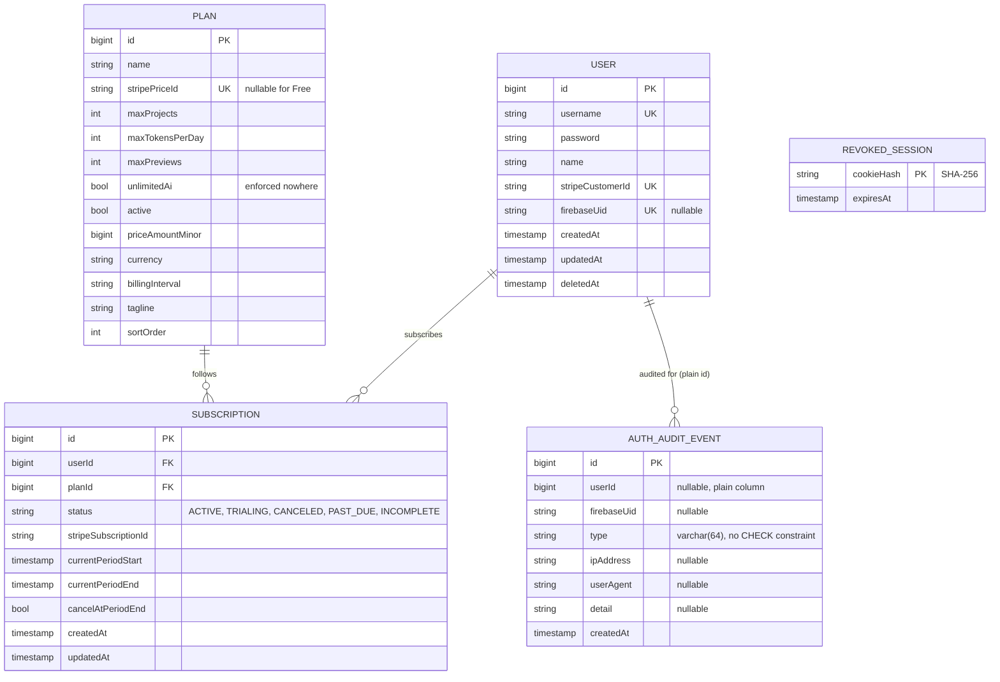

# account-service

## USER

An account holder — collaborates on projects, holds a subscription. Everything about who a person *is* lives here and nowhere else: other services see a `UserDto` (id, username, name, firebase uid) over the internal API.

| Field | Meaning |
|---|---|
| `id` | Primary key. |
| `username` | Login identifier, unique, not null. Despite the name it's validated as email-shaped at the DTO layer (`@Email`) — nothing on the entity itself constrains the format. |
| `password` | A BCrypt hash. `NOT NULL`, but never a real user-chosen password — Firebase holds the actual credential. Set to an unguessable random secret when the account is created (`SessionServiceImpl`) purely to satisfy the column constraint; nothing ever authenticates against it. |
| `name` | Display name. |
| `stripeCustomerId` | Unique, nullable. Set once the user's first Stripe Checkout completes; reused on every later checkout so Stripe never mints a duplicate customer. |
| `firebaseUid` | Unique, nullable. Set on Firebase sign-in. |
| `deletedAt` | Soft-delete marker (see [Soft delete](conventions.md#soft-delete-is-a-plain-column-not-a-framework-filter)). |

`User implements UserDetails` (Spring Security) with `getAuthorities()` hardcoded to an empty list — every authenticated caller is equivalent from Spring Security's point of view; role is per-project (`ProjectMember.projectRole`), not a platform-wide concept.

## SUBSCRIPTION / PLAN

A user's billing relationship to a `PLAN` (billing tier). `Plan` is seeded on every boot by `config.PlanSeeder`, upserted on `stripePriceId` (Free, which has none, on `name`), so a restart never duplicates a plan. Free's limits come from `SubscriptionService.FREE_TIER_PROJECTS_ALLOWED`/`FREE_TIER_DAILY_TOKENS`/`FREE_TIER_PREVIEWS` — the same Java constants that gate a user with no subscription at all, so the seeded row and enforcement can never disagree. `unlimitedAi` exists on the entity but is enforced nowhere — `maxTokensPerDay` is the real limit on every plan, including ones that could set it `true`.

Other services never read these tables. They ask `GET /internal/v1/users/{id}/plan-limits`, which returns the *effective* limits (the free-tier fallback included) as a `PlanDto`.

## AUTH_AUDIT_EVENT / REVOKED_SESSION

Two small tables backing the Firebase-session auth model (`docs/architecture/request-flows.md` §4.1):

- **`AUTH_AUDIT_EVENT`** — append-only sign-in history (`AuthAuditEventType`). `userId` is a plain nullable column, not a relation — a rejected sign-in often has no matched user yet.
- **`REVOKED_SESSION`** — a session cookie that's been signed out of but hasn't naturally expired. Firebase can only revoke *every* session for a user at once; single-device sign-out is enforced here. Only the cookie's SHA-256 is stored, as the primary key itself. It lives only in this database: workspace and intelligence check it through `GET /internal/v1/sessions/revoked`.

**`password_reset_tokens`** is in the account baseline migration but nothing maps to it: the username/password reset flow it served (Firebase sends its own reset emails) no longer exists. The table is orphaned and empty in practice; a new migration can drop it whenever convenient.
