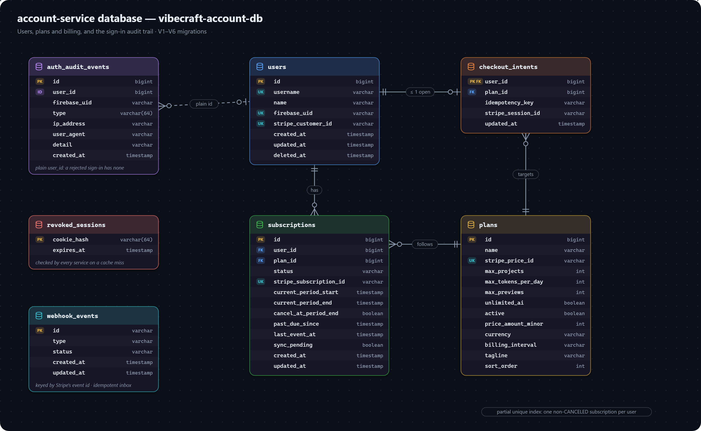

# account-service data model

Users, plans and billing, and the sign-in audit trail. Database: `vibecraft-account-db`.

## USER

An account holder — collaborates on projects, holds a subscription. Everything about who a person *is* lives here and nowhere else: other services see a `UserDto` (id, username, name, firebase uid) over the internal API.

| Field | Meaning |
|---|---|
| `id` | Primary key. |
| `username` | Login identifier, unique, not null. Despite the name it's validated as email-shaped at the DTO layer (`@Email`) — nothing on the entity itself constrains the format. |
| `name` | Display name. |
| `stripeCustomerId` | Unique, nullable. Set once the user's first Stripe Checkout completes; reused on every later checkout so Stripe never mints a duplicate customer. |
| `firebaseUid` | Unique, nullable. Set on Firebase sign-in. |
| `deletedAt` | Soft-delete marker (see [Soft delete](conventions.md#soft-delete-is-a-plain-column-not-a-framework-filter)). |

`User implements UserDetails` (Spring Security) with `getAuthorities()` hardcoded to an empty list — every authenticated caller is equivalent from Spring Security's point of view; role is per-project (`ProjectMember.projectRole`), not a platform-wide concept.

## SUBSCRIPTION / PLAN

A user's billing relationship to a `PLAN` (billing tier). `Plan` is seeded on every boot by `config.PlanSeeder`, upserted on `stripePriceId` (Free, which has none, on `name`), so a restart never duplicates a plan. Free's limits come from `SubscriptionService.FREE_TIER_PROJECTS_ALLOWED`/`FREE_TIER_DAILY_TOKENS`/`FREE_TIER_PREVIEWS` — the same Java constants that gate a user with no subscription at all, so the seeded row and enforcement can never disagree. `unlimitedAi` short-circuits the daily token check in `UsageServiceImpl.assertWithinDailyTokenBudget` — a plan with it set is not capped by `maxTokensPerDay`, which stays populated for display. No seeded plan sets it today.

Other services never read these tables. They ask `GET /internal/v1/users/{id}/plan-limits`, which returns the *effective* limits (the free-tier fallback included) as a `PlanDto`.

Two database constraints back `SubscriptionServiceImpl.activateSubscription`: `stripe_subscription_id` is globally unique, and a partial unique index (`uk_subscriptions_user_non_terminal`, on `user_id` `WHERE status <> 'CANCELED'`) means a user can hold at most one non-terminal subscription row at a time — CANCELED rows are exempt so resubscribing after cancelling isn't blocked. A violation of the first is treated as an idempotent duplicate webhook/confirm race; a violation of the second refuses to open a second concurrent subscription.

Entitlement is not a flat status set: ACTIVE and TRIALING always entitle, PAST_DUE entitles only within `billing.past-due-grace-days` of `pastDueSince` (computed at read time in `SubscriptionServiceImpl.isCurrentlyEntitling`, not by another webhook), and CANCELED/INCOMPLETE/UNPAID/PAUSED never do. `lastEventAt` guards every mutator against a delayed or redelivered-out-of-order Stripe webhook applying older state after newer state already landed — see `SubscriptionServiceImpl`'s class Javadoc. `syncPending` is set when a plan-change's write to Stripe succeeded but the immediate read-back failed, so `GET /api/me/subscription` never implies the mirrored fields are known-current just because it returned 200.

## CHECKOUT_INTENT

At most one outstanding Stripe Checkout attempt per user, keyed on `userId` itself. `CheckoutIntentRepository.claimOrRefresh` is a native `INSERT ... ON CONFLICT (user_id) DO UPDATE ... WHERE ...` upsert rather than a JPA `save()` — this entity's manually-assigned id would otherwise route `save()` through `entityManager.merge()`, which upserts silently instead of ever failing on conflict, so two concurrent requests could mint two different idempotency keys instead of converging on one (see [upserts](conventions.md#upserts-need-native-sql)). Carries the Stripe idempotency key and (once minted) the Stripe Checkout Session id, both reused across a double click or a parallel tab until the intent goes stale (older than a Checkout Session's own ~24h expiry) or targets a different plan. Cleared once the checkout activates a subscription.

## WEBHOOK_EVENT

A durable inbox of Stripe webhook deliveries, keyed on Stripe's own event id — what makes `StripePaymentProcessor.handleWebhookEvent` idempotent. `RECEIVED` covers both "still in flight" and "a previous attempt's handler threw"; both are reclaimable by a retry. `PROCESSED` is terminal — an event in that state is skipped outright on redelivery. The claim itself (`WebhookEventRepository.tryClaim`) is a native `INSERT ... ON CONFLICT ... DO UPDATE ... WHERE status <> 'PROCESSED'`, not a JPA `save()`, because `save()` on this entity's manually-assigned id would merge rather than insert and so could never detect a duplicate.

## AUTH_AUDIT_EVENT / REVOKED_SESSION

Two small tables backing the Firebase-session auth model (see the [authentication flow](../architecture/flows/authentication.md)):

- **`AUTH_AUDIT_EVENT`** — append-only sign-in history (`AuthAuditEventType`). `userId` is a plain nullable column, not a relation — a rejected sign-in often has no matched user yet.
- **`REVOKED_SESSION`** — a session cookie that's been signed out of but hasn't naturally expired. Firebase can only revoke *every* session for a user at once; single-device sign-out is enforced here. Only the cookie's SHA-256 is stored, as the primary key itself. It lives only in this database: workspace and intelligence check it through `GET /internal/v1/sessions/revoked`.
