# Entity Overview

17 entity types, 19 files under `src/main/java/com/java/vibecraft/entity/` (two — `ChatSessionId`, `ProjectMemberId` — are `@Embeddable` composite-key classes, not entities in their own right). Every entity carries a `Long id` (`IDENTITY` strategy) unless it uses a composite key, plus `createdAt`/`updatedAt` via Hibernate's `@CreationTimestamp`/`@UpdateTimestamp`.

```mermaid
erDiagram
    USER ||--o{ PROJECT_MEMBER : "is member of"
    USER ||--o{ CHAT_SESSION : participates
    USER ||--o{ SUBSCRIPTION : subscribes
    USER ||--o{ USAGE_LOG : "tracked by"
    USER ||--o{ USAGE_EVENT : spends
    USER ||--o{ CODE_NOTE : asked
    USER ||--o{ PREVIEW_SESSION : watches
    USER ||--o{ AUTH_AUDIT_EVENT : "audited for"
    USER ||--o{ PASSWORD_RESET_TOKEN : requests

    PROJECT ||--o{ PROJECT_MEMBER : "has members"
    PROJECT ||--o{ PROJECT_FILE : contains
    PROJECT ||--o{ PREVIEW : "has previews"
    PROJECT ||--o{ CHAT_SESSION : "has conversations"
    PROJECT ||--o{ CODE_NOTE : "has code notes"

    PLAN ||--o{ SUBSCRIPTION : follows
    CHAT_SESSION ||--o{ CHAT_MESSAGE : contains
    CHAT_MESSAGE ||--o{ CHAT_EVENT : "made up of"
    PREVIEW ||--o{ PREVIEW_SESSION : "watched by"

    USER {
        bigint id PK
        string username UK
        string password
        string name
        string stripeCustomerId UK
        string firebaseUid UK "nullable"
        timestamp createdAt
        timestamp updatedAt
        timestamp deletedAt
    }

    PROJECT {
        bigint id PK
        string name
        bool isPublic
        string templateInitIssue "nullable"
        bigint forkedFromProjectId "nullable, plain id"
        timestamp createdAt
        timestamp updatedAt
        timestamp deletedAt
    }

    PROJECT_MEMBER {
        bigint projectId PK_FK
        bigint userId PK_FK
        string projectRole "EDITOR, VIEWER, OWNER"
        timestamp invitedAt
        timestamp acceptedAt "nullable"
        timestamp pinnedAt "nullable"
        timestamp starredAt "nullable"
    }

    PROJECT_FILE {
        bigint id PK
        bigint projectId FK
        string path
        string minioObjectKey
        bigint size
        string type
        bigint createdBy FK
        bigint updatedBy FK
        timestamp createdAt
        timestamp updatedAt
    }

    PREVIEW {
        bigint id PK
        bigint projectId FK
        bigint startedByUserId
        string namespace
        string podName
        string hostname
        string previewUrl
        string status "CREATING, RUNNING, FAILED, TERMINATED"
        string detail "nullable"
        string failureLog "nullable"
        timestamp startedAt
        timestamp readyAt "nullable"
        timestamp lastAccessedAt
        timestamp terminatedAt "nullable"
        timestamp createdAt
    }

    PREVIEW_SESSION {
        bigint id PK
        bigint previewId FK
        bigint projectId "denormalised"
        bigint userId
        timestamp startedAt
        timestamp lastSeenAt
        timestamp endedAt "nullable"
        string endReason "nullable"
        bool failed
    }

    CHAT_SESSION {
        bigint projectId PK_FK
        bigint userId PK_FK
        timestamp createdAt
        timestamp updatedAt
        timestamp deletedAt
    }

    CHAT_MESSAGE {
        bigint id PK
        bigint projectId FK
        bigint userId FK
        text content "placeholder for ASSISTANT rows"
        string role "USER, ASSISTANT, SYSTEM, TOOL"
        int tokensUsed "nullable"
        timestamp createdAt
    }

    CHAT_EVENT {
        bigint id PK
        bigint chatMessageId FK
        string type "THOUGHT, MESSAGE, TODO, FILE_EDIT, LEARN, TOOL_LOG"
        int sequenceOrder
        text content
        string filePath "nullable"
        text metadata "nullable"
    }

    CODE_NOTE {
        bigint id PK
        bigint projectId FK
        bigint userId FK
        text question
        text answer
        string selectionPath "nullable"
        text selectionCode "nullable"
        int selectionStartLine "nullable"
        int selectionEndLine "nullable"
        timestamp createdAt
    }

    SUBSCRIPTION {
        bigint id PK
        bigint userId FK
        bigint planId FK
        string status "ACTIVE, TRIALING, CANCELED, PAST_DUE, INCOMPLETE"
        string stripeSubscriptionId
        timestamp currentPeriodStart
        timestamp currentPeriodEnd
        bool cancelAtPeriodEnd
        timestamp createdAt
        timestamp updatedAt
    }

    PLAN {
        bigint id PK
        string name
        string stripePriceId UK "nullable for Free"
        int maxProjects
        int maxTokensPerDay
        int maxPreviews
        bool unlimitedAi "enforced nowhere"
        bool active
        bigint priceAmountMinor
        string currency
        string billingInterval
        string tagline
        int sortOrder
    }

    USAGE_LOG {
        bigint id PK
        bigint userId "plain column"
        date date
        int tokensUsed
    }

    USAGE_EVENT {
        bigint id PK
        bigint userId "plain column"
        bigint projectId "nullable, plain column"
        string feature "plain string, not @Enumerated"
        int inputTokens
        int outputTokens
        int totalTokens
        timestamp createdAt "set explicitly"
    }

    AUTH_AUDIT_EVENT {
        bigint id PK
        bigint userId "nullable, plain column"
        string firebaseUid "nullable"
        string type "varchar(64), no CHECK constraint"
        string ipAddress "nullable"
        string userAgent "nullable"
        string detail "nullable"
        timestamp createdAt
    }

    REVOKED_SESSION {
        string cookieHash PK "SHA-256"
        timestamp expiresAt
    }

    PASSWORD_RESET_TOKEN {
        bigint id PK
        bigint userId FK
        string tokenHash UK "SHA-256"
        timestamp expiresAt
        timestamp createdAt
    }
```

Hibernate's default physical naming strategy converts these camelCase field names to `snake_case` columns (`createdBy` → `created_by`). `Project` has no `owner` field of its own — ownership is expressed entirely by a `PROJECT_MEMBER` row with `projectRole = OWNER`; see [Ownership lives on the join row](conventions.md#ownership-lives-on-the-join-row-not-a-fk) below.
