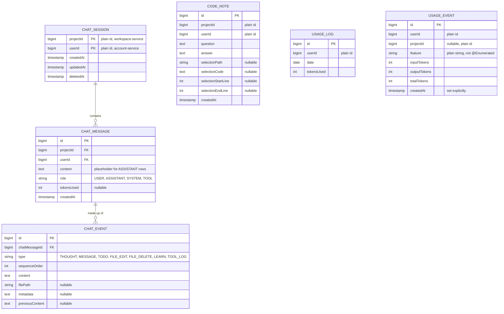

# intelligence-service data model

Chat history, code notes, and AI usage. Database: `vibecraft-intelligence-db`.

## CHAT_SESSION

One project × one user's build conversation. `projectId` + `userId` is the composite primary key (`ChatSessionId`); both are plain ids into other services' databases.

| Field | Meaning |
|---|---|
| `deletedAt` | Soft-delete marker — but note: there is no server-side delete path for a chat session at all today (`finalizeChats` only ever inserts). |

## CHAT_MESSAGE

One turn of a chat session. Its `(project_id, user_id)` is a real composite foreign key into `chat_sessions` — both tables live in this one database.

| Field | Meaning |
|---|---|
| `content` | **For an `ASSISTANT` row this is always the literal placeholder `"Assistant Message here..."`, never the model's real output.** The real content lives entirely in the message's `CHAT_EVENT` children — this column exists to satisfy the `not null` constraint and nothing reads it for an assistant turn. Anyone querying `chat_messages` directly needs to know this. |
| `role` | `MessageRole` — see below. |
| `tokensUsed` | Nullable — `null` if the provider didn't report usage for that exchange. |
| `events` | `@OneToMany(cascade = ALL)`, ordered by `sequenceOrder` — the actual structured content of an assistant reply. |

## CHAT_EVENT

One step of an assistant's response.

| Field | Meaning |
|---|---|
| `chatMessage` | `@ManyToOne`, not null. |
| `type` | `ChatEventType` — see below. |
| `sequenceOrder` | Render/fetch order. |
| `content` | Markdown for `MESSAGE`; the file's full content for `FILE_EDIT`; the raw walkthrough body for `LEARN`. |
| `filePath` | Always set for `FILE_EDIT`/`FILE_DELETE`. For `TODO`, the file that step writes (when it has one). For `LEARN`, the file the walkthrough explains. **This string must match byte-for-byte between a `TODO` and its `FILE_EDIT`** — see the [AI generation flow](../architecture/flows/ai-generation.md) for why. |
| `metadata` | Free text — the tool-args string for `TOOL_LOG`; the comma-joined concepts introduced, for `LEARN`. |
| `previousContent` | For `FILE_EDIT`/`FILE_DELETE`: the file as it was just before this turn wrote it (`""` for a new file, `null` if it couldn't be read). What lets the editor show a turn's diff (`GET /api/chat/projects/{id}/last-turn-changes`). |

## CODE_NOTE

One saved question+answer exchange from the code-notes feature (see the [code insight API](../api/code-insight.md)).

| Field | Meaning |
|---|---|
| `projectId` + `userId` | Plain ids. **Every repository query filters on both** — there is deliberately no find-by-project-alone method, since that query is exactly the shape of the leak this design fixed (two accounts sharing a project seeing each other's notes). |
| `answer` | Written only once the answer finished streaming — a reply that errored or was left half-read is never saved. |
| `selectionPath`/`selectionCode`/`selectionStartLine`/`selectionEndLine` | The quoted block, or all four `null` for a question about the project in general. |

One row is one whole exchange (question + answer), not one message — deleting a note removes the pair together, and there's no soft delete: these are personal notes, a delete is a delete.

## USAGE_LOG / USAGE_EVENT

Usage is recorded **twice, on purpose, in one transaction** (`UsageServiceImpl.recordTokenUsage`):

- `USAGE_LOG` — one row per user per day (`UNIQUE (user_id, date)`), a running total. What the pre-flight quota check reads (`assertWithinDailyTokenBudget`) — a single-row lookup, so it has to stay cheap. The allowance it is compared against comes from account-service.
- `USAGE_EVENT` — one row per AI call, the ledger behind the usage-insights page's breakdowns by feature/project/day. `feature` is a **plain `String` column** (`VARCHAR(32)`), deliberately not `@Enumerated`.

The two serve different reads and neither can stand in for the other: the counter can't say *where* tokens went, and the ledger is too expensive to check on every single AI request. Usage recorded before the ledger existed is reported as an `UNATTRIBUTED` bucket rather than guessed at, so a chart's total always matches what the quota counted.
