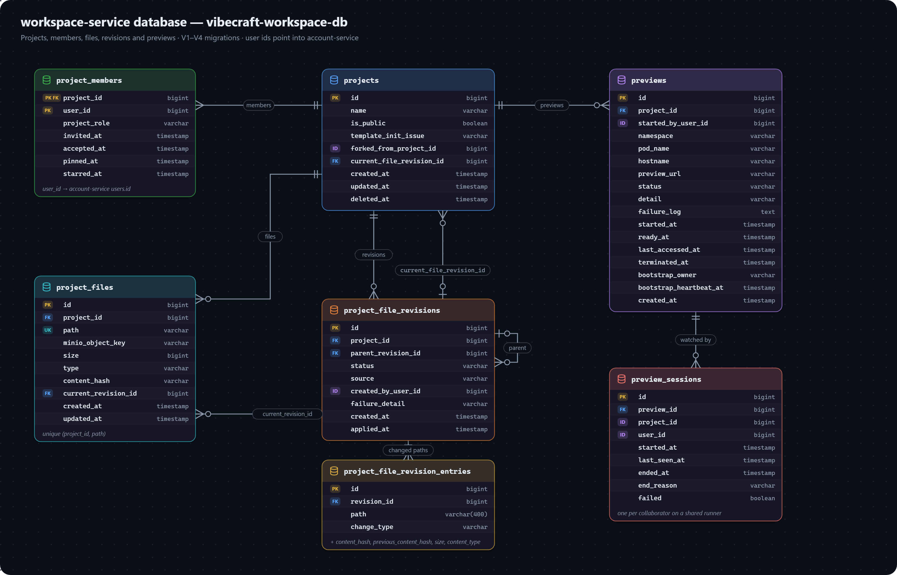

# workspace-service data model

Projects, members, files, file revisions and live previews. Database: `vibecraft-workspace-db`.

`Project` has no `owner` field of its own — ownership is expressed entirely by a `PROJECT_MEMBER` row with `projectRole = OWNER`; see [Ownership lives on the join row](conventions.md#ownership-lives-on-the-join-row-not-a-foreign-key).

## PROJECT

A workspace being built.

| Field | Meaning |
|---|---|
| `name` | Not null. |
| `isPublic` | Whether the project is visible to non-members. Defaults `false`. Not currently enforced by any read endpoint — every project read still goes through `@security.canViewProject`. |
| `templateInitIssue` | Nullable. `null` = the starter template copied cleanly (or wasn't needed); otherwise a short description of what's still missing. Cleared by `POST /api/projects/{id}/retry-template-init`. |
| `forkedFromProjectId` | Nullable, a plain `Long` (not a relation) — set by `POST /api/projects/{id}/fork`. Plain so a fork keeps working after its source is deleted. |
| `deletedAt` | Soft-delete marker. An owner's delete sets this; an editor's delete instead removes only their own `PROJECT_MEMBER` row and leaves the project untouched — see [Projects API](../api/projects.md). |
| `currentFileRevisionId` | Nullable, a plain `Long` (not a relation on purpose — see [File revisions](../architecture/file-revisions.md)) — the project's currently-published revision. `null` until the project's first revision. Only ever advanced by `ProjectRepository.casAdvanceCurrentRevision`'s single-statement compare-and-swap, never a plain entity save. |

## PROJECT_MEMBER

The only record of who can access a project and how — owners and collaborators are both just rows here.

| Field | Meaning |
|---|---|
| `projectId` + `userId` | Composite primary key (`ProjectMemberId`, `@Embeddable`, `Serializable`, with `equals()`/`hashCode()` over both fields — required by the JPA spec for a composite key to behave correctly in the persistence context). `projectId` is a real foreign key; `userId` is a plain id into account-service's database. |
| `projectRole` | `OWNER`, `EDITOR`, or `VIEWER` — see [roles and permissions](enums.md#roles-and-permissions). Nothing enforces "exactly one `OWNER`" or restricts who may be assigned it (see [known gaps](../known-gaps/not-yet-built.md)). |
| `invitedAt` / `acceptedAt` | `acceptedAt` is `null` until `POST /api/projects/{projectId}/members/accept`; access is **not** gated on it — an invited member has full access from the moment the row is created, whether or not they've accepted. This is a deliberate product choice, not an oversight. |
| `pinnedAt` / `starredAt` | Independent, nullable, per-member sidebar preferences. Re-setting either keeps the original timestamp so a list ordered by it doesn't reshuffle. |

## PROJECT_FILE

Metadata for one file; content lives in MinIO, not this row. There is no `createdBy`/`updatedBy`: nothing would read them.

| Field | Meaning |
|---|---|
| `project` | `@ManyToOne`, not null. |
| `path` | The file's path within the project (`src/App.tsx`). Every MinIO key for it is built through one place, `ProjectFilePath.objectKey(projectId, path)`. |
| `minioObjectKey` | Locates the content in object storage. |
| `size` / `type` | Set from the real uploaded content (or the template source's real size, at template-init time) — never guessed. |
| `contentHash` | Nullable — the live content's SHA-256 hash in the `project-blobs` bucket (see [File revisions](../architecture/file-revisions.md)). `null` for a file not touched since revisions were introduced; lazily adopted the first time it's next edited or deleted. |
| `currentRevisionId` | Nullable, a plain `Long` — the revision that last changed this path. `null` for the same reason `contentHash` can be. |

## PROJECT_FILE_REVISION

One attempted change set — the durable manifest `RevisionPublisherImpl.publish` records before touching the live layout. See [File revisions](../architecture/file-revisions.md) for the full design.

| Field | Meaning |
|---|---|
| `projectId` | Plain `Long`, not a relation — a revision chain is walked by id via a recursive query, not loaded as an object graph. |
| `parentRevisionId` | Nullable, a plain `Long` — the revision this one was published against. `null` only for a project's very first revision. The optimistic-concurrency base for `ProjectRepository.casAdvanceCurrentRevision`. |
| `status` | `STAGING` → `APPLIED` (landed), `FAILED` (rolled back — storage/DB error), or `CONFLICT` (rolled back — lost the CAS race). |
| `source` | `AI_GENERATION`, `MANUAL_EDIT` (supported, but nothing produces it yet), or `RESTORE`. |
| `createdByUserId` | Plain `Long`. |
| `failureDetail` | Nullable — set only on `FAILED`. |

## PROJECT_FILE_REVISION_ENTRY

One path's change within a revision — a delta entry against its parent, not a full-tree snapshot row. A snapshot at any revision is reconstructed by walking `parentRevisionId` back to the root and keeping each path's most recent entry (`ProjectFileRevisionRepository.reconstructSnapshot`, a native recursive CTE).

| Field | Meaning |
|---|---|
| `revisionId` | Plain `Long`, not a relation, for the same reason as `PROJECT_FILE_REVISION.projectId`. |
| `path` / `changeType` | `EDIT` or `DELETE`. |
| `contentHash` | The new content's hash in `project-blobs`. `null` for `DELETE`. |
| `previousContentHash` | The path's content hash immediately before this revision — the rollback data a failed or superseded publish restores from. `null` only if the path did not exist before this revision (a brand-new file). |
| `size` / `contentType` | `null` for `DELETE`. |

## PREVIEW

One attempt at running a project live (see the [live preview flow](../architecture/flows/live-preview.md)). A new row per start attempt, so a failure stays readable after a retry. Status only ever moves through `PreviewRepository`'s conditional status-transition updates (`markRunning`, `markFailed`, `markTerminated`, …) — never a plain entity save, since the async bootstrap and a user pressing Stop can race and a naive save from whichever finishes last could resurrect a stopped preview.

| Field | Meaning |
|---|---|
| `project` / `projectId` | The FK relation, plus a read-only mirror column (`insertable = false, updatable = false`) for code running outside a request — the reaper — where touching the lazy relation would throw. |
| `hostname` | The preview proxy's routing key (`p12-x7k2m9qd4a.localhost`). Reused across restarts of the same project (`findLatestHostname`) so a shared link keeps working, and randomly generated so it can't be guessed from the project id. |
| `startedByUserId` | Whose plan the preview allowance counts against. |
| `status` | `PreviewStatus` — see below. |
| `detail` | While `CREATING`: the step in progress. Once ended: why. |
| `failureLog` | Tail of install/dev-server output on a failed start — the pod is gone by the time anyone reads this, so it has to be captured before that. |
| `lastAccessedAt` | Refreshed by `PreviewLifecycle` while the app polls `GET .../preview`. Distinct from the proxy's own Redis-side "seen" tracking of direct browser visits. |
| `bootstrapOwner` / `bootstrapHeartbeatAt` | Written when a bootstrap claims a `CREATING` row and refreshed on every poll while it runs. On startup, `PreviewReaper` fails a `CREATING` row left over from before only if this heartbeat is missing or older than its own staleness grace period — not unconditionally — so a rolling deployment's new instance doesn't fail a bootstrap another, still-live instance owns. `bootstrapOwner` is a diagnostic label only; the fail/keep decision is judged by heartbeat age, not identity. |

## PREVIEW_SESSION

One person's use of a shared `PREVIEW` runner. A preview is one pod per project (a second runner would just be a stale copy of the same files); a session is what makes it *someone's* — it shows as running for a person only while their session is open, their Stop ends only their session, and their plan's preview allowance counts only their own open sessions. The runner itself is torn down only once its last session ends (`shutDownIfUnused`).

| Field | Meaning |
|---|---|
| `preview` | `@ManyToOne`, the shared runner. |
| `projectId` | Denormalised from `preview.project`, so "this user's session on this project" is a single-table lookup. |
| `lastSeenAt` | This person's own idle clock — separate from `Preview.lastAccessedAt`. |
| `endedAt` / `endReason` / `failed` | Null while open. `failed = true` means the runner never came up — shown to the user as an error rather than a normal stop. |
